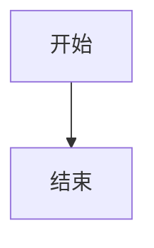

# 贡献指南

感谢你对 awsome-softwaredocs-skill 的关注！欢迎提交 Issue 和 Pull Request。

---

## 目录结构

```
templates/
├── zh/                               # 中文模板
│   ├── docs/                        # 软件工程文档
│   ├── project-templates/           # 项目代码模板
│   └── uml-diagrams/               # UML 图表模板
└── en/                              # 英文模板
    ├── docs/
    ├── project-templates/
    └── uml-diagrams/
```

> **重要**：所有模板必须成对提供（中文 + 英文），路径为 `templates/zh/` 和 `templates/en/`。

---

## 添加新文档模板

在 `templates/zh/docs/` 和 `templates/en/docs/` 目录下添加对应的新 `.md` 文件。

### 文件格式要求

```markdown
# 文档标题

## 文档信息

| 项目 | 内容 |
|------|------|
| 文档名称 | [文档名称] |
| 文档编号 | [编号] |
| 版本 | V1.0 |
| 日期 | [日期] |
| 作者 | [作者] |

---

## 版本历史

| 版本 | 日期 | 作者 | 描述 |
|------|------|------|------|
| V1.0 | [日期] | [姓名] | 初始版本 |

---

## 正文内容

### 章节标题

内容...
```

### 占位符规范

| 占位符 | 用途 |
|--------|------|
| `{{projectName}}` | 将被替换为实际项目名称 |
| `{{projectCode}}` | 将被替换为项目代号（大写） |
| `{{createdDate}}` | 将被替换为生成日期 |
| `{{author}}` | 将被替换为作者名称 |

### 命名规范

- 中文文档：`X-文档名称.md`（X为数字编号）
- 英文文档：`X-Document-Name.md`

---

## 添加新代码模板

在 `templates/zh/project-templates/` 和 `templates/en/project-templates/` 目录下创建新的模板目录。

### 目录结构

```
templates/zh/project-templates/
└── 基础XXX项目模板/
    ├── README.md                      # 模板说明
    ├── pom.xml / requirements.txt    # 依赖配置
    └── src/                          # 源代码
        └── ...
```

### README.md 模板

```markdown
# 项目模板名称

## 项目结构

```
project-name/
├── src/
│   └── ...
└── ...
```

## 技术栈

- 语言：
- 框架：
- 数据库：

## 快速开始

```bash
# 安装依赖
...

# 运行
...
```
```

---

## 添加新 UML 图表模板

在 `templates/zh/uml-diagrams/` 和 `templates/en/uml-diagrams/` 目录下添加对应的新 `.md` 文件。

### 文件格式要求

```markdown
# 图表名称模板

## 模板说明

简要说明图表用途...

## 基本语法



## 符号说明

| 符号 | 含义 |
|------|------|
| `[文本]` | 活动节点 |
| `{文本}` | 判断节点 |

## 模板示例

### 示例1


## 使用指南

1. 步骤1
2. 步骤2
```

### Mermaid 语法参考

| 图表类型 | 语法 | 说明 |
|----------|------|------|
| 用例图 | `graph LR` | 参与者 + 用例 |
| 类图 | `classDiagram` | 类 + 关系 |
| 序列图 | `sequenceDiagram` | 对象 + 消息 |
| 活动图 | `graph TD/LR` | 活动 + 流程 |
| 状态图 | `stateDiagram-v2` | 状态 + 转换 |

---

## 添加新脚本

在 `scripts/` 目录下添加新的 `.sh` 脚本：

### 脚本规范

```bash
#!/bin/bash

# ==============================================================================
# 脚本功能描述
# 用法: ./script-name.sh <参数1> [参数2]
# 示例: ./script-name.sh arg1 arg2
# ==============================================================================

set -e

# 颜色定义
RED='\033[0;31m'
GREEN='\033[0;32m'
NC='\033[0m'

print_success() {
    echo -e "${GREEN}[SUCCESS]${NC} $1"
}

print_error() {
    echo -e "${RED}[ERROR]${NC} $1"
}

# 主函数
main() {
    # 参数验证
    if [ -z "$1" ]; then
        echo "用法: $0 <参数>"
        exit 1
    fi

    # 脚本逻辑
    print_success "完成"
}

main "$@"
```

### 脚本元数据注释

必填：
- 脚本功能描述
- 用法
- 示例

---

## 项目规范

### Git 提交信息规范

采用 [Conventional Commits](https://www.conventionalcommits.org/)：

```
<type>(<scope>): <subject>

<body>
```

**Type 类型**：

| Type | 说明 |
|------|------|
| feat | 新功能 |
| fix | 修复 bug |
| docs | 文档更新 |
| style | 代码格式（不影响功能） |
| refactor | 重构 |
| test | 测试相关 |
| chore | 构建/工具相关 |

**示例**：

```
feat(docs): 添加微服务架构文档模板

- 添加服务注册与发现说明
- 添加 API 网关配置示例
- 更新项目结构图

Closes #123
```

### 分支命名规范

| 类型 | 命名格式 | 示例 |
|------|----------|------|
| 功能分支 | `feature/<功能名>` | `feature/user-auth` |
| 修复分支 | `fix/<问题描述>` | `fix/login-bug` |
| 文档分支 | `docs/<文档类型>` | `docs/api-spec` |

### 代码规范

- Shell 脚本：使用 `shellcheck` 检查
- Markdown：遵循 [Markdown Guide](https://www.markdownguide.org/)
- Mermaid：确保语法正确，可在线预览验证

---

## 测试

### 本地测试

```bash
# 验证项目结构
./scripts/validate-structure.sh ./your-test-project

# 测试初始化脚本
./scripts/init-project.sh test-project web java

# 检查 Shell 脚本语法
shellcheck scripts/*.sh
```

---

## 发布流程

1. 更新版本号（如需要）
2. 更新 CHANGELOG.md
3. 创建 Pull Request
4. 合并后创建 Release Tag

---

## 问题反馈

- **Bug 报告**：创建 [Issue](https://github.com/Freakz3z/awsome-softwaredocs-skill/issues)
- **功能建议**：创建 [Discussion](https://github.com/Freakz3z/awsome-softwaredocs-skill/discussions)
- **贡献代码**：提交 Pull Request

---

## 许可证

贡献的代码将采用与项目相同的 [MIT License](LICENSE)。
