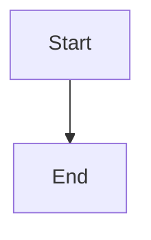

# Contributing Guide

Thank you for your interest in awsome-softwaredocs-skill! We welcome Issue submissions and Pull Requests.

---

## Directory Structure

```
templates/
├── zh/                               # Chinese templates
│   ├── docs/                        # Software engineering documents
│   ├── project-templates/           # Project code templates
│   └── uml-diagrams/              # UML diagram templates
└── en/                              # English templates
    ├── docs/
    ├── project-templates/
    └── uml-diagrams/
```

> **Important**: All templates must be provided in pairs (Chinese + English), at `templates/zh/` and `templates/en/`.

---

## Adding New Document Templates

Add corresponding new `.md` files in `templates/zh/docs/` and `templates/en/docs/`.

### File Format Requirements

```markdown
# Document Title

## Document Information

| Item | Content |
|------|---------|
| Document Name | [Document Name] |
| Document Number | [Number] |
| Version | V1.0 |
| Date | [Date] |
| Author | [Author] |

---

## Version History

| Version | Date | Author | Description |
|---------|------|--------|-------------|
| V1.0 | [Date] | [Name] | Initial version |

---

## Body Content

### Chapter Title

Content...
```

### Placeholder Standards

| Placeholder | Purpose |
|-------------|---------|
| `{{projectName}}` | Will be replaced with actual project name |
| `{{projectCode}}` | Will be replaced with project code (uppercase) |
| `{{createdDate}}` | Will be replaced with generation date |
| `{{author}}` | Will be replaced with author name |

### Naming Conventions

- Chinese documents: `X-Document-Name.md` (X is the numeric order)
- English documents: `X-Document-Name.md`

---

## Adding New Code Templates

Create new template directories in `templates/zh/project-templates/` and `templates/en/project-templates/`.

### Directory Structure

```
templates/en/project-templates/
└── BasicXXXProjectTemplate/
    ├── README.md                      # Template description
    ├── pom.xml / requirements.txt   # Dependency configuration
    └── src/                          # Source code
        └── ...
```

### README.md Template

```markdown
# Project Template Name

## Project Structure

```
project-name/
├── src/
│   └── ...
└── ...
```

## Tech Stack

- Language:
- Framework:
- Database:

## Quick Start

```bash
# Install dependencies
...

# Run
...
```
```

---

## Adding New UML Diagram Templates

Add corresponding new `.md` files in `templates/zh/uml-diagrams/` and `templates/en/uml-diagrams/`.

### File Format Requirements

```markdown
# Diagram Name Template

## Template Description

Brief description of diagram usage...

## Basic Syntax



## Symbol Reference

| Symbol | Meaning |
|--------|---------|
| `[Text]` | Activity node |
| `{Text}` | Decision node |

## Template Examples

### Example 1


## Usage Guide

1. Step 1
2. Step 2
```

### Mermaid Syntax Reference

| Diagram Type | Syntax | Description |
|--------------|--------|-------------|
| Use Case | `graph LR` | Actors + Use Cases |
| Class | `classDiagram` | Classes + Relationships |
| Sequence | `sequenceDiagram` | Objects + Messages |
| Activity | `graph TD/LR` | Activities + Flow |
| State | `stateDiagram-v2` | States + Transitions |

---

## Adding New Scripts

Add new `.sh` scripts in the `scripts/` directory:

### Script Standards

```bash
#!/bin/bash

# ==============================================================================
# Script description
# Usage: ./script-name.sh <param1> [param2]
# Example: ./script-name.sh arg1 arg2
# ==============================================================================

set -e

# Color definitions
RED='\033[0;31m'
GREEN='\033[0;32m'
NC='\033[0m'

print_success() {
    echo -e "${GREEN}[SUCCESS]${NC} $1"
}

print_error() {
    echo -e "${RED}[ERROR]${NC} $1"
}

# Main function
main() {
    # Argument validation
    if [ -z "$1" ]; then
        echo "Usage: $0 <param>"
        exit 1
    fi

    # Script logic
    print_success "Done"
}

main "$@"
```

### Script Metadata Comments

Required:
- Script description
- Usage
- Example

---

## Project Standards

### Git Commit Message Convention

Follow [Conventional Commits](https://www.conventionalcommits.org/):

```
<type>(<scope>): <subject>

<body>
```

**Type Categories**:

| Type | Description |
|------|-------------|
| feat | New feature |
| fix | Bug fix |
| docs | Documentation update |
| style | Code formatting (no functional change) |
| refactor | Refactoring |
| test | Test related |
| chore | Build/tool related |

**Examples**:

```
feat(docs): Add microservice architecture document template

- Add service registration and discovery documentation
- Add API gateway configuration example
- Update project structure diagram

Closes #123
```

### Branch Naming Convention

| Type | Naming Format | Example |
|------|---------------|---------|
| Feature branch | `feature/<feature-name>` | `feature/user-auth` |
| Fix branch | `fix/<issue-description>` | `fix/login-bug` |
| Docs branch | `docs/<document-type>` | `docs/api-spec` |

### Code Standards

- Shell scripts: Use `shellcheck` for validation
- Markdown: Follow [Markdown Guide](https://www.markdownguide.org/)
- Mermaid: Ensure syntax is correct, verify with online preview

---

## Testing

### Local Testing

```bash
# Validate project structure
./scripts/validate-structure.sh ./your-test-project

# Test initialization script
./scripts/init-project.sh test-project web java

# Check Shell script syntax
shellcheck scripts/*.sh
```

---

## Release Process

1. Update version number (if needed)
2. Update CHANGELOG.md
3. Create Pull Request
4. Create Release Tag after merge

---

## Feedback

- **Bug Reports**: Create an [Issue](https://github.com/Freakz3z/awsome-softwaredocs-skill/issues)
- **Feature Suggestions**: Create a [Discussion](https://github.com/Freakz3z/awsome-softwaredocs-skill/discussions)
- **Code Contributions**: Submit a Pull Request

---

## License

Contributed code will use the same [MIT License](LICENSE) as the project.
