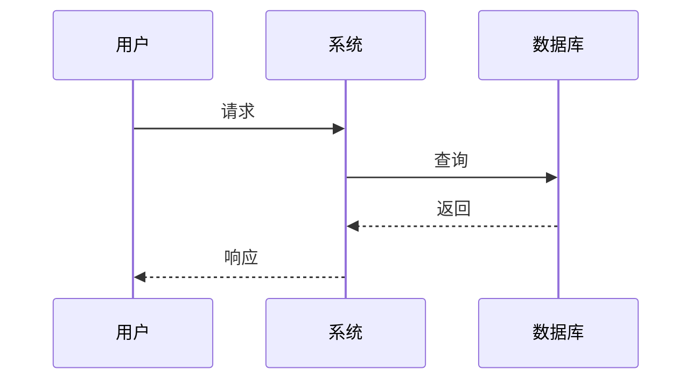

# awsome-softwaredocs-skill

<div align="center">

**专业的软件工程技能** — 从零开始构建符合工业标准的软件项目

[](LICENSE)
[]()

[简体中文](README.md)｜[English](README_EN.md)

*适用于 Claude Code · 支持中英文 · 9份专业文档 · 6种UML图表*

</div>

---

## 为什么使用 awsome-softwaredocs-skill？

| 场景 | 没有它 | 使用它 |
|------|--------|--------|
| **学习软件工程** | 理论枯燥、难以实践 | 边做边学，文档即教材 |
| **毕业设计** | 不知从何入手 | 完整模板，快速启动 |
| **团队项目** | 文档不规范、不完整 | 工业级标准文档一键生成 |
| **接外包项目** | 客户要文档不会写 | 专业模板，高效交付 |

## 两种工作模式

```
┌─────────────────────────────────────────────────────────────┐
│  模式一：一步步走模式 (学习场景)                               │
│  ─────────────────────────────────────────────               │
│  阶段1 项目立项 → 阶段2 需求分析 → 阶段3 概要设计              │
│  → 阶段4 详细设计 → 阶段5 编码实现 → 阶段6 单元测试            │
│  → 阶段7 系统测试 → 阶段8 部署运维                           │
└─────────────────────────────────────────────────────────────┘

┌─────────────────────────────────────────────────────────────┐
│  模式二：一步到位模式 (快速启动)                               │
│  ─────────────────────────────────────────────               │
│  你提供：项目名称 + 类型 + 核心功能                             │
│  自动生成：完整项目结构 + 全部文档 + 可运行代码框架             │
└─────────────────────────────────────────────────────────────┘
```

## 项目结构

```
awsome-softwaredocs-skill/
├── SKILL.md                              # Claude Code 技能定义
├── README.md                              # 本文档
│
├── templates/                             # 📁 模板目录（按语言分类）
│   ├── zh/                               # 🇨🇳 中文模板
│   │   ├── docs/                        # 📄 9份软件工程文档
│   │   │   ├── 1-需求规格说明书.md
│   │   │   ├── 2-软件设计说明书.md
│   │   │   ├── 3-数据库设计说明书.md
│   │   │   ├── 4-接口设计说明书.md
│   │   │   ├── 5-测试计划说明书.md
│   │   │   ├── 6-测试报告.md
│   │   │   ├── 7-用户手册.md
│   │   │   ├── 8-项目计划.md
│   │   │   └── 9-配置管理计划.md
│   │   │
│   │   └── uml-diagrams/               # 📊 6种UML图表
│   │       ├── 用例图模板.md
│   │       ├── 类图模板.md
│   │       ├── 序列图模板.md
│   │       ├── 活动图模板.md
│   │       ├── 状态图模板.md
│   │       └── 组件图和部署图模板.md
│   │
│   └── en/                              # 🇺🇸 英文模板
│       ├── docs/                        # 9 Software Engineering Documents
│       └── uml-diagrams/               # 6 UML Diagram Templates
│
└── scripts/                              # 🔧 自动化脚本
    ├── init-project.sh                   # 项目初始化
    ├── generate-doc.sh                   # 文档生成
    └── validate-structure.sh             # 结构验证
```

## 快速开始

### 方式一：Claude Code 对话

```bash
# 1. 安装技能
mkdir -p ~/.claude/skills
cp -r awsome-softwaredocs-skill ~/.claude/skills/

# 2. 在 Claude Code 中对话
用户: 帮我创建一个图书管理系统
用户: 使用一步步走模式
用户: 帮我生成需求规格说明书
```

### 方式二：命令行脚本

```bash
# 初始化项目（自动创建结构 + 文档 + 代码）
./scripts/init-project.sh my-project web java

# 生成指定文档
./scripts/generate-doc.sh srs ./my-project      # 需求规格说明书
./scripts/generate-doc.sh all ./my-project      # 所有文档

# 验证项目结构
./scripts/validate-structure.sh ./my-project
```

### 方式三：直接复制模板

```bash
# 复制中文文档模板
cp -r templates/zh/docs/* your-project/docs/

# 复制中文 UML 图表
cp -r templates/zh/uml-diagrams/* your-project/diagrams/

# 复制代码模板
cp -r templates/zh/project-templates/基础Java项目模板/* your-project/
```

### 方式四：从插件市场安装

如果你已创建 GitHub 仓库并发布了插件市场，可以使用以下命令安装：

```bash
# 1. 添加插件市场
/plugin marketplace add https://github.com/Freakz3z/awsome-softwaredocs-skill

# 2. 安装技能
/plugin install awsome-softwaredocs-skill@Freakz3z/awsome-softwaredocs-skill

# 3. 在 Claude Code 中使用
用户: 帮我创建一个任务管理系统
用户: 使用一步步走模式
```

## 核心功能

### 📄 软件工程文档 (9份)

| 文档 | 编号 | 内容预览 |
|------|------|----------|
| 需求规格说明书 | SRS | 用例图、功能列表、非功能需求 |
| 软件设计说明书 | SDS | 架构图、模块设计、类图 |
| 数据库设计说明书 | DD | ER图、表结构、索引设计 |
| 接口设计说明书 | ID | REST API、参数定义、响应格式 |
| 测试计划说明书 | TP | 测试策略、用例设计、进度计划 |
| 测试报告 | TR | 执行结果、缺陷统计、质量评估 |
| 用户手册 | UM | 操作指南、常见问题 |
| 项目计划 | PP | WBS、甘特图、资源分配 |
| 配置管理计划 | CMP | Git Flow、变更流程、备份策略 |

### 📊 UML 图表 (6种)



| 图表 | Mermaid 语法 | 适用场景 |
|------|--------------|----------|
| 用例图 | `graph LR` | 系统功能建模 |
| 类图 | `classDiagram` | 面向对象设计 |
| 序列图 | `sequenceDiagram` | 对象交互时序 |
| 活动图 | `graph TD/LR` | 业务流程 |
| 状态图 | `stateDiagram-v2` | 状态机设计 |
| 部署图 | `graph TB` | 系统架构 |

### 💻 支持的技术栈

| 层级 | 技术选项 |
|------|----------|
| **后端** | Java Spring Boot, Python Django, Go Gin, Node.js Express |
| **前端** | React + TypeScript, Vue 3 + TypeScript, 原生 HTML/JS |
| **数据库** | MySQL, PostgreSQL, MongoDB, Redis |
| **部署** | Docker, Docker Compose, Kubernetes |

## 使用示例

### 示例：创建学生成绩管理系统

**输入**：
```
用户: 帮我创建一个学生成绩管理系统，需要管理学生信息、课程信息、成绩录入和查询统计功能
```

**输出** (一步到位模式)：

```
✅ 项目结构已创建: student-grade-system/
✅ 需求规格说明书已生成: docs/SRS.md
✅ 软件设计说明书已生成: docs/SDS.md
✅ 数据库设计说明书已生成: docs/DD.md
✅ 接口设计说明书已生成: docs/ID.md
✅ 测试计划说明书已生成: docs/TP.md
✅ 测试报告已生成: docs/TR.md
✅ 用户手册已生成: docs/UM.md
✅ 项目计划已生成: docs/PP.md
✅ 配置管理计划已生成: docs/CMP.md
✅ UML图表已生成: diagrams/
✅ Java Spring Boot 项目框架: src/
✅ 可直接打开 docs/SRS.md 开始填写需求
```

### 一一步步走模式示例

```
用户: 使用一步步走模式
助手: 开始【阶段1：项目立项】

请告诉我：
1. 项目名称：学生成绩管理系统
2. 项目背景：（学校/培训机构需要管理学生成绩）
3. 项目目标：（实现成绩的录入、查询、统计分析）
4. 预期用户：（教师、教务管理员、学生）
5. 项目周期：（例如：3个月）

完成立项后，我们将进入【阶段2：需求分析】...
```

## 脚本参考

### init-project.sh

```bash
./scripts/init-project.sh <项目名称> [项目类型] [技术栈]

# 示例
./scripts/init-project.sh my-project                    # 默认 (web + javascript)
./scripts/init-project.sh api-service api go            # API 项目 + Go
./scripts/init-project.sh admin-system web java         # Web 项目 + Java
```

### generate-doc.sh

```bash
./scripts/generate-doc.sh <文档类型> [项目路径]

# 文档类型: srs | sds | dd | id | tp | tr | um | pp | cmp | all

# 示例
./scripts/generate-doc.sh srs  ./my-project    # 生成需求规格说明书
./scripts/generate-doc.sh all ./my-project    # 生成所有文档
```

## 参考标准

| 标准 | 说明 |
|------|------|
| GB/T 8566-2007 | 软件生存周期过程 |
| GB/T 9385-2008 | 计算机软件需求规格说明规范 |
| GB/T 8567-2006 | 计算机软件设计说明规范 |
| ISO/IEC 25010 | 软件质量模型 |
| UML 2.5 | 统一建模语言规范 |

---

详细开发指南请参阅 [CONTRIBUTING.md](CONTRIBUTING.md)。

## 许可证

MIT License · Copyright (c) 2026

## 如果有帮助，请给个 ⭐

如果你觉得 awsome-softwaredocs-skill 对你有帮助，欢迎给个 Star！
