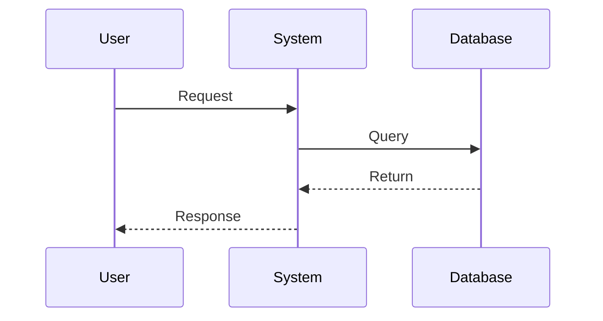

# awsome-softwaredocs-skill

<div align="center">

**Professional Software Engineering Skill** — Build industry-standard software projects from scratch

[](LICENSE)
[]()

[简体中文](README.md)｜[English](README_EN.md)

*For Claude Code · Chinese & English · 9 Professional Documents · 6 UML Diagrams*

</div>

---

## Why awsome-softwaredocs-skill?

| Scenario | Without it | With it |
|----------|-----------|---------|
| **Learning Software Engineering** | Dry theory, hard to practice | Learn by doing, docs as textbook |
| **Capstone Project** | Don't know where to start | Complete templates, quick start |
| **Team Project** | Inconsistent, incomplete docs | One-click industrial-standard docs |
| **Freelance Project** | Client asks for docs, can't write | Professional templates, efficient delivery |

## Two Working Modes

```
┌─────────────────────────────────────────────────────────────┐
│  Mode 1: Step-by-Step Mode (Learning)                       │
│  ─────────────────────────────────────────────               │
│  Phase 1 Project Init → Phase 2 Requirements                │
│  → Phase 3 Architecture → Phase 4 Detailed Design            │
│  → Phase 5 Implementation → Phase 6 Unit Testing            │
│  → Phase 7 System Testing → Phase 8 Deployment               │
└─────────────────────────────────────────────────────────────┘

┌─────────────────────────────────────────────────────────────┐
│  Mode 2: One-Click Mode (Quick Start)                       │
│  ─────────────────────────────────────────────               │
│  You provide: Project name + Type + Core features           │
│  Auto-generates: Complete structure + All docs + Code        │
└─────────────────────────────────────────────────────────────┘
```

## Project Structure

```
awsome-softwaredocs-skill/
├── SKILL.md                              # Claude Code skill definition
├── README.md                              # Documentation
│
├── templates/                            # 📁 Template directory (by language)
│   ├── zh/                              # 🇨🇳 Chinese templates
│   │   ├── docs/                       # 📄 9 Software engineering documents
│   │   │   ├── 1-需求规格说明书.md
│   │   │   ├── 2-软件设计说明书.md
│   │   │   ├── 3-数据库设计说明书.md
│   │   │   ├── 4-接口设计说明书.md
│   │   │   ├── 5-测试计划说明书.md
│   │   │   ├── 6-测试报告.md
│   │   │   ├── 7-用户手册.md
│   │   │   ├── 8-项目计划.md
│   │   │   └── 9-配置管理计划.md
│   │   │
│   │   ├── project-templates/          # 💻 4 Project templates
│   │   │   ├── 基础Java项目模板/
│   │   │   ├── 基础Python项目模板/
│   │   │   ├── 基础Web项目模板/
│   │   │   └── 基础Go项目模板/
│   │   │
│   │   └── uml-diagrams/               # 📊 6 UML diagram templates
│   │       ├── 用例图模板.md
│   │       ├── 类图模板.md
│   │       ├── 序列图模板.md
│   │       ├── 活动图模板.md
│   │       ├── 状态图模板.md
│   │       └── 组件图和部署图模板.md
│   │
│   └── en/                              # 🇺🇸 English templates
│       ├── docs/                       # 9 Software engineering documents
│       ├── project-templates/           # 4 Project templates
│       └── uml-diagrams/              # 6 UML diagram templates
│
└── scripts/                              # 🔧 Automation scripts
    ├── init-project.sh                   # Project initialization
    ├── generate-doc.sh                   # Document generation
    └── validate-structure.sh             # Structure validation
```

## Quick Start

### Method 1: Claude Code Conversation

```bash
# 1. Install the skill
mkdir -p ~/.claude/skills
cp -r awsome-softwaredocs-skill ~/.claude/skills/

# 2. Chat in Claude Code
User: Create a library management system
User: Use step-by-step mode
User: Generate requirements specification
```

### Method 2: Command Line Scripts

```bash
# Initialize project (auto-creates structure + docs + code)
./scripts/init-project.sh my-project web java

# Generate specific document
./scripts/generate-doc.sh srs ./my-project
./scripts/generate-doc.sh all ./my-project

# Validate project structure
./scripts/validate-structure.sh ./my-project
```

### Method 3: Copy Templates Directly

```bash
# Copy English document templates
cp -r templates/en/docs/* your-project/docs/

# Copy English UML diagrams
cp -r templates/en/uml-diagrams/* your-project/diagrams/

# Copy code templates
cp -r templates/en/project-templates/BasicJavaProjectTemplate/* your-project/
```

### Method 4: Install from Plugin Marketplace

If you have published the plugin marketplace on GitHub, use these commands to install:

```bash
# 1. Add the plugin marketplace
/plugin marketplace add https://github.com/Freakz3z/awsome-softwaredocs-skill

# 2. Install the skill
/plugin install awsome-softwaredocs-skill@Freakz3z/awsome-softwaredocs-skill

# 3. Start using in Claude Code
User: Create a task management system
User: Use step-by-step mode
```

## Core Features

### 📄 Software Engineering Documents (9)

| Document | Code | Content |
|----------|------|---------|
| Software Requirements Specification | SRS | Use cases, features, non-functional requirements |
| Software Design Specification | SDS | Architecture, module design, class diagrams |
| Database Design Specification | DD | ER diagrams, table structures, indexes |
| Interface Design Specification | ID | REST API, parameters, response formats |
| Test Plan | TP | Test strategy, test cases, schedule |
| Test Report | TR | Execution results, defect statistics |
| User Manual | UM | Operation guide, FAQ |
| Project Plan | PP | WBS, Gantt chart, resource allocation |
| Configuration Management Plan | CMP | Git Flow, change process, backup strategy |

### 📊 UML Diagrams (6)



| Diagram | Mermaid Syntax | Use Case |
|---------|----------------|----------|
| Use Case | `graph LR` | System functionality modeling |
| Class | `classDiagram` | Object-oriented design |
| Sequence | `sequenceDiagram` | Object interaction timing |
| Activity | `graph TD/LR` | Business process |
| State | `stateDiagram-v2` | State machine |
| Deployment | `graph TB` | System architecture |

### 💻 Supported Tech Stack

| Layer | Options |
|-------|---------|
| **Backend** | Java Spring Boot, Python Django, Go Gin, Node.js Express |
| **Frontend** | React + TypeScript, Vue 3 + TypeScript, Vanilla HTML/JS |
| **Database** | MySQL, PostgreSQL, MongoDB, Redis |
| **Deployment** | Docker, Docker Compose, Kubernetes |

## Usage Examples

### Example: Create Student Grade Management System

**Input**:
```
User: Create a student grade management system with student info, course info, grade entry and query statistics
```

**Output** (One-Click Mode):

```
✅ Project structure created: student-grade-system/
✅ Requirements Specification: docs/SRS.md
✅ Software Design Specification: docs/SDS.md
✅ Database Design: docs/DD.md
✅ Interface Design: docs/ID.md
✅ Test Plan: docs/TP.md
✅ Test Report: docs/TR.md
✅ User Manual: docs/UM.md
✅ Project Plan: docs/PP.md
✅ Configuration Management Plan: docs/CMP.md
✅ UML diagrams: diagrams/
✅ Java Spring Boot project framework: src/
✅ Open docs/SRS.md to start filling requirements
```

### Step-by-Step Mode Example

```
User: Use step-by-step mode
Assistant: Starting [Phase 1: Project Init]

Please provide:
1. Project name: Student Grade Management System
2. Project background: (School/training institution needs)
3. Project goals: (Grade entry, query, statistics)
4. Expected users: (Teachers, admin, students)
5. Project duration: (e.g., 3 months)

After init, we'll proceed to [Phase 2: Requirements Analysis]...
```

## Scripts Reference

### init-project.sh

```bash
./scripts/init-project.sh <project-name> [project-type] [tech-stack]

# Examples
./scripts/init-project.sh my-project                    # Default (web + javascript)
./scripts/init-project.sh api-service api go            # API project + Go
./scripts/init-project.sh admin-system web java        # Web project + Java
```

### generate-doc.sh

```bash
./scripts/generate-doc.sh <doc-type> [project-path]

# Doc types: srs | sds | dd | id | tp | tr | um | pp | cmp | all

# Examples
./scripts/generate-doc.sh srs  ./my-project    # Generate SRS
./scripts/generate-doc.sh all ./my-project      # Generate all documents
```

## Reference Standards

| Standard | Description |
|----------|-------------|
| GB/T 8566-2007 | Software Life Cycle Processes |
| GB/T 9385-2008 | Computer Software Requirements Specification |
| GB/T 8567-2006 | Computer Software Design Description |
| ISO/IEC 25010 | Systems and Software Quality Requirements |
| UML 2.5 | Unified Modeling Language Specification |

---

For detailed development guide, see [CONTRIBUTING_EN.md](CONTRIBUTING_EN.md).

## License

MIT License · Copyright (c) 2026

## If Helpful, Please Give a ⭐

If awsome-softwaredocs-skill helps you, please give it a Star!
