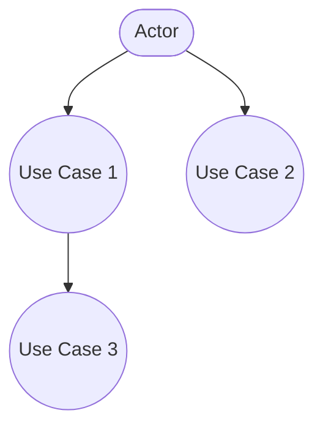
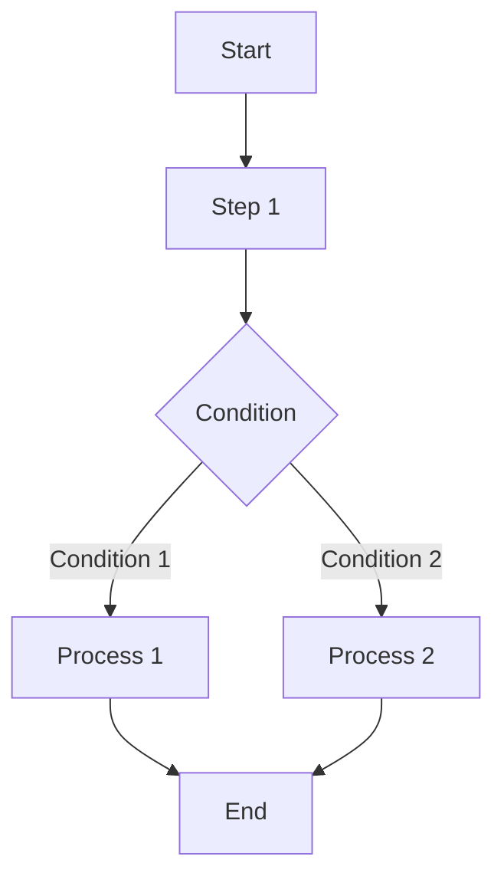

# Software Requirements Specification (SRS)

## Document Information

| Item | Content |
|------|---------|
| Document Name | Software Requirements Specification |
| Document Number | SRS-{{projectCode}}-V1.0 |
| Version | V1.0 |
| Date | {{createdDate}} |
| Author | {{author}} |

---

## Version History

| Version | Date | Author | Description |
|---------|------|--------|-------------|
| V1.0 | {{createdDate}} | {{author}} | Initial version |

---

## Review Record

| Date | Reviewer | Conclusion | Signature |
|------|----------|------------|-----------|
| {{createdDate}} | {{author}} | [Pass/Fail] | [Signature] |

---

## 1. Introduction

### 1.1 Purpose

This document describes the functional and non-functional requirements of **{{projectName}}** in detail, serving as the basis for software development, testing, and acceptance.

### 1.2 Scope

This document applies to:
- Development Team: Understanding the functions to be implemented
- Testing Team: Preparing test plans and controlling test cases
- Customer/Users: Confirming whether the system meets their requirements
- Project Managers: Serving as the basis for project planning and schedule control

### 1.3 Definitions and Abbreviations

| Term | Definition |
|------|------------|
| [Term 1] | [Definition] |
| [Term 2] | [Definition] |

### 1.4 References

| Document | Description |
|----------|-------------|
| [Document 1] | [Description] |
| [Document 2] | [Description] |

---

## 2. Overall Description

### 2.1 Product Background

[Describe the background, origin, and driving factors of the product]

### 2.2 Product Positioning

[Describe the product's position in the market or organization]

### 2.3 User Characteristics

| User Type | Description | Skill Level | Usage Frequency |
|-----------|-------------|-------------|-----------------|
| [Type 1] | [Description] | [Beginner/Intermediate/Advanced] | [Occasional/Frequent/Daily] |
| [Type 2] | [Description] | [Beginner/Intermediate/Advanced] | [Occasional/Frequent/Daily] |

### 2.4 Constraints

#### 2.4.1 Hardware Constraints
- Server configuration requirements
- Client minimum configuration
- Network requirements

#### 2.4.2 Software Constraints
- Operating system requirements
- Browser requirements (Web application)
- Dependent software

#### 2.4.3 Regulatory Constraints
- [Related laws and regulations]

#### 2.4.4 Budget and Schedule Constraints
- Project budget: [X] 万元 (RMB)
- Project duration: [X] months

### 2.5 Assumptions and Dependencies

| Assumption/Dependency | Description | Impact |
|----------------------|-------------|--------|
| [Assumption 1] | [Description] | [Impact description] |
| [Dependency 1] | [Description] | [Impact description] |

---

## 3. Functional Requirements

### 3.1 Functional Requirements Overview

[Overall description of system functions]

### 3.2 Use Case Diagram

### 3.3 Detailed Functional Requirements

#### 3.3.1 [Functional Module 1]

**Description**:
[Detailed description of the function]

**Business Rules**:
| Rule ID | Rule Content |
|---------|--------------|
| BR-001 | [Rule content] |
| BR-002 | [Rule content] |

**Input Items**:
| Field Name | Type | Required | Description |
|------------|------|----------|-------------|
| [Field 1] | [Type] | [Yes/No] | [Description] |

**Output Items**:
[Describe system output]

**Process Flow**:

**Exception Handling**:
| Exception | Handling Method |
|-----------|-----------------|
| [Exception 1] | [Handling method] |

**Priority**: [High/Medium/Low]

#### 3.3.2 [Functional Module 2]

[Same structure as above]

### 3.4 Data Requirements

#### 3.4.1 Data Item List

| Data Item Name | Data Type | Length | Description |
|----------------|-----------|--------|-------------|
| [Name 1] | [Type] | [Length] | [Description] |
| [Name 2] | [Type] | [Length] | [Description] |

#### 3.4.2 Data Volume Estimation

| Data Type | Initial Volume | Annual Growth | Retention Period |
|-----------|----------------|---------------|------------------|
| [Type 1] | [X] 万 records | [Y]% | [Z] years |

---

## 4. Non-Functional Requirements

### 4.1 Performance Requirements

| Metric | Requirement | Test Standard |
|--------|-------------|---------------|
| Response Time | Operation completion ≤ [X] seconds | [Standard] |
| Concurrent Users | Support [X] concurrent users | [Standard] |
| Throughput | [X] TPS | [Standard] |
| Resource Usage | CPU ≤ [X]%, Memory ≤ [X]MB | [Standard] |

### 4.2 Reliability Requirements

| Metric | Requirement |
|--------|-------------|
| System Availability | ≥ [X]% |
| MTBF (Mean Time Between Failures) | ≥ [X] hours |
| MTTR (Mean Time To Recovery) | ≤ [X] minutes |
| Data Accuracy | Error rate ≤ [X]% |

### 4.3 Security Requirements

| Security Requirement | Description |
|---------------------|-------------|
| Authentication | Support username/password authentication, integrate third-party auth |
| Access Control | Role-Based Access Control (RBAC) |
| Data Encryption | Encrypt sensitive data in storage and transmission |
| Security Audit | Log critical operations |
| Protection | Prevent SQL injection, XSS, CSRF attacks |

### 4.4 Compatibility Requirements

| Type | Requirement |
|------|-------------|
| Browser Compatibility | Chrome ≥ 90, Firefox ≥ 88, Safari ≥ 14, Edge ≥ 90 |
| OS Compatibility | Windows 10/11, macOS 11+, Linux (Ubuntu 20.04+) |
| Mobile Compatibility | iOS 14+, Android 11+ |
| Backward Compatibility | [Description] |

### 4.5 Usability Requirements

| Metric | Requirement |
|--------|-------------|
| Learning Time | Ordinary user ≤ [X] hours |
| Operation Efficiency | Skilled user task completion ≤ [baseline time] |
| Error Rate | Operation error rate ≤ [X]% |
| User Satisfaction | Satisfaction score ≥ [X] points |

### 4.6 Maintainability Requirements

| Metric | Requirement |
|--------|-------------|
| Code Readability | Follow code standards, comment coverage ≥ [X]% |
| Modularity | Module coupling ≤ [X] |
| Documentation Completeness | All modules documented |

### 4.7 Scalability Requirements

| Metric | Requirement |
|--------|-------------|
| Horizontal Scaling | Support adding nodes to expand system capacity |
| Vertical Scaling | Support increasing hardware resources for performance |
| Functional Extension | Reserve extension interfaces, support hot-swappable modules |

---

## 5. Interface Requirements

### 5.1 User Interface

#### 5.1.1 Interface Style
- Style: [Modern/Traditional/Minimalist]
- Theme: [Light/Dark/System Follow]
- Language: [Chinese/English/Multi-language]

#### 5.1.2 Interface Layout
[Describe main interface layout structure]

#### 5.1.3 Interaction Methods
- Mouse operations
- Keyboard shortcuts
- Touch operations (mobile)

### 5.2 Hardware Interface

| Device | Interface Type | Description |
|--------|----------------|-------------|
| [Device 1] | [Type] | [Description] |

### 5.3 Software Interface

#### 5.3.1 External System Interfaces

| System | Interface Method | Data Format | Frequency |
|--------|------------------|--------------|-----------|
| [System 1] | [REST API/Message Queue/etc.] | [JSON/XML/etc.] | [Real-time/Scheduled] |

#### 5.3.2 Middleware Interfaces

| Middleware | Version | Purpose |
|------------|---------|---------|
| [Middleware 1] | [Version] | [Purpose] |

### 5.4 Communication Interface

| Type | Protocol | Description |
|------|----------|-------------|
| HTTP/HTTPS | TLS 1.2+ | Web communication |
| WebSocket | - | Real-time communication |
| [Other] | - | - |

---

## 6. Data Dictionary

### 6.1 Main Data Entities

#### [Entity Name]

| Field Name | Chinese Name | Data Type | Length | Primary Key | Not Null | Description |
|------------|--------------|-----------|--------|-------------|----------|-------------|
| [Field 1] | {{author}} | [Type] | [Length] | [Yes/No] | [Yes/No] | [Description] |

---

## 7. Acceptance Criteria

### 7.1 Functional Acceptance Criteria

| Function | Acceptance Condition | Verification Method |
|----------|---------------------|---------------------|
| [Function 1] | [Condition] | [Method] |

### 7.2 Performance Acceptance Criteria

| Metric | Target Value | Verification Method |
|--------|--------------|---------------------|
| [Metric 1] | [Value] | [Method] |

### 7.3 Security Acceptance Criteria

| Item | Acceptance Condition |
|------|---------------------|
| [Item 1] | [Condition] |

---

## 8. Appendices

### 8.1 Glossary

| Term | English | Definition |
|------|---------|------------|
| [Term] | [English] | [Definition] |

### 8.2 Change Log

| Change Date | Change Content | Changed By | Approved By |
|-------------|----------------|------------|-------------|
| {{createdDate}} | [Content] | {{author}} | {{author}} |

---

**Document Approval**:

| Role | Name | Date | Signature |
|------|------|------|-----------|
| Project Manager | | | |
| Technical Lead | | | |
| Quality Lead | | | |
| Customer Representative | | | |