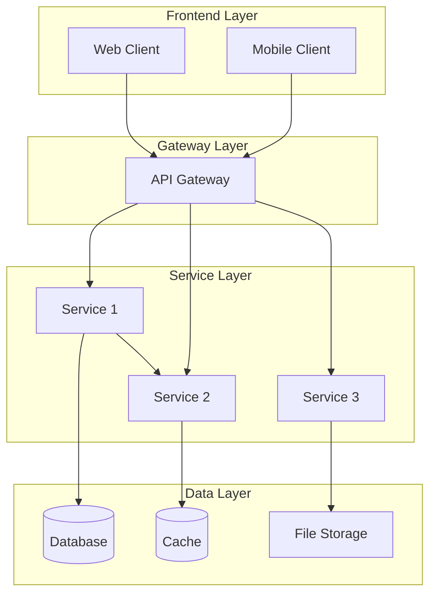
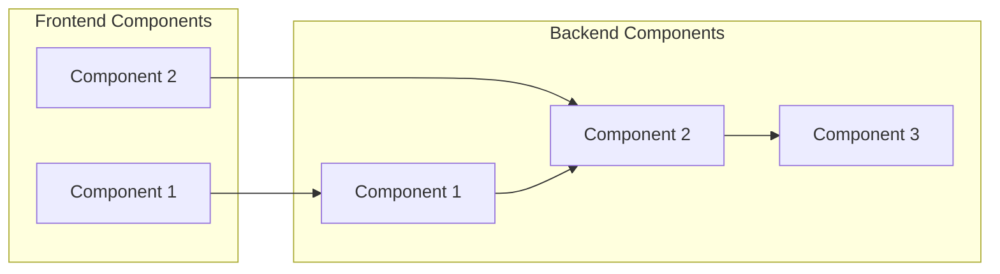
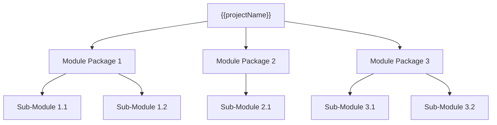
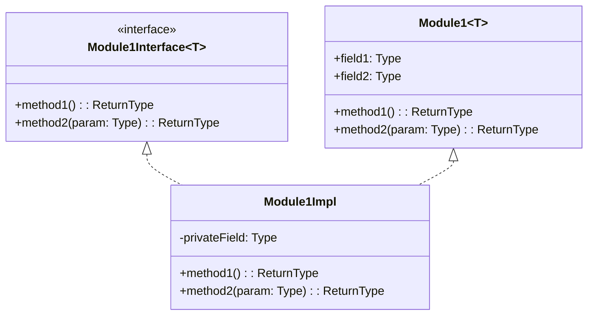
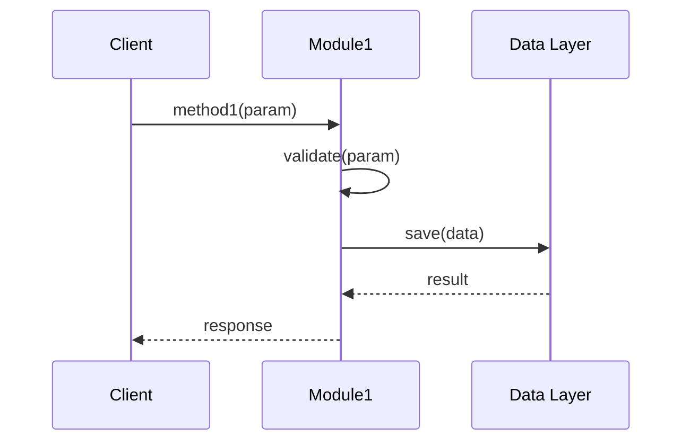
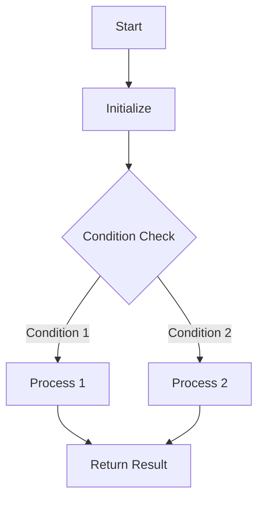
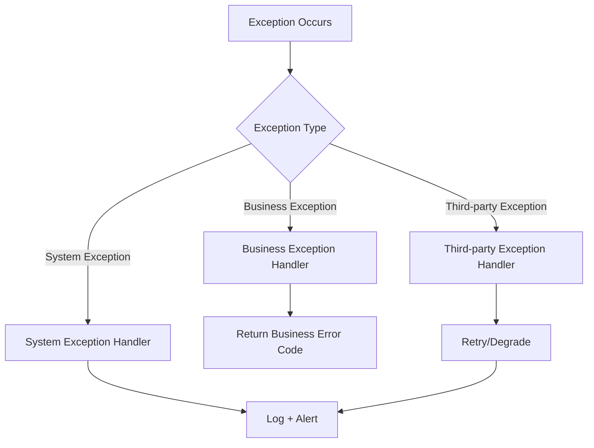
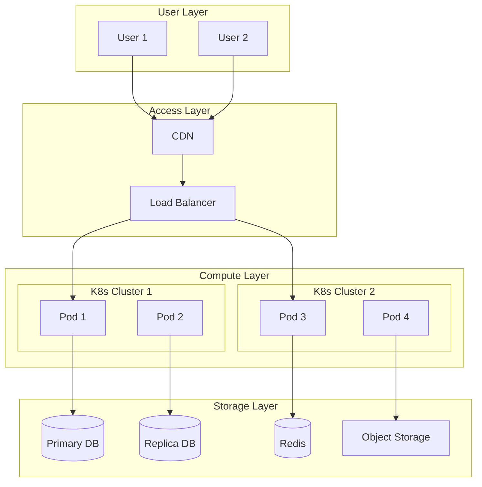

# Software Design Specification (SDS)

## Document Information

| Item | Content |
|------|---------|
| Document Name | Software Design Specification |
| Document Number | SDS-{{projectCode}}-V1.0 |
| Version | V1.0 |
| Date | {{createdDate}} |
| Author | {{author}} |

---

## Version History

| Version | Date | Author | Description |
|---------|------|--------|-------------|
| V1.0 | {{createdDate}} | {{author}} | Initial version |

---

## Review Record

| Date | Reviewer | Conclusion | Signature |
|------|----------|------------|-----------|
| {{createdDate}} | {{author}} | [Pass/Fail] | [Signature] |

---

## 1. Introduction

### 1.1 Purpose

This document describes the software architecture design and detailed design of **{{projectName}}**, providing developers with clear implementation guidance.

### 1.2 Scope

Applies to:
- Development Team: Understanding system architecture and module design
- Testing Team: Understanding system behavior for test case preparation
- Maintenance Personnel: Understanding the system for maintenance and extension

### 1.3 Definitions and Abbreviations

| Term | Definition |
|------|------------|
| [Term 1] | [Definition] |

---

## 2. System Architecture Design

### 2.1 Architecture Overview

[Overall system architecture description]

### 2.2 Architecture Style

```
□ Layered Architecture
□ MVC Architecture
□ Microservices Architecture
□ Event-Driven Architecture
□ Plugin Architecture
□ Other: [Description]
```

### 2.3 System Architecture Diagram



### 2.4 Technology Stack

| Layer | Technology | Version | Description |
|-------|------------|---------|-------------|
| Frontend Framework | [React/Vue/Angular] | [Version] | [Description] |
| Backend Framework | [Spring Boot/Django/Gin] | [Version] | [Description] |
| Database | [MySQL/PostgreSQL/MongoDB] | [Version] | [Description] |
| Cache | [Redis/Memcached] | [Version] | [Description] |
| Message Queue | [RabbitMQ/Kafka] | [Version] | [Description] |
| Search Engine | [Elasticsearch] | [Version] | [Description] |
| Containerization | [Docker/Kubernetes] | [Version] | [Description] |

### 2.5 System Component Diagram



---

## 3. Module Design

### 3.1 Module Division



### 3.2 Module Responsibilities

| Module Name | English Name | Responsibility | Public Interfaces |
|-------------|--------------|----------------|-------------------|
| [Module 1] | {{author}} | [Description] | [Interface list] |
| [Module 2] | {{author}} | [Description] | [Interface list] |

### 3.3 Module Detailed Design

#### 3.3.1 [Module 1]

**Class Diagram**:


**Class Responsibility**:
[Describe the class responsibility]

**Property Description**:
| Property Name | Type | Description |
|---------------|------|-------------|
| [Property 1] | [Type] | [Description] |

**Method Description**:
| Method Name | Parameters | Return Value | Description |
|-------------|-------------|--------------|-------------|
| [Method 1] | [Parameters] | [Type] | [Description] |

**Sequence Diagram**:


---

## 4. Database Design

(See "Database Design Specification" for details)

---

## 5. Interface Design

### 5.1 Interface Overview

This system provides the following types of interfaces:
- **Internal Interfaces**: Inter-module calls
- **External Interfaces**: Interaction with other systems
- **User Interfaces**: Frontend-backend interaction

### 5.2 API Interface Design

#### 5.2.1 REST API

**Base URL**: `/api/v1`

| Interface Path | Method | Description |
|----------------|--------|-------------|
| /users | GET | Get user list |
| /users/{id} | GET | Get user details |
| /users | POST | Create user |
| /users/{id} | PUT | Update user |
| /users/{id} | DELETE | Delete user |

#### 5.2.2 Interface Detailed Definition

**Request Format**:
```json
{
    "field1": "value1",
    "field2": "value2"
}
```

**Response Format**:
```json
{
    "code": 200,
    "message": "success",
    "data": {}
}
```

---

## 6. Design Patterns Application

### 6.1 Design Patterns Used

| Pattern Type | Pattern Name | Application Scenario | Class/Module |
|--------------|--------------|---------------------|--------------|
| Creational | [Pattern name] | [Scenario] | [Class name] |
| Structural | [Pattern name] | [Scenario] | [Class name] |
| Behavioral | [Pattern name] | [Scenario] | [Class name] |

### 6.2 Pattern Application Description

#### [Pattern Name]

**Intent**: [Describe pattern intent]

**Structure**:
[Class diagram or structure description]

**Application**:
[Specific application description]

---

## 7. Core Algorithm Design

### 7.1 [Algorithm Name]

**Algorithm Description**:
[Describe the algorithm]

**Input**:
[Describe input]

**Output**:
[Describe output]

**Flow**:


**Complexity Analysis**:
- Time Complexity: O(?)
- Space Complexity: O(?)

---

## 8. Error Handling Strategy

### 8.1 Error Classification

| Error Type | Code Range | Handling Strategy |
|------------|------------|-------------------|
| Client Error | 4xx | Return error message, guide user to fix |
| Server Error | 5xx | Log error, return friendly error message |

### 8.2 Exception Handling Mechanism



---

## 9. Security Design

### 9.1 Authentication and Authorization

| Mechanism | Description |
|-----------|-------------|
| Authentication | JWT Token / Session |
| Authorization | RBAC |
| Password Encryption | BCrypt / Argon2 |

### 9.2 Data Security

| Security Measure | Description |
|------------------|-------------|
| Sensitive Data Encryption | [Algorithm] |
| Communication Encryption | TLS 1.2+ |
| Data Masking | [Rules] |

---

## 10. Deployment Architecture



---

**Document Approval**:

| Role | Name | Date | Signature |
|------|------|------|-----------|
| Architect | | | |
| Technical Lead | | | |
| Project Manager | | | |