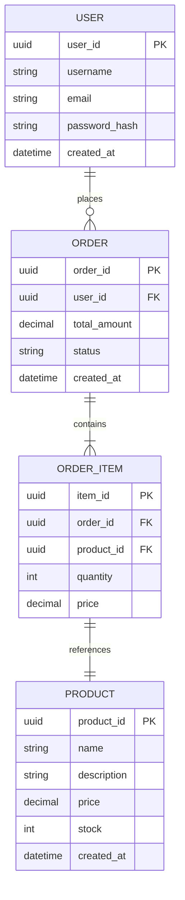
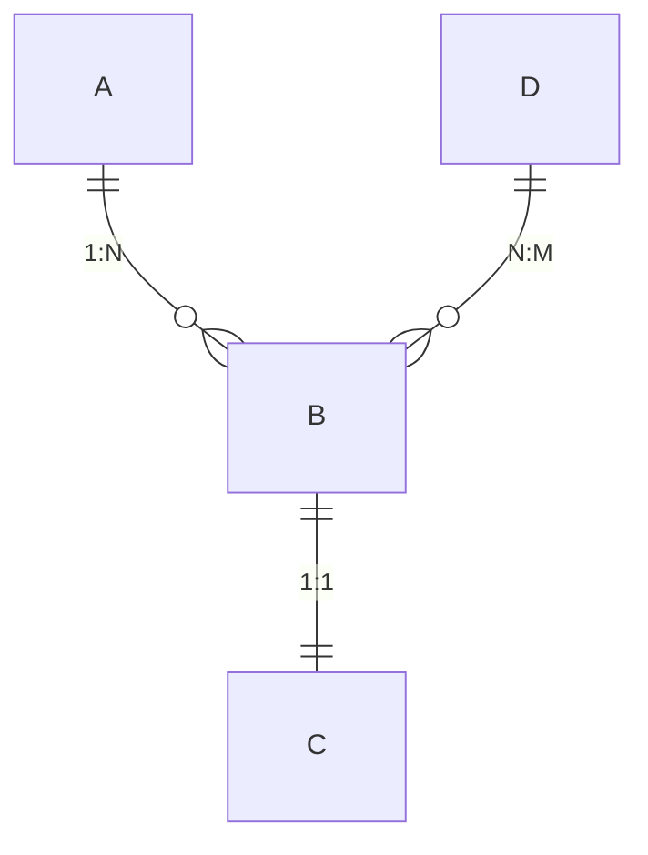

# Database Design Specification (DD)

## Document Information

| Item | Content |
|------|---------|
| Document Name | Database Design Specification |
| Document Number | DD-{{projectCode}}-V1.0 |
| Version | V1.0 |
| Date | {{createdDate}} |
| Author | {{author}} |

---

## 1. Introduction

### 1.1 Purpose

This document defines the database design scheme for **{{projectName}}**, including conceptual structure, logical structure, and physical structure design.

### 1.2 Scope

Applies to database development, testing, and maintenance.

---

## 2. Conceptual Structure Design

### 2.1 ER Diagram



### 2.2 Entity Description

#### 2.2.1 [Entity 1]

**Description**: [Description]

**Attributes**:
| Attribute Name | Type | Description |
|----------------|------|-------------|
| [Attribute 1] | [Type] | [Description] |

---

## 3. Logical Structure Design

### 3.1 Table Structure Design

#### 3.1.1 [Table Name] (table_name)

**Description**: [Description]

| No. | Field Name | Chinese Name | Data Type | Length | Primary Key | Not Null | Default | Description |
|-----|------------|--------------|-----------|--------|-------------|----------|---------|-------------|
| 1 | [Field 1] | {{author}} | [Type] | [Length] | PK | NOT NULL | [Value] | [Description] |
| 2 | [Field 2] | {{author}} | [Type] | [Length] | | NOT NULL | [Value] | [Description] |
| 3 | [Field 3] | {{author}} | [Type] | [Length] | | | [Value] | [Description] |
| 4 | [Field 4] | {{author}} | [Type] | [Length] | | | [Value] | [Description] |
| 5 | [Field 5] | {{author}} | [Type] | [Length] | | | [Value] | [Description] |
| 6 | gmt_create | Create Time | datetime | | | NOT NULL | CURRENT_TIMESTAMP | |
| 7 | gmt_modified | Modify Time | datetime | | | NOT NULL | CURRENT_TIMESTAMP ON UPDATE | |

**Indexes**:
| Index Name | Index Type | Fields | Description |
|------------|------------|--------|-------------|
| idx_[Field] | [BTREE/HASH] | [Field name] | [Description] |
| uk_[Field] | UNIQUE | [Field name] | [Description] |

**Constraints**:
| Constraint Name | Type | Fields | Condition |
|------------------|------|--------|-----------|
| [Constraint name] | [CHECK/UNIQUE] | [Field] | [Condition] |

#### 3.1.2 [Table Name 2]

[Same structure as above]

### 3.2 Table Relationship Summary



| Relationship | Primary Table | Foreign Table | Relationship Type |
|--------------|---------------|---------------|-------------------|
| A-B | A | B | 1:N |
| B-C | B | C | 1:1 |
| D-B | D | B | N:M |

---

## 4. Physical Structure Design

### 4.1 Tablespace Design

| Tablespace Name | Purpose | Size | Extension Strategy |
|-----------------|---------|------|-------------------|
| [Tablespace 1] | [Purpose] | [Initial size] | [Auto extend] |

### 4.2 Storage Parameters

| Parameter | Value | Description |
|-----------|-------|-------------|
| CHARSET | UTF8MB4 | Character set |
| COLLATE | utf8mb4_unicode_ci | Collation |
| ENGINE | InnoDB | Storage engine |

### 4.3 Partition Strategy

| Table Name | Partition Type | Partition Key | Partition Count |
|------------|---------------|--------------|-----------------|
| [Table name] | [RANGE/LIST/HASH] | [Field] | [Count] |

---

## 5. Index Design

### 5.1 Index Summary

| Table Name | Index Name | Type | Fields | Unique | Description |
|------------|------------|------|--------|--------|-------------|
| [Table 1] | idx_Field1 | BTREE | Field1, Field2 | No | [Description] |
| [Table 1] | uk_Field2 | BTREE | Field2 | Yes | [Description] |

### 5.2 Index Design Principles

- Prioritize building indexes on high-selectivity fields
- Avoid building indexes on frequently updated fields
- Composite indexes follow the leftmost prefix principle
- Periodically analyze index usage and delete invalid indexes

---

## 6. View Design

### 6.1 View List

| View Name | Description | Base Tables |
|-----------|-------------|-------------|
| [View 1] | [Description] | [Table1, Table2] |

### 6.2 View Definition

#### 6.2.1 [View Name]

```sql
CREATE VIEW view_name AS
SELECT
    t1.field1,
    t2.field2
FROM table1 t1
LEFT JOIN table2 t2 ON t1.id = t2.t1_id
WHERE t1.status = 'ACTIVE';
```

---

## 7. Trigger Design

### 7.1 Trigger List

| Trigger Name | Trigger Event | Trigger Timing | Target Table | Description |
|--------------|---------------|----------------|---------------|-------------|
| [Trigger 1] | [INSERT/UPDATE/DELETE] | [BEFORE/AFTER] | [Table name] | [Description] |

### 7.2 Trigger Definition

```sql
DELIMITER //

CREATE TRIGGER trigger_name
[BEFORE/AFTER] [INSERT/UPDATE/DELETE] ON table_name
FOR EACH ROW
BEGIN
    -- Trigger logic
END//

DELIMITER ;
```

---

## 8. Stored Procedures and Functions

### 8.1 Stored Procedures

| Procedure Name | Parameters | Description |
|----------------|-------------|-------------|
| [Procedure 1] | [IN/OUT] param type | [Description] |

### 8.2 Stored Functions

| Function Name | Parameters | Return Type | Description |
|---------------|-------------|-------------|-------------|
| [Function 1] | param type | type | [Description] |

---

## 9. Data Initialization

### 9.1 Initial Data

| Table Name | Purpose | Data Volume |
|-------------|---------|-------------|
| [Table 1] | [Initial data/Test data] | [Count] |

### 9.2 Data Dictionary

[Detailed data dictionary definitions]

---

## 10. Database Security Design

### 10.1 User Permissions

| User | Host | Permissions | Scope |
|------|------|-------------|-------|
| [User 1] | localhost | SELECT, INSERT, UPDATE, DELETE | [DB].[Table] |
| [User 2] | % | SELECT | [DB].* |

### 10.2 Security Policies

- Password strength requirements: length ≥ 8, containing uppercase, lowercase, numbers, and special characters
- Regular password rotation: 90 days
- IP access control: Limit access IP range
- Audit logs: Record all DDL operations

---

**Document Approval**:

| Role | Name | Date | Signature |
|------|------|------|-----------|
| DBA | | | |
| Technical Lead | | | |