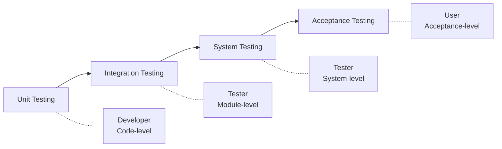
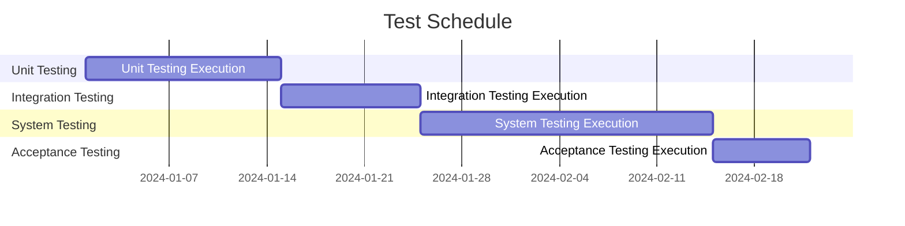

# Test Plan Specification (TP)

## Document Information

| Item | Content |
|------|---------|
| Document Name | Test Plan Specification |
| Document Number | TP-{{projectCode}}-V1.0 |
| Version | V1.0 |
| Date | {{createdDate}} |
| Author | {{author}} |

---

## Version History

| Version | Date | Author | Description |
|---------|------|--------|-------------|
| V1.0 | {{createdDate}} | {{author}} | Initial version |

---

## 1. Introduction

### 1.1 Purpose

This document defines the test strategy, test methods, test resource arrangements, and schedule plan for **{{projectName}}**.

### 1.2 Test Scope

| Test Type | Coverage |
|-----------|----------|
| Unit Testing | Core business logic code |
| Integration Testing | Inter-module interface calls |
| System Testing | Complete system functions |
| Acceptance Testing | User requirement satisfaction |

---

## 2. Test Strategy

### 2.1 Test Levels

### 2.2 Test Methods

| Test Type | Method | Description |
|-----------|--------|-------------|
| Black Box Testing | Functional verification | Verify functions based on requirements |
| White Box Testing | Structural coverage | Design test cases based on code structure |
| Gray Box Testing | Interface verification | Verify interfaces combining black and white box |
| Automated Testing | Script execution | Automate repetitive tests |
| Performance Testing | Load simulation | Verify performance metrics |

### 2.3 Test Entry and Exit Criteria

#### 2.3.1 Entry Criteria

| Test Phase | Entry Conditions |
|------------|------------------|
| Unit Testing | Code completed, coverage ≥ 80% |
| Integration Testing | Unit tests passed, modules integrated |
| System Testing | Integration tests passed, system deployed |
| Acceptance Testing | System tests passed, stable version released |

#### 2.3.2 Exit Criteria

| Test Phase | Exit Conditions |
|------------|-----------------|
| Unit Testing | Branch coverage ≥ 80%, no high-severity defects |
| Integration Testing | Interface test pass rate 100%, no blocking defects |
| System Testing | Functional test pass rate ≥ 95%, no critical defects |
| Acceptance Testing | User confirms all requirements met |

---

## 3. Test Resources

### 3.1 Human Resources

| Tester | Role | Responsibility | Time Investment |
|--------|------|----------------|----------------|
| [Name 1] | Test Manager | Test plan development, schedule control | X person-months |
| [Name 2] | Test Engineer | Functional test execution | X person-months |
| [Name 3] | Automation Engineer | Automated test development | X person-months |
| [Name 4] | Performance Engineer | Performance test execution | X person-months |

### 3.2 Test Environment

| Environment | Purpose | Configuration | Software |
|-------------|---------|---------------|----------|
| Development | Daily testing | [Config] | [Software list] |
| Testing | Functional testing | [Config] | [Software list] |
| Staging | Acceptance testing | [Config] | [Software list] |
| Production | Final verification | [Config] | [Software list] |

### 3.3 Test Tools

| Tool Type | Tool Name | Version | Purpose |
|-----------|-----------|---------|---------|
| Defect Management | [Jira/Mantis] | [Version] | Defect tracking |
| Test Management | [TestRail/Zephyr] | [Version] | Test case management |
| Automation Framework | [Selenium/JUnit/TestNG] | [Version] | Automated testing |
| Performance Testing | [JMeter/LoadRunner] | [Version] | Performance testing |
| API Testing | [Postman/SoapUI] | [Version] | API testing |

---

## 4. Test Schedule Plan

### 4.1 Test Milestones

### 4.2 Detailed Schedule

| Phase | Task | Owner | Start Date | End Date | Work Days |
|-------|------|-------|------------|----------|-----------|
| Unit Testing | Test case writing | {{author}} | {{createdDate}} | {{createdDate}} | X days |
| Unit Testing | Test execution | {{author}} | {{createdDate}} | {{createdDate}} | X days |
| Unit Testing | Defect tracking | {{author}} | {{createdDate}} | {{createdDate}} | X days |
| Integration Testing | Interface testing | {{author}} | {{createdDate}} | {{createdDate}} | X days |
| ... | ... | ... | ... | ... | ... |

---

## 5. Test Case Design

### 5.1 Case Design Methods

| Method | Applicable Scenario | Description |
|--------|-------------------|-------------|
| Equivalence Partitioning | Many input items | Partition valid/invalid equivalence classes |
| Boundary Value Analysis | Numeric ranges | Test boundary values |
| Decision Table | Multi-condition combinations | Condition combination testing |
| Scenario Method | Business processes | Basic/alternative/exception scenarios |
| Orthogonal Testing | Multi-factor combinations | Factor-level combinations |

### 5.2 Case Example

#### 5.2.1 [Function Module] - [Test Point]

| Case ID | TC-[Module]-001 |
|---------|-----------------|
| Case Name | {{author}} |
| Priority | [P0/P1/P2/P3] |
| Precondition | [Condition] |
| Test Steps | 1. [Step 1] 2. [Step 2] 3. [Step 3] |
| Test Data | [Data] |
| Expected Result | [Result] |

---

## 6. Risk Assessment

### 6.1 Test Risk Identification

| Risk ID | Risk Description | Probability | Impact | Mitigation Strategy |
|---------|------------------|-------------|--------|-------------------|
| R-001 | [Risk 1] | [High/Medium/Low] | [High/Medium/Low] | [Strategy] |
| R-002 | [Risk 2] | [High/Medium/Low] | [High/Medium/Low] | [Strategy] |

### 6.2 Risk Response Plan

- **Avoidance**: Take preventive measures to eliminate risks
- **Transfer**: Purchase insurance or outsource
- **Mitigation**: Take measures to reduce probability or impact
- **Acceptance**: Accept residual risks

---

## 7. Quality Metrics

### 7.1 Test Coverage

| Metric | Target Value |
|--------|--------------|
| Code Coverage | ≥ 80% |
| Branch Coverage | ≥ 80% |
| Requirements Coverage | 100% |
| Case Execution Rate | 100% |

### 7.2 Defect-Related Metrics

| Metric | Target Value |
|--------|--------------|
| Defect Density | ≤ [X] defects/KLOC |
| Defect Fix Rate | ≥ 95% |
| Miss Rate | ≤ [X]% |
| Defect Severity Distribution | Critical: High, Normal: Medium, Minor: Low |

---

## 8. Appendices

### 8.1 Test Terminology Glossary

| Term | Definition |
|------|------------|
| [Term] | [Definition] |

### 8.2 Reference Documents

| Document Name | Document Number | Description |
|--------------|-----------------|-------------|
| [Document 1] | [Number] | [Description] |

---

**Document Approval**:

| Role | Name | Date | Signature |
|------|------|------|-----------|
| Test Manager | | | |
| Project Manager | | | |
| Quality Lead | | | |