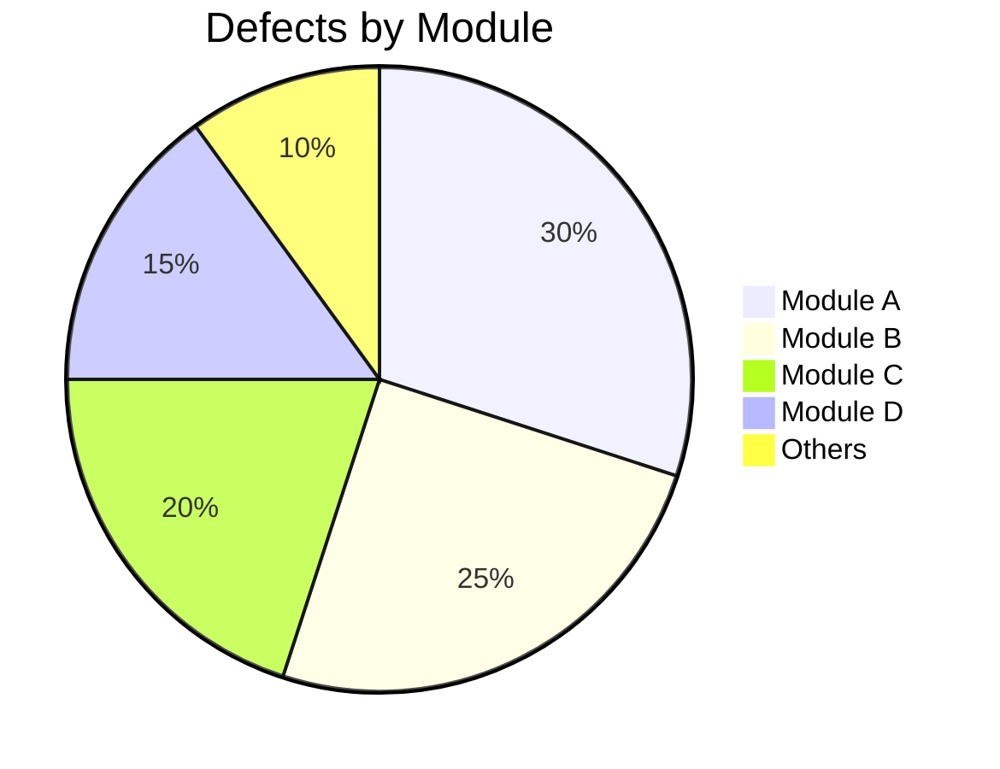
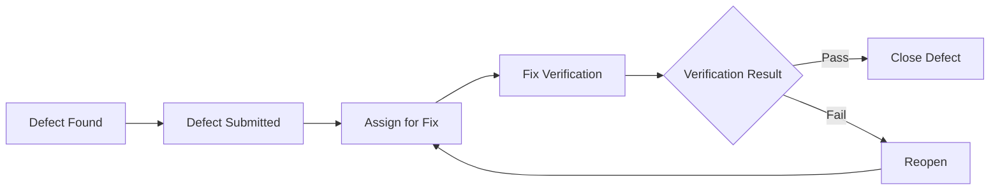

# Test Report (TR)

## Document Information

| Item | Content |
|------|---------|
| Document Name | Test Report |
| Document Number | TR-{{projectCode}}-V1.0 |
| Version | V1.0 |
| Date | {{createdDate}} |
| Author | {{author}} |

---

## Version History

| Version | Date | Author | Description |
|---------|------|--------|-------------|
| V1.0 | {{createdDate}} | {{author}} | Initial version |

---

## 1. Test Overview

### 1.1 Test Background

[Describe the background and purpose of this test]

### 1.2 Test Scope

| Test Type | Test Scope |
|-----------|------------|
| Unit Testing | [Module list] |
| Integration Testing | [Module list] |
| System Testing | [Function list] |
| Performance Testing | [Scenario list] |

### 1.3 Test Environment

| Environment | Configuration | Software Version |
|-------------|---------------|------------------|
| [Environment name] | [CPU/Memory/Disk] | [Software version list] |

---

## 2. Test Execution Summary

### 2.1 Test Progress

```mermaid
gantt
    title Test Execution Progress
    dateFormat YYYY-MM-DD
    section Execution Stats
    Planned Test Cases       :2024-01-01, 0d
    Executed Test Cases     :0d, 7d
    Passed Test Cases       :0d, 7d
    Failed Test Cases       :0d, 7d
    Blocked Test Cases      :0d, 7d
```

### 2.2 Execution Statistics

| Metric | Planned | Actual | Completion Rate |
|--------|---------|--------|----------------|
| Total Test Cases | X | X | X% |
| Executed Cases | X | X | X% |
| Passed Cases | - | X | X% |
| Failed Cases | - | X | X% |
| Blocked Cases | - | X | X% |

### 2.3 Case Execution Details

| Module | Total | Passed | Failed | Blocked | Pass Rate |
|--------|-------|--------|--------|---------|-----------|
| [Module 1] | X | X | X | X | X% |
| [Module 2] | X | X | X | X | X% |
| Total | X | X | X | X | X% |

---

## 3. Defect Analysis

### 3.1 Defect Summary

| Severity | New | Fixed | Unfixed | Fix Rate |
|----------|-----|-------|---------|----------|
| Critical (S1) | X | X | X | X% |
| High (S2) | X | X | X | X% |
| Medium (S3) | X | X | X | X% |
| Low (S4) | X | X | X | X% |
| Total | X | X | X | X% |

### 3.2 Defect Distribution



### 3.3 Defect Trend



### 3.4 Unresolved Defect List

| Defect ID | Defect Title | Severity | Module | Status | Remarks |
|-----------|--------------|----------|--------|--------|---------|
| [ID-001] | [Title] | S2 | [Module] | [Open/Deferred] | [Remarks] |

---

## 4. Test Results Analysis

### 4.1 Functional Test Results

| Function | Test Result | Description |
|----------|-------------|-------------|
| [Function 1] | [Pass/Fail] | [Description] |
| [Function 2] | [Pass/Fail] | [Description] |

### 4.2 Performance Test Results

| Metric | Target Value | Actual Value | Result |
|--------|--------------|--------------|--------|
| Response Time | ≤ 2s | Xs | [Met/Not Met] |
| Concurrent Users | ≥ 100 | X | [Met/Not Met] |
| TPS | ≥ 50 | X | [Met/Not Met] |
| CPU Usage | ≤ 80% | X% | [Met/Not Met] |

### 4.3 Security Test Results

| Test Item | Result | Description |
|-----------|--------|-------------|
| [Test Item 1] | [Pass/Fail] | [Description] |

---

## 5. Test Quality Assessment

### 5.1 Test Coverage

| Coverage Type | Coverage | Target | Result |
|--------------|----------|--------|--------|
| Requirements Coverage | X% | 100% | [Met/Not Met] |
| Code Coverage | X% | ≥80% | [Met/Not Met] |
| Branch Coverage | X% | ≥80% | [Met/Not Met] |

### 5.2 Quality Assessment

| Quality Dimension | Assessment Result |
|------------------|-------------------|
| Functional Completeness | [Excellent/Good/Fair/Poor] |
| Defect Fix Quality | [Excellent/Good/Fair/Poor] |
| Performance Compliance | [Excellent/Good/Fair/Poor] |
| Overall Quality Level | [Excellent/Good/Fair/Poor] |

---

## 6. Risks and Remaining Issues

### 6.1 Remaining Risks

| Risk ID | Risk Description | Impact | Suggested Measures |
|---------|------------------|--------|-------------------|
| [ID-001] | [Description] | [Impact description] | [Measures] |

### 6.2 Remaining Issues

| Issue ID | Issue Description | Severity | Cause | Handling Suggestion |
|----------|-------------------|----------|-------|--------------------|
| [ID-001] | [Description] | [Level] | [Cause] | [Suggestion] |

---

## 7. Test Conclusions and Recommendations

### 7.1 Test Conclusion

**[System Name]** has [passed/failed] the acceptance test this time.

- Functional Testing: [X] function points, [X] passed, [X] not passed
- Performance Testing: [X] metrics met, [X] not met
- Defect Fix Rate: [X]%
- Conclusion: [Overall assessment]

### 7.2 Improvement Recommendations

1. [Recommendation 1]
2. [Recommendation 2]
3. [Recommendation 3]

---

## 8. Appendices

### 8.1 Test Case Execution Details

[Detailed test case execution result list]

### 8.2 Defect List

[Complete defect list]

---

**Document Approval**:

| Role | Name | Date | Signature |
|------|------|------|-----------|
| Test Lead | | | |
| Technical Lead | | | |
| Project Manager | | | |
| Customer Representative | | | |