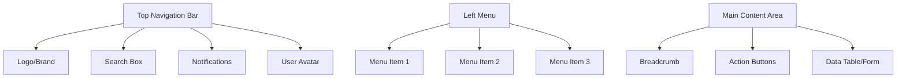

# User Manual (UM)

## Document Information

| Item | Content |
|------|---------|
| Document Name | User Manual |
| Document Number | UM-{{projectCode}}-V1.0 |
| Version | V1.0 |
| Date | {{createdDate}} |

---

## Table of Contents

1. Product Introduction
2. System Requirements
3. Installation and Deployment
4. Quick Start
5. Function Description
6. FAQ
7. Appendices

---

## 1. Product Introduction

### 1.1 Product Overview

**{{projectName}}** is a [product positioning description]...

### 1.2 Main Features

| Feature Module | Feature Description |
|----------------|---------------------|
| [Module 1] | [Description] |
| [Module 2] | [Description] |
| [Module 3] | [Description] |

### 1.3 Product Features

- **Feature 1**: [Description]
- **Feature 2**: [Description]
- **Feature 3**: [Description]

---

## 2. System Requirements

### 2.1 Client Requirements

#### 2.1.1 Web Browser

| Browser | Minimum Version | Recommended Version |
|---------|-----------------|---------------------|
| Chrome | 90+ | Latest |
| Firefox | 88+ | Latest |
| Safari | 14+ | Latest |
| Edge | 90+ | Latest |

#### 2.1.2 Mobile

| Platform | Minimum Version | Recommended Version |
|----------|-----------------|---------------------|
| iOS | 14+ | Latest |
| Android | 11+ | Latest |

### 2.2 Network Requirements

- Recommended bandwidth: ≥ 2Mbps
- Supported network types: WiFi, 4G, 5G

---

## 3. Installation and Deployment

### 3.1 Web Access

**Access URL**: `https://[domain]`

**First Access Steps**:
1. Open browser and enter access URL
2. Enter login page
3. Enter username and password (contact admin for initial account)
4. Change password after first login

### 3.2 Mobile Installation

#### iOS
1. Open App Store
2. Search "[App Name]"
3. Tap Install
4. Open app after installation

#### Android
1. Open app store
2. Search "[App Name]"
3. Tap Install
4. Open app after installation

---

## 4. Quick Start

### 4.1 Login to System

```
Step 1: Open login page
Step 2: Enter username and password
Step 3: Click "Login" button
Step 4: First-time login requires binding phone/email
Step 5: Login successful, enter homepage
```

### 4.2 Interface Introduction



| Area | Description |
|------|-------------|
| Top Navigation Bar | Logo, search, notifications, user info |
| Left Menu | Feature module navigation |
| Main Content Area | Business data display and operation area |

### 4.3 Basic Operations

#### How to Search
1. Enter keywords in search box
2. Press Enter or click search icon
3. View search results

#### How to Create
1. Click "New" or "Add" button
2. Fill in form information
3. Click "Save" button
4. Prompt "Saved successfully"

#### How to Edit
1. Find the record to edit in the list
2. Click "Edit" button
3. Modify form information
4. Click "Save" button

#### How to Delete
1. Find the record to delete in the list
2. Click "Delete" button
3. Confirm deletion prompt
4. Prompt "Deleted successfully"

---

## 5. Function Description

### 5.1 [Function Module 1]

#### 5.1.1 Function Entry

Path: [Menu path]

#### 5.1.2 Function Description

[Detailed function description]

#### 5.1.3 Operation Guide

**Step 1**: [Operation description]
**Step 2**: [Operation description]
**Step 3**: [Operation description]

#### 5.1.4 Interface Screenshots

[Screenshot location]

### 5.2 [Function Module 2]

[Same structure as above]

---

## 6. FAQ

### 6.1 Login Related

| Question | Solution |
|----------|----------|
| What if I forgot my password? | Click "Forgot Password" on login page, reset via bound phone/email |
| What if my account is locked? | Contact system administrator to unlock |
| Login shows "Verification code error" | Refresh page and get new verification code |

### 6.2 Operation Related

| Question | Solution |
|----------|----------|
| What if save fails? | Check if required fields are filled, or contact admin |
| What if data export fails? | Check network connection, or try exporting in batches |
| Page loads slowly | Clear browser cache, or switch to recommended browser |

### 6.3 Other Questions

| Question | Solution |
|----------|----------|
| How to modify personal info? | Click avatar in top right, select "Personal Settings" |
| How to change password? | Click avatar in top right, select "Change Password" |
| How to contact technical support? | Send email to [Support email] or call [Support phone] |

---

## 7. Appendices

### 7.1 Keyboard Shortcuts

| Shortcut | Function |
|----------|----------|
| Ctrl + S | Save |
| Ctrl + Z | Undo |
| Ctrl + F | Search |
| Esc | Cancel/Close |

### 7.2 Terminology

| Term | Explanation |
|------|-------------|
| [Term 1] | [Explanation] |

### 7.3 Contact Information

| Type | Information |
|------|-------------|
| Technical Support Email | [Email] |
| Technical Support Phone | [Phone] |
| Official Website | [URL] |

---

## Version History

| Version | Date | Update Content |
|---------|------|---------------|
| V1.0 | {{createdDate}} | Initial release |

---

**Document Completed**