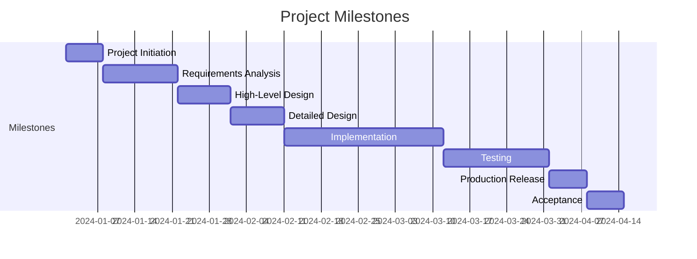
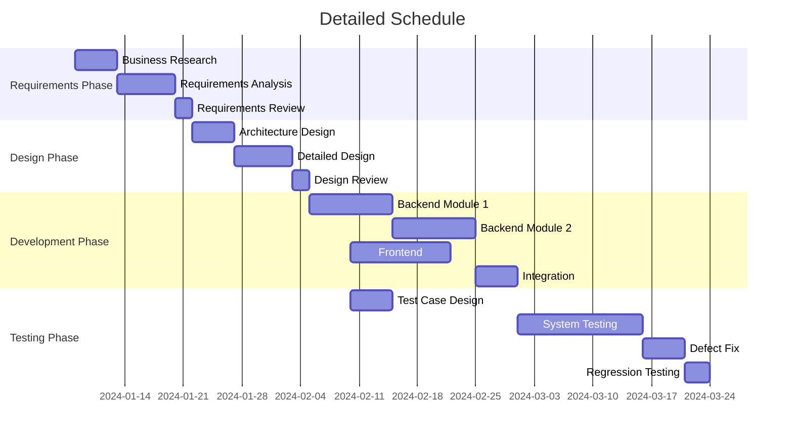

# Project Plan (PP)

## Document Information

| Item | Content |
|------|---------|
| Document Name | Project Plan |
| Document Number | PP-{{projectCode}}-V1.0 |
| Version | V1.0 |
| Date | {{createdDate}} |
| Project Manager | [Project Manager Name] |

---

## Version History

| Version | Date | Author | Description |
|---------|------|--------|-------------|
| V1.0 | {{createdDate}} | {{author}} | Initial version |

---

## 1. Project Overview

### 1.1 Project Background

[Describe the reasons and business background for the project]

### 1.2 Project Objectives

| Objective ID | Objective Description | Measurement Criteria |
|--------------|---------------------|---------------------|
| OBJ-001 | [Objective 1] | [Standard] |
| OBJ-002 | [Objective 2] | [Standard] |

### 1.3 Project Scope

**Included Scope**:
- [Scope 1]
- [Scope 2]

**Excluded Scope**:
- [Excluded Item 1]
- [Excluded Item 2]

### 1.4 Assumptions and Constraints

| Type | Content | Impact |
|------|---------|--------|
| Assumption | [Assumption condition] | [Impact description] |
| Schedule Constraint | [Time requirement] | [Impact description] |
| Resource Constraint | [Resource limitation] | [Impact description] |

---

## 2. Project Organization

### 2.1 Organization Structure

```mermaid
graph TB
    PM[Project Manager\n[Name]] --> TL1[Tech Lead\n[Name]]
    PM --> TL2[Test Lead\n[Name]]

    TL1 --> DEV1[Software Engineer 1\n[Name]]
    TL1 --> DEV2[Software Engineer 2\n[Name]]

    TL2 --> QA1[QA Engineer 1\n[Name]]
    TL2 --> QA2[QA Engineer 2\n[Name]]

    PM --> UI[UI Designer\n[Name]]
```

### 2.2 Roles and Responsibilities

| Role | Name | Main Responsibilities |
|------|------|----------------------|
| Project Manager | [Name] | Overall project management, schedule control, stakeholder communication |
| Technical Lead | [Name] | Technical architecture, technical decisions, code review |
| Software Engineer | [Name] | Feature development, unit testing |
| Test Lead | [Name] | Test planning, case design, defect management |
| QA Engineer | [Name] | Test execution, test reporting |
| UI Designer | [Name] | Interface design, interaction design |

---

## 3. Milestone Plan

### 3.1 Project Milestones

| Milestone ID | Milestone Name | Planned Completion | Actual Completion | Status |
|--------------|---------------|-------------------|-------------------|--------|
| M1 | Project Initiation | {{createdDate}} | {{createdDate}} | [Completed/In Progress/Pending] |
| M2 | Requirements Analysis Complete | {{createdDate}} | {{createdDate}} | [Completed/In Progress/Pending] |
| M3 | High-Level Design Complete | {{createdDate}} | {{createdDate}} | [Completed/In Progress/Pending] |
| M4 | Detailed Design Complete | {{createdDate}} | {{createdDate}} | [Completed/In Progress/Pending] |
| M5 | Development Complete | {{createdDate}} | {{createdDate}} | [Completed/In Progress/Pending] |
| M6 | Testing Complete | {{createdDate}} | {{createdDate}} | [Completed/In Progress/Pending] |
| M7 | Production Release | {{createdDate}} | {{createdDate}} | [Completed/In Progress/Pending] |
| M8 | Project Acceptance | {{createdDate}} | {{createdDate}} | [Completed/In Progress/Pending] |

### 3.2 Milestone Diagram



---

## 4. Detailed Schedule Plan

### 4.1 WBS (Work Breakdown Structure)

```
{{projectName}}
├── 1. Project Management
│   ├── 1.1 Project Initiation
│   ├── 1.2 Project Planning
│   ├── 1.3 Project Monitoring
│   └── 1.4 Project Closure
├── 2. Requirements Engineering
│   ├── 2.1 Business Research
│   ├── 2.2 Requirements Analysis
│   ├── 2.3 Requirements Review
│   └── 2.4 Requirements Sign-off
├── 3. Software Design
│   ├── 3.1 Architecture Design
│   ├── 3.2 Detailed Design
│   └── 3.3 Design Review
├── 4. Implementation
│   ├── 4.1 Coding Standards
│   ├── 4.2 Module Development
│   ├── 4.3 Code Review
│   └── 4.4 Unit Testing
├── 5. Testing
│   ├── 5.1 Test Planning
│   ├── 5.2 Test Case Design
│   ├── 5.3 Test Execution
│   └── 5.4 Test Reporting
└── 6. Deployment & Operations
    ├── 6.1 Environment Deployment
    ├── 6.2 Data Migration
    ├── 6.3 System Launch
    └── 6.4 Operations Support
```

### 4.2 Task Breakdown Table

| Phase | Task | Owner | Start Date | End Date | Effort (Person-days) | Dependencies |
|-------|------|-------|------------|----------|---------------------|--------------|
| Project Management | Project Initiation | {{author}} | {{createdDate}} | {{createdDate}} | X | - |
| Project Management | Project Planning | {{author}} | {{createdDate}} | {{createdDate}} | X | Project Initiation |
| Requirements | Business Research | {{author}} | {{createdDate}} | {{createdDate}} | X | Project Planning |
| Requirements | Requirements Analysis | {{author}} | {{createdDate}} | {{createdDate}} | X | Business Research |
| ... | ... | ... | ... | ... | ... | ... |

### 4.3 Schedule Diagram



---

## 5. Resource Plan

### 5.1 Human Resources

| Role | Name | Allocation | Time Period |
|------|------|------------|-------------|
| Project Manager | {{author}} | 100% | [Start]-[End] |
| Technical Lead | {{author}} | 100% | [Start]-[End] |
| Software Engineer | {{author}} | 100% | [Start]-[End] |
| QA Engineer | {{author}} | 80% | [Start]-[End] |
| UI Designer | {{author}} | 30% | [Start]-[End] |

### 5.2 Hardware Resources

| Resource Type | Specification | Quantity | Purpose |
|--------------|---------------|----------|---------|
| Development Server | [Spec] | X units | Development & Testing |
| Test Server | [Spec] | X units | Functional Testing |
| Production Server | [Spec] | X units | Production Deployment |

### 5.3 Software Resources

| Software Name | Version | Quantity | Purpose |
|---------------|---------|----------|---------|
| [Software 1] | [Version] | X | [Purpose] |
| [Software 2] | [Version] | X | [Purpose] |

### 5.4 Budget Estimation

| Cost Type | Budget (万元/RMB) | Description |
|-----------|------------------|------------|
| Human Cost | X | Personnel expenses |
| Hardware Cost | X | Servers, etc. |
| Software Cost | X | Licenses, etc. |
| Other Cost | X | Training, travel, etc. |
| **Total** | **X** | |

---

## 6. Risk Management

### 6.1 Risk Identification

| Risk ID | Risk Description | Category | Probability | Impact | Priority |
|---------|------------------|----------|-------------|--------|----------|
| R-001 | [Risk 1] | [Tech/People/Schedule] | [High/Medium/Low] | [High/Medium/Low] | [P0-P3] |
| R-002 | [Risk 2] | [Tech/People/Schedule] | [High/Medium/Low] | [High/Medium/Low] | [P0-P3] |

### 6.2 Risk Response Plan

| Risk ID | Response Strategy | Specific Measures | Owner | Trigger Condition |
|---------|-------------------|-------------------|-------|------------------|
| R-001 | [Avoid/Transfer/Mitigate/Accept] | [Measures] | {{author}} | [Condition] |
| R-002 | [Avoid/Transfer/Mitigate/Accept] | [Measures] | {{author}} | [Condition] |

---

## 7. Communication Management

### 7.1 Communication Plan

| Communication Type | Frequency | Participants | Content | Output |
|-------------------|-----------|--------------|---------|--------|
| Weekly Meeting | Weekly | Project team | Progress sync, issue tracking | Weekly report |
| Milestone Review | Milestone | All stakeholders | Phase review | Review report |
| Daily Communication | Daily | Team members | Task coordination | - |

### 7.2 Reporting Mechanism

| Report Type | Frequency | Recipient | Prepared By |
|-------------|-----------|-----------|-------------|
| Weekly Progress Report | Weekly | Project sponsor | Project Manager |
| Monthly Report | Monthly | Management | Project Manager |
| Milestone Report | Milestone | All stakeholders | Project Manager |

---

## 8. Quality Assurance

### 8.1 Quality Objectives

| Quality Metric | Target Value | Measurement Method |
|--------------|--------------|-------------------|
| Requirements Document Completeness | 100% | Review pass rate |
| Code Review Coverage | ≥ 80% | Reviewed code / Total code |
| Test Case Execution Rate | 100% | Executed cases / Total cases |
| Defect Fix Rate | ≥ 95% | Fixed / Total defects |
| Customer Satisfaction | ≥ 90 points | Satisfaction survey |

### 8.2 Review Plan

| Review Point | Review Content | Reviewers | Time |
|-------------|---------------|-----------|------|
| Requirements Review | SRS document | Tech/Business | {{createdDate}} |
| Design Review | SDS document | Tech team | {{createdDate}} |
| Code Review | Core code | Tech Lead | {{createdDate}} |
| Test Review | Test plan | QA/Tech | {{createdDate}} |

---

**Document Approval**:

| Role | Name | Date | Signature |
|------|------|------|-----------|
| Project Manager | | | |
| Technical Lead | | | |
| Quality Lead | | | |
| Project Sponsor | | | |