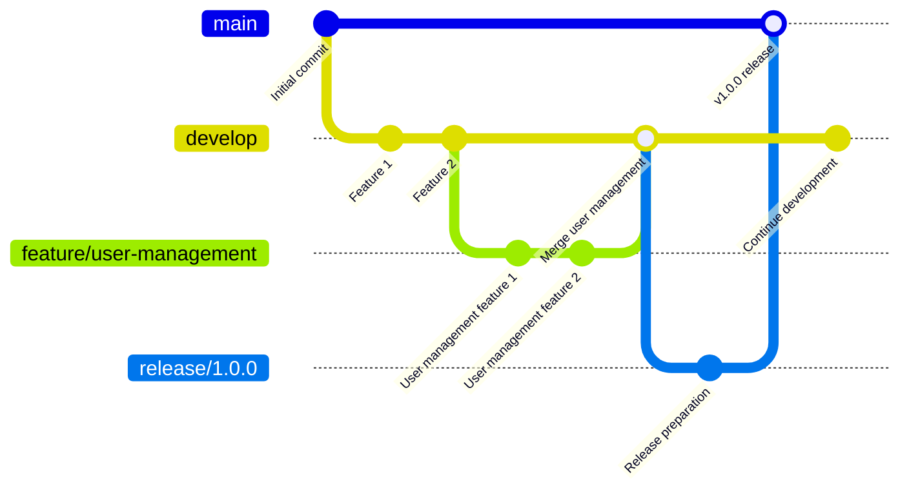
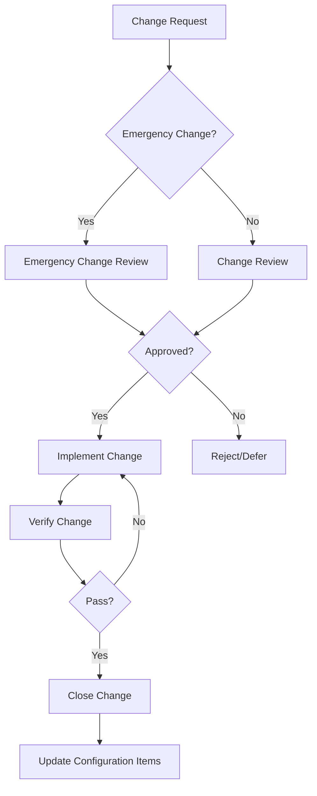

# Configuration Management Plan (CMP)

## Document Information

| Item | Content |
|------|---------|
| Document Name | Configuration Management Plan |
| Document Number | CMP-{{projectCode}}-V1.0 |
| Version | V1.0 |
| Date | {{createdDate}} |
| Configuration Manager | [Configuration Manager Name] |

---

## Version History

| Version | Date | Author | Description |
|---------|------|--------|-------------|
| V1.0 | {{createdDate}} | {{author}} | Initial version |

---

## 1. Introduction

### 1.1 Purpose

This document defines the configuration management strategy, processes, and activities for **{{projectName}}**, ensuring the integrity, traceability, and version control of project assets.

### 1.2 Scope

Applies to:
- Source code management
- Document version management
- Defect tracking
- Change control

### 1.3 Definitions and Abbreviations

| Term | Definition |
|------|------------|
| SCM | Software Configuration Management |
| Baseline | A set of configuration items that have been formally reviewed and approved |
| Configuration Item | An entity that is placed under configuration management |
| Change Control | The review and approval process for changes to configuration items |

---

## 2. Configuration Management Strategy

### 2.1 Configuration Management Tools

| Tool Type | Tool Name | Version | Purpose |
|-----------|-----------|---------|---------|
| Version Control | Git | 2.x+ | Source code management |
| Code Repository | GitHub/GitLab/Gitee | - | Remote repository |
| Document Management | [Confluence/Others] | - | Document storage |
| Defect Management | [Jira/Mantis] | - | Defect tracking |
| Package Management | [Nexus/Artifactory] | - | Artifact repository |

### 2.2 Branch Strategy



#### 2.2.1 Branch Type Description

| Branch Type | Naming Convention | Lifecycle | Description |
|-------------|------------------|-----------|-------------|
| main/master | main | Permanent | Official release version |
| develop | develop | Permanent | Main development branch |
| feature/* | feature/feature-name | Temporary | Feature branches |
| release/* | release/version | Temporary | Release branches |
| hotfix/* | hotfix/issue-description | Temporary | Emergency fix branches |

#### 2.2.2 Branch Merge Rules

- feature → develop: Pull Request + Code Review
- release → main: Pull Request + Tests Passed + Release Approval
- hotfix → main + develop: Pull Request + Emergency Approval

### 2.3 Version Naming Convention

**Format**: `Major.Minor.Patch`

| Identifier | Meaning | Change Rule |
|------------|---------|-------------|
| Major | Major architecture changes | Incompatible API changes |
| Minor | New features | Backward-compatible feature additions |
| Patch | Bug fixes | Backward-compatible bug fixes |

**Example**: `v1.2.3`
- 1: Major version number
- 2: Minor version number
- 3: Patch version number

---

## 3. Configuration Item Identification

### 3.1 Configuration Item Classification

| Configuration Item Type | ID Format | Storage Location |
|------------------------|----------|-----------------|
| Source Code | src/* | Git repository |
| Configuration Files | config/* | Git repository |
| Documents | docs/* | Git repository/Confluence |
| Database Scripts | sql/* | Git repository |
| Dependencies | lib/* | Artifact repository |
| Released Artifacts | *-release/* | Artifact repository |
| Test Cases | test/* | Git repository |

### 3.2 Configuration Item List

| CI ID | CI Name | Type | Storage Location | Owner |
|-------|---------|------|-----------------|-------|
| CI-001 | Source Code | source | Git | Development Lead |
| CI-002 | Requirements Documents | document | Confluence | Product Manager |
| CI-003 | Design Documents | document | Confluence | Technical Lead |
| CI-004 | Test Cases | test | Git | Test Lead |
| CI-005 | Deployment Scripts | script | Git | Ops Lead |
| CI-006 | Released Artifacts | release | Artifact Repository | Ops Lead |

---

## 4. Change Control Process

### 4.1 Change Process



### 4.2 Change Types and Approval Authority

| Change Type | Impact Scope | Approver | Response Time |
|-------------|--------------|----------|---------------|
| Emergency Change | Business interruption/Critical defect | PM + Tech Lead | 4 hours |
| Major Change | Architecture adjustment/Core feature | PM + Tech Lead + Customer | 3 days |
| Normal Change | Feature adjustment/Non-core | Tech Lead | 1 day |
| Minor Change | Code optimization/Doc correction | Dev Lead | Immediate |

### 4.3 Change Request Form

| Field | Content |
|-------|---------|
| Change ID | [Auto-generated] |
| Change Title | [Title] |
| Change Type | [Emergency/Major/Normal/Minor] |
| Change Description | [Detailed description] |
| Change Reason | [Reason] |
| Change Impact | [Impact analysis] |
| Implementation Plan | [Plan] |
| Rollback Plan | [Plan] |
| Requester | {{author}} |
| Request Date | {{createdDate}} |
| Approver | {{author}} |
| Approval Opinion | [Opinion] |
| Approval Date | {{createdDate}} |

---

## 5. Baseline Management

### 5.1 Baseline Definition

| Baseline Name | Baseline Content | Review Time | Approver |
|--------------|-----------------|-------------|----------|
| Functional Baseline | Requirements Specification SRS | After requirements review | Product Manager |
| Design Baseline | Software Design Specification SDS | After design review | Technical Lead |
| Product Baseline | Releaseable version vX.X.X | Before release | Project Manager |

### 5.2 Baseline Release Process

1. Trigger: Baseline release criteria met
2. Review: Configuration audit + Change confirmation
3. Create: Tag + Archive
4. Notify: Baseline release notification

---

## 6. Configuration Audit

### 6.1 Audit Types

| Audit Type | Frequency | Executor | Content |
|-----------|-----------|----------|---------|
| Functional Configuration Audit | Monthly | Config Manager | Configuration item completeness check |
| Physical Configuration Audit | Quarterly | QA | Configuration storage media check |
| Release Audit | Each release | Config Manager | Release consistency check |

### 6.2 Audit Checklist

| Check Item | Check Content | Result |
|-----------|---------------|--------|
| Identification Completeness | All configuration items have unique identifiers | [Pass/Fail] |
| Storage Completeness | All configuration items in controlled storage | [Pass/Fail] |
| Change Records | Complete change records | [Pass/Fail] |
| Version Consistency | Related configuration item versions are consistent | [Pass/Fail] |

---

## 7. Backup and Recovery

### 7.1 Backup Strategy

| Data Type | Backup Frequency | Retention Period | Storage Location |
|-----------|-----------------|------------------|-----------------|
| Source Code Repository | Real-time sync | Permanent | Primary + Mirror |
| Configuration Repository | Daily incremental | 90 days | Local + Cloud |
| Artifact Repository | Weekly full | 1 year | Local + Cloud |
| Document Repository | Daily incremental | 90 days | Local + Cloud |

### 7.2 Recovery Testing

| Test Type | Frequency | Owner | Record |
|-----------|-----------|-------|--------|
| Data Recovery Test | Quarterly | Config Manager | [Record location] |
| Drill | Semi-annually | Ops Lead | [Record location] |

---

## 8. Roles and Responsibilities

| Role | Responsibilities | Personnel |
|------|------------------|------------|
| Configuration Manager | Daily config management, backup, audit | {{author}} |
| Development Lead | Code branch management, merge approval | {{author}} |
| Release Manager | Artifact release, version management | {{author}} |
| Project Manager | Change approval, baseline release | {{author}} |

---

## 9. Appendices

### 9.1 Git Command Reference

```bash
# Create feature branch
git checkout develop
git pull origin develop
git checkout -b feature/feature-name

# Merge to develop
git checkout develop
git pull origin develop
git merge feature/feature-name
git push origin develop

# Create release branch
git checkout develop
git pull origin develop
git checkout -b release/v1.0.0
# After release, merge to main and develop
```

### 9.2 Configuration Management Checklist

- [ ] Configuration management tools installed and configured
- [ ] Branch strategy established and communicated
- [ ] Access permissions configured
- [ ] Backup strategy configured
- [ ] Change process trained

---

**Document Approval**:

| Role | Name | Date | Signature |
|------|------|------|-----------|
| Configuration Manager | | | |
| Technical Lead | | | |
| Project Manager | | | |