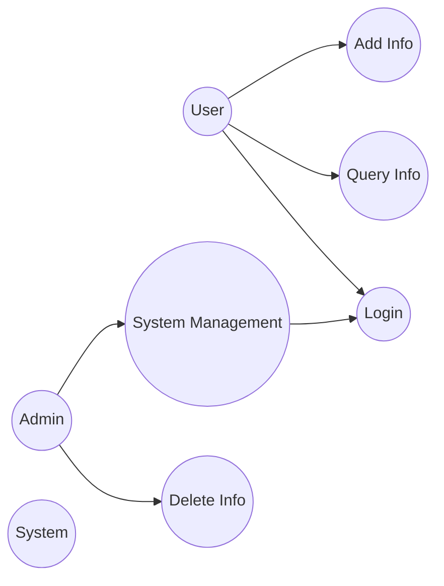

# Use Case Diagram Template

## Template Description

Use Case Diagram is used to describe the interaction between system functions and external actors.

## Basic Syntax

```mermaid
graph LR
    %% Actor definition
    A([Actor]) or A[Actor] or ((Actor))

    %% Use case definition
    U((Use Case))

    %% Relationship definition
    A --> U  %% Association
    A -- "relationship label" --> U  %% Labeled association
    U1 --o|include| U2  %% Include relationship
    U1 --|>extend| U2  %% Extend relationship
    A --|> --> U  %% Generalization
```

## Symbol Reference

| Symbol | Meaning | Description |
|--------|---------|-------------|
| `(--)` | Actor/System Boundary | Rounded rectangle or human icon |
| `((()))` | Use Case | Ellipse |
| `-->` | Association | Solid arrow |
| `--o` | Include | Dashed arrow, labeled "include" |
| `--|>` | Extend | Dashed arrow, labeled "extend" |
| `--\|>` | Generalization | Solid hollow arrow |

## Template Examples

### 1. Simple User Management System Use Case



### 2. Complete E-commerce System Use Case

```mermaid
graph TB
    subgraph "User Roles"
        Customer((Customer))
        Merchant((Merchant))
        Admin((Admin))
    end

    subgraph "Customer Functions"
        UC1((Browse Products))
        UC2((Search Products))
        UC3((Add to Cart))
        UC4((Place Order))
        UC5((Pay Order))
        UC6((View Orders))
        UC7((Review Products))
        UC8((Return/Exchange))
    end

    subgraph "Merchant Functions"
        UC9((Product Management))
        UC10((Order Management))
        UC11((Sales Statistics))
    end

    subgraph "Admin Functions"
        UC12((User Management))
        UC13((Product Review))
        UC14((Data Statistics))
    end

    subgraph "System Functions"
        UC15((User Registration))
        UC16((User Login))
        UC17((Message Notification))
    end

    %% Customer relationships
    Customer --> UC1
    Customer --> UC2
    Customer --> UC3
    Customer --> UC4
    Customer --> UC5
    Customer --> UC6
    Customer --> UC7
    Customer --> UC8

    %% Merchant relationships
    Merchant --> UC9
    Merchant --> UC10
    Merchant --> UC11

    %% Admin relationships
    Admin --> UC12
    Admin --> UC13
    Admin --> UC14

    %% Include and extend relationships
    UC4 ..> UC5 : include
    UC8 ..> UC5 : extend
    UC2 ..> UC1 : extend
```

### 3. Bank Transfer System Use Case

```mermaid
graph TB
    Actor((Customer))
    Bank((Banking System))
    Auth((Authentication System))

    %% Use cases
    Login((Login))
    CheckBalance((Check Balance))
    Transfer((Transfer))
    ViewHistory((View Transaction History))
    ManageAccount((Account Management))

    %% External system use cases
    Notify((SMS Notification))

    %% Relationships
    Actor --> Login
    Actor --> CheckBalance
    Actor --> Transfer
    Actor --> ViewHistory
    Actor --> ManageAccount

    Login --> Auth : include
    Transfer ..> Notify : extend

    Bank --- Auth
    Bank --- Notify
```

## Usage Guide

1. **Identify Actors**: Find all external entities that interact with the system
2. **Identify Use Cases**: Describe system functions from the actor's perspective
3. **Establish Relationships**:
   - Use `include` for mandatory common behaviors
   - Use `extend` for optional extended behaviors
4. **Organize Structure**: Use `subgraph` to group use cases

## Best Practices

- Use verb-object phrases for use case names (e.g., "Login System")
- Use role nouns for actor names (e.g., "Customer", "Admin")
- Avoid direct connections between use cases; connect through actors
- Include: sub-use case is a required part of the parent
- Extend: sub-use case is an optional extension of the parent