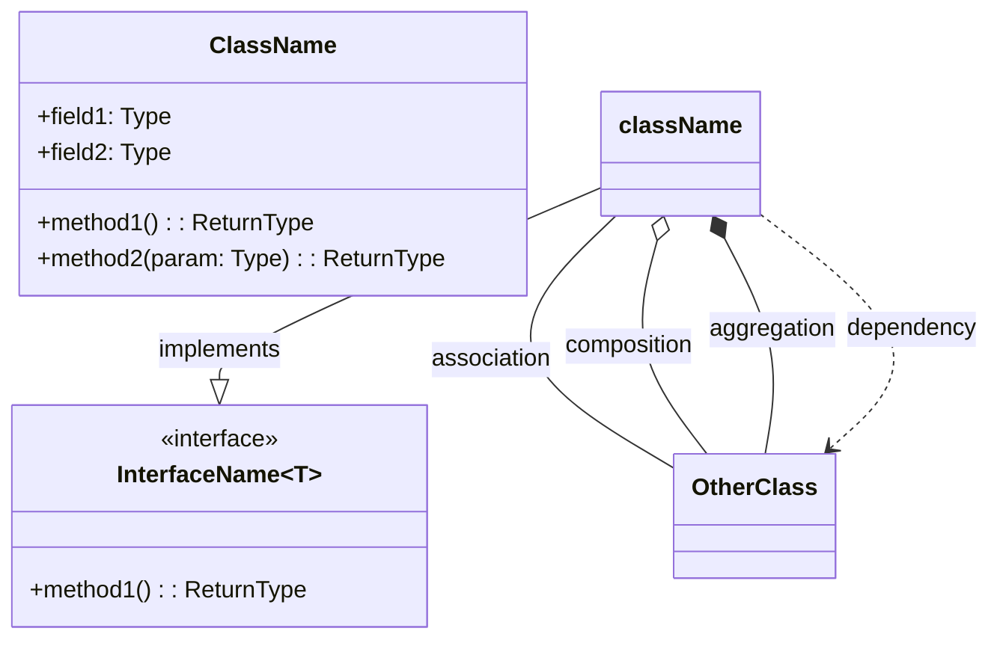
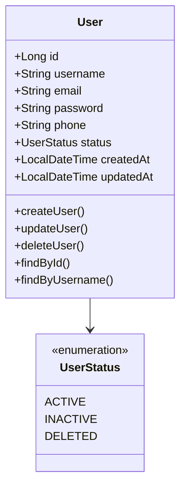
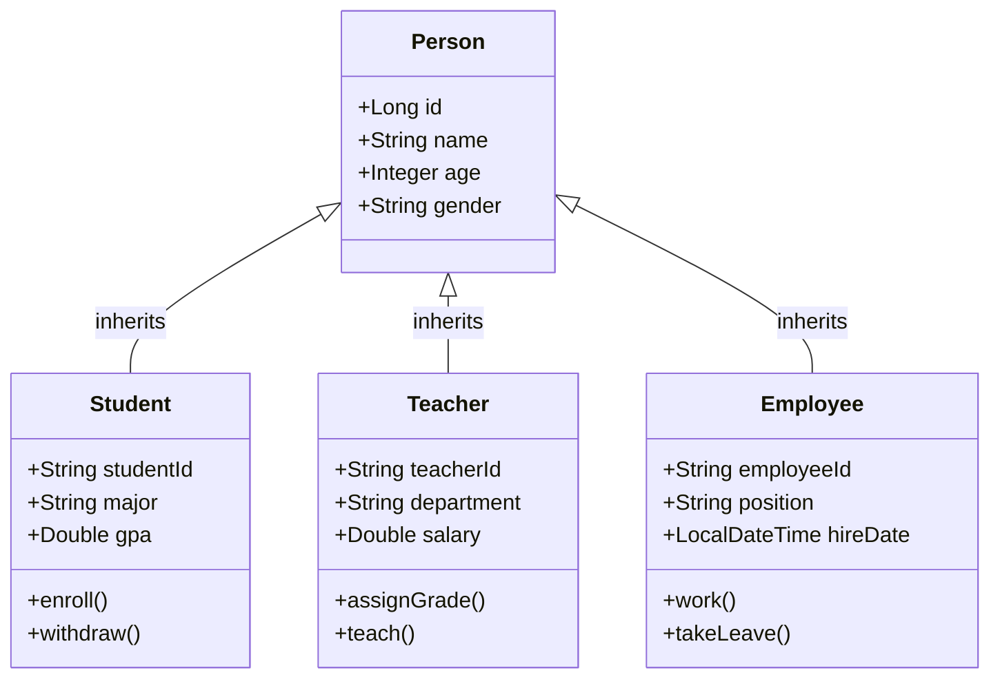
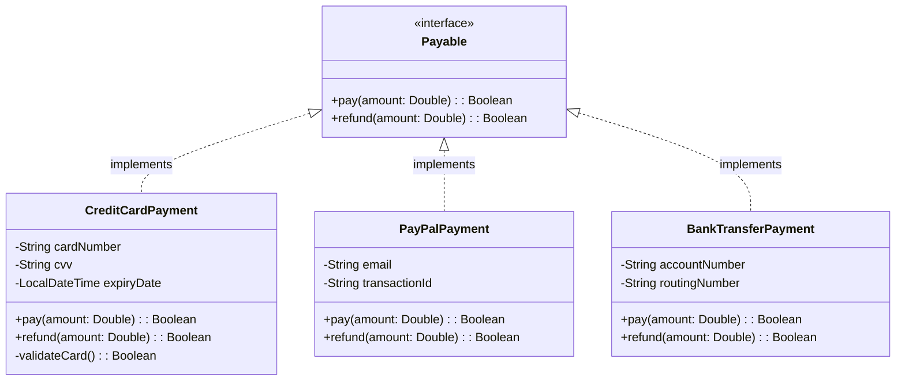
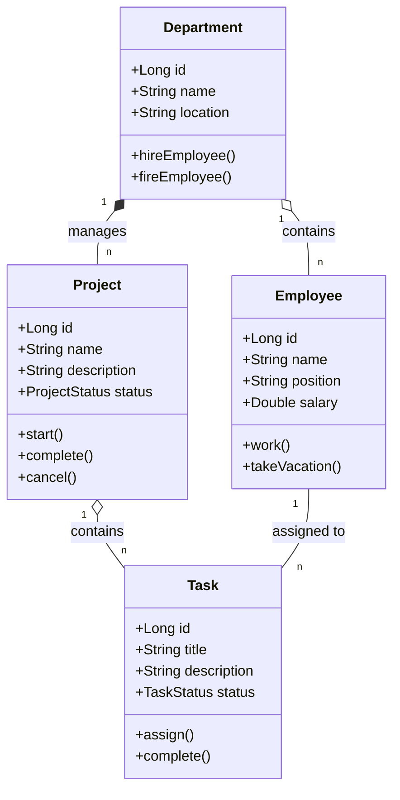
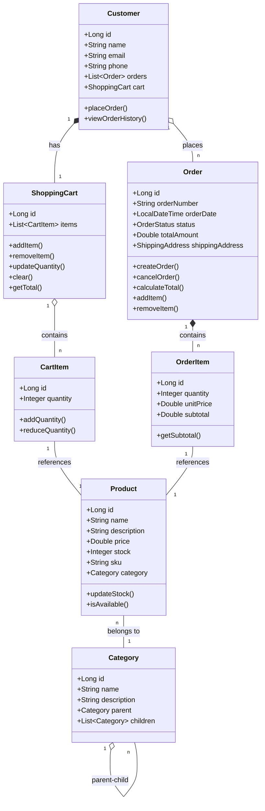
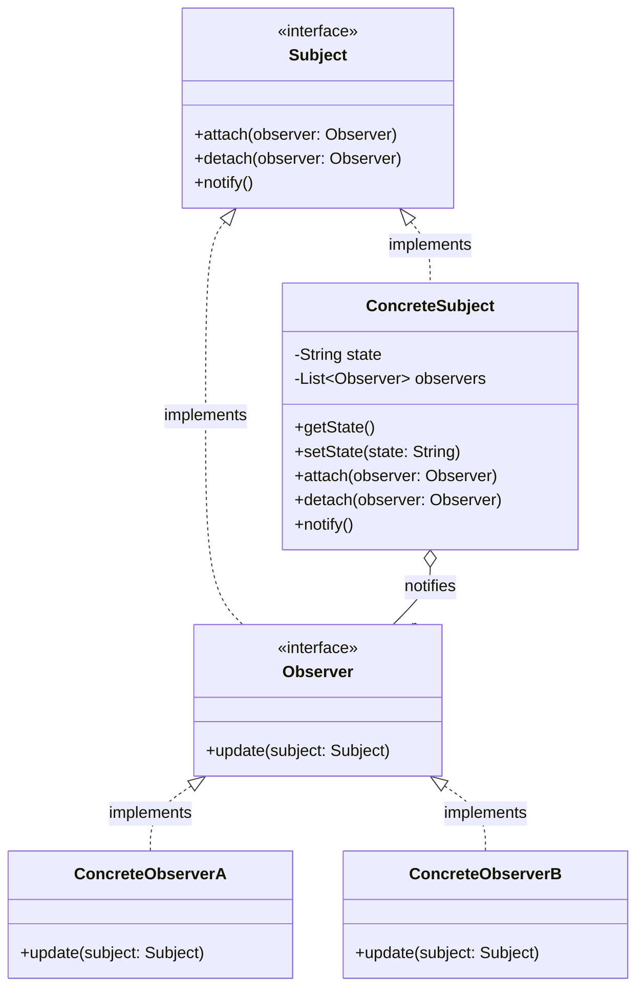

# Class Diagram Template

## Template Description

Class Diagram is used to show classes, interfaces, and their relationships in a system.

## Basic Syntax

## Symbol Reference

| Symbol | Relationship Type | Description |
|--------|------------------|-------------|
| `-->` | Association | Connection between classes |
| `*--` | Composition | Strong "has-a" relationship, parts cannot exist independently |
| `o--` | Aggregation | Weak "has-a" relationship, parts can exist independently |
| `--|>` | Generalization | Inheritance |
| `..|>` | Realization | Interface implementation |
| `..>` | Dependency | One class uses another |
| `--` | Direct Association | Bidirectional association |

## Template Examples

### 1. Basic Entity Class

### 2. Inheritance Relationship

### 3. Interface and Implementation

### 4. Composition/Aggregation Relationship

### 5. Complete Business Class Diagram

### 6. Design Pattern Example

## Usage Guide

1. **Class Names**: Capitalize first letter, use nouns
2. **Properties**: Visibility + Name + Type
   - `+` public
   - `-` private
   - `#` protected
   - `~` package
3. **Methods**: Visibility + Name + Parameters + Return Type
4. **Relationship Lines**: Label multiplicity on both ends

## Multiplicity Reference

| Notation | Meaning |
|----------|---------|
| 1 | Exactly one |
| 0..1 | Zero or one |
| n | Exactly n |
| 0..* or * | Zero or more |
| 1..* | One or more |
| m..n | At least m, at most n |