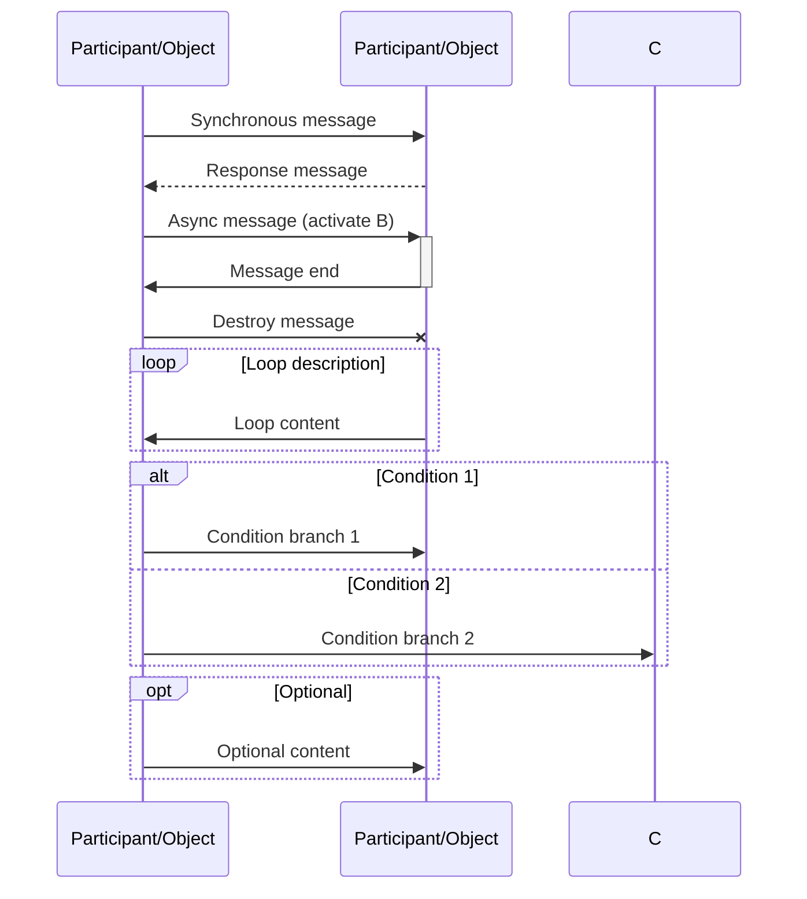
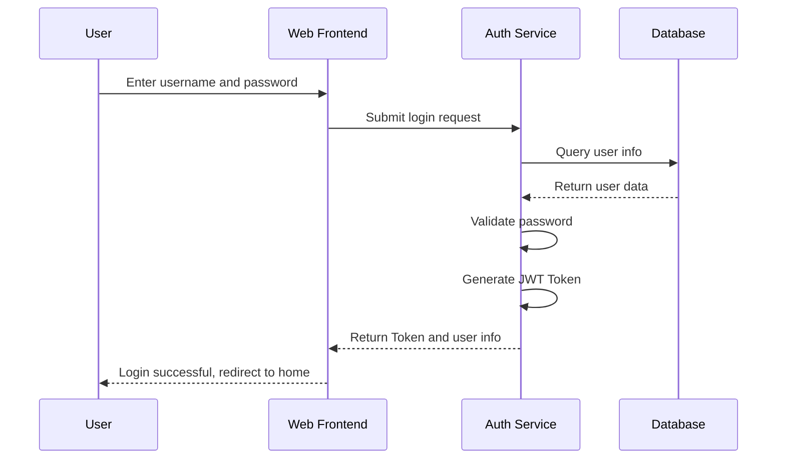
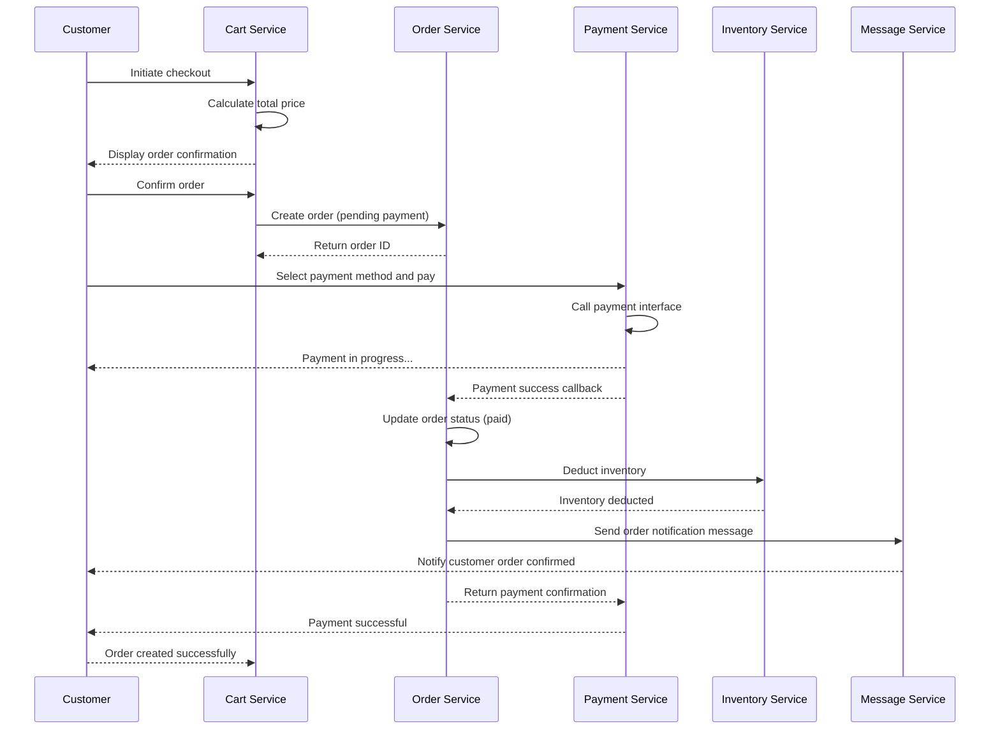
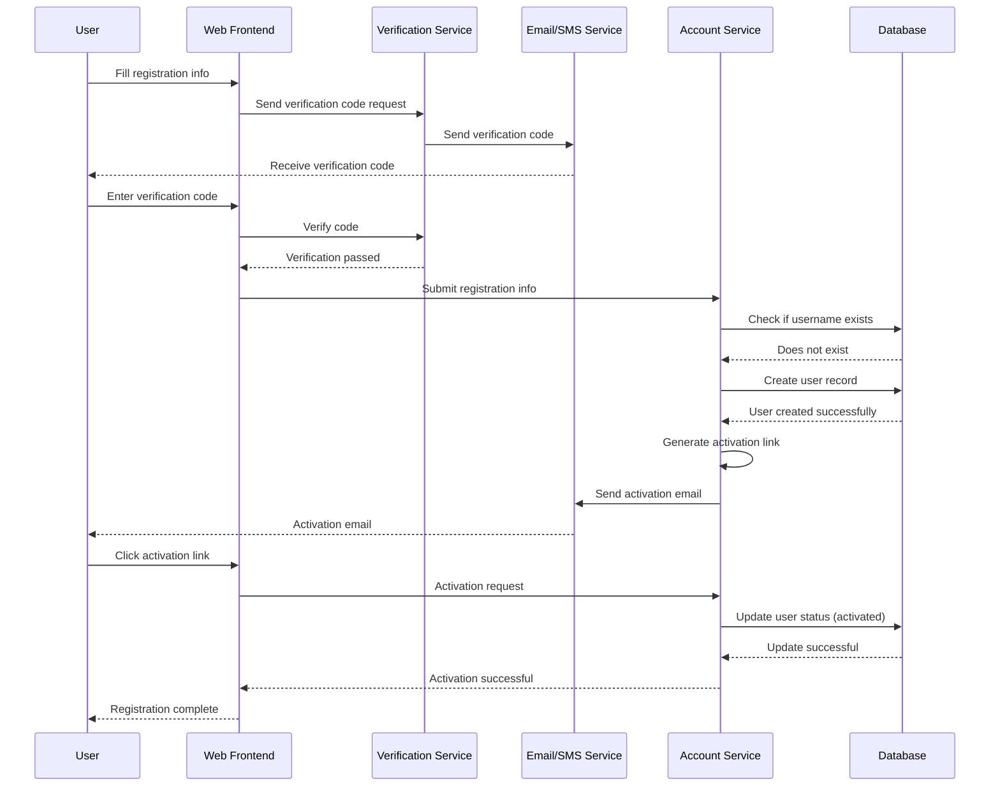
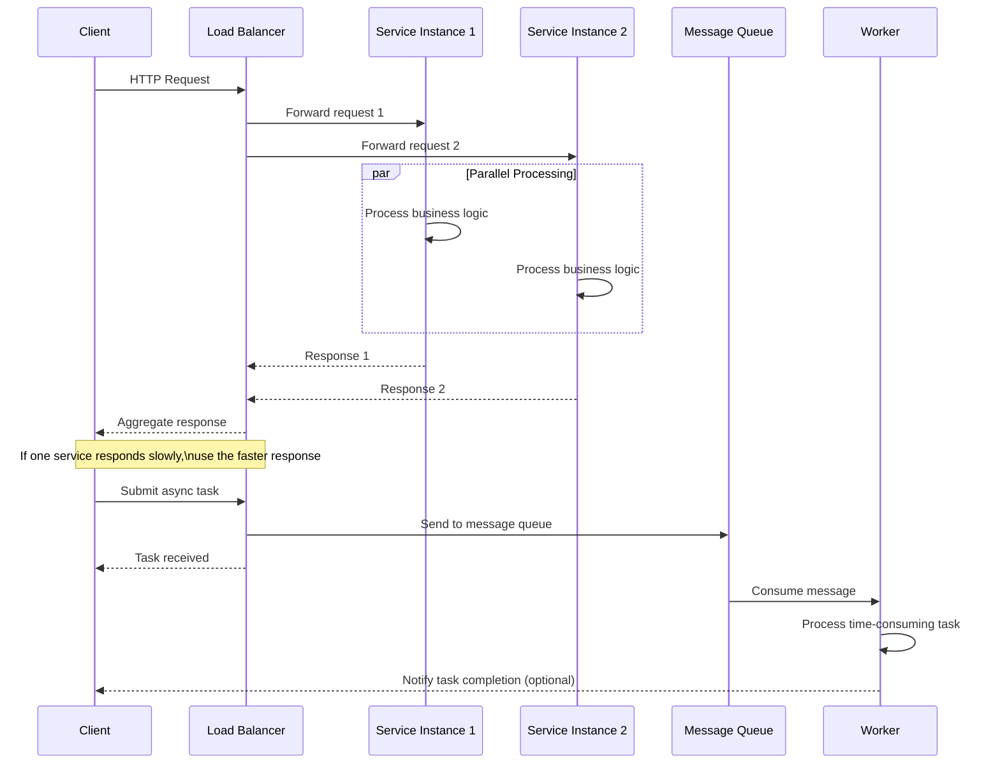
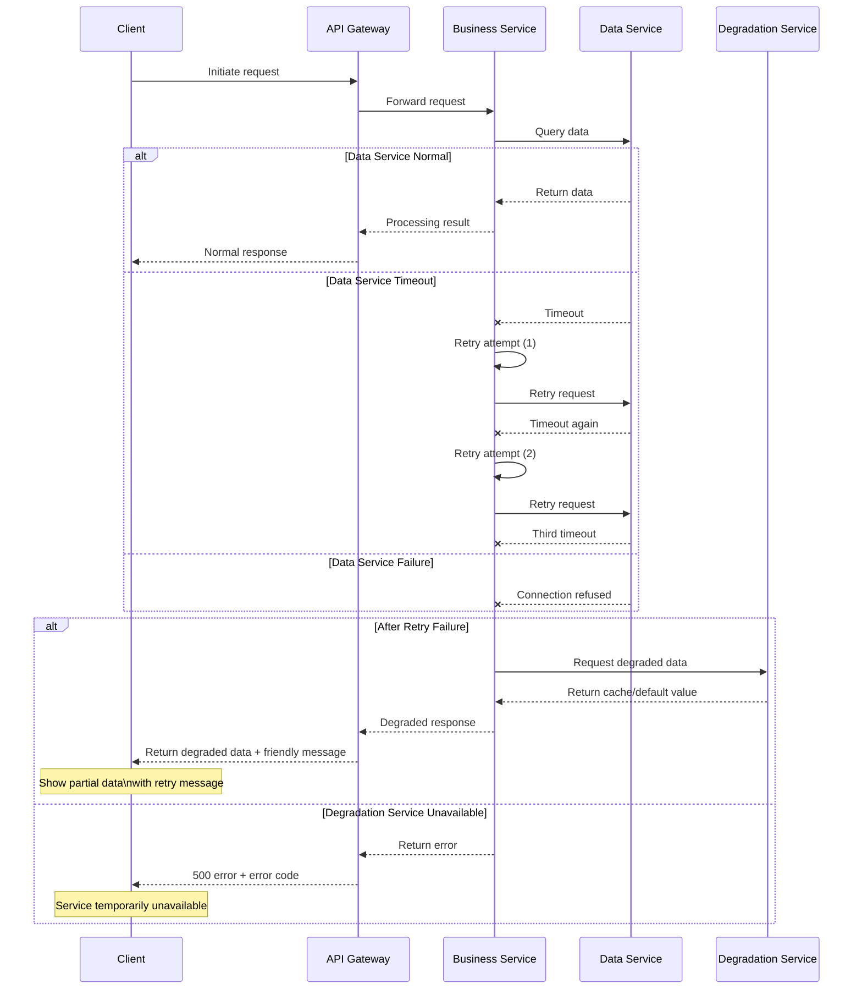
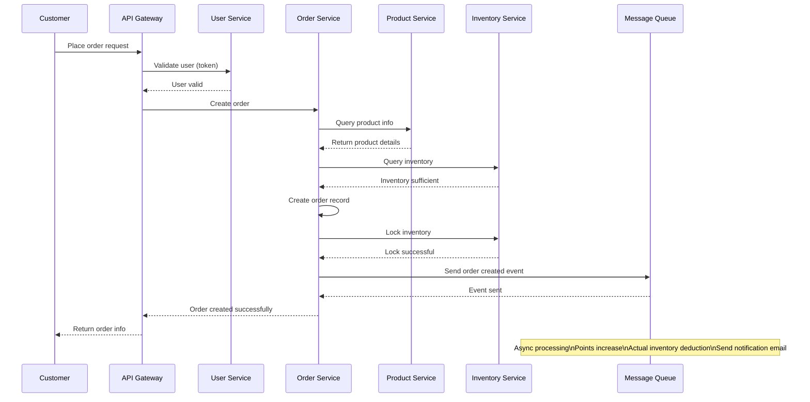

# Sequence Diagram Template

## Template Description

Sequence Diagram is used to describe the time-ordered message sequence between object interactions.

## Basic Syntax

## Message Type Reference

| Syntax | Message Type | Description |
|--------|--------------|-------------|
| `->>` | Synchronous message | Sender waits for response |
| `-->>` | Response message | Return value |
| `->>+` | Activate+Sync | Activate target object |
| `-->>-` | Deactivate | Destroy object |
| `-x` | Async message | Sender does not wait |
| `loop` | Loop fragment | Loop execution |
| `alt/else` | Choice fragment | Conditional branch |
| `opt` | Optional fragment | Optional execution |

## Template Examples

### 1. User Login Sequence

### 2. Order Creation Sequence

### 3. User Registration Sequence

### 4. Concurrent Processing Sequence

### 5. Error Handling Sequence

### 6. Microservice Call Sequence

## Usage Guide

1. **Identify Participants**: Identify main objects/services in the interaction
2. **Identify Messages**: Identify information passed between participants
3. **Identify Order**: Arrange messages in time sequence
4. **Mark Activation**: Mark start and end of object lifecycle
5. **Handle Branches**: Use `alt/else` for conditional branches
6. **Handle Loops**: Use `loop` for repeated operations

## Best Practices

- Message flow top-to-bottom represents time progression
- Use clear participant naming
- Add explanatory comments to key messages
- Split complex flows into multiple sequence diagrams
- Use `Note` to mark important explanations