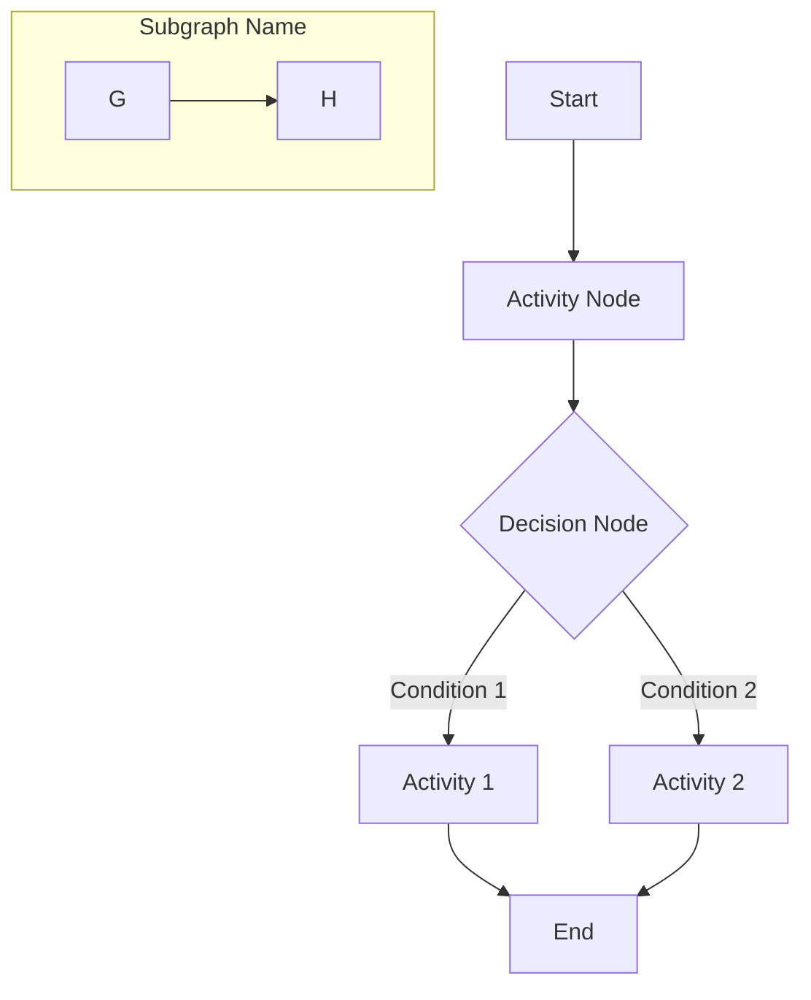
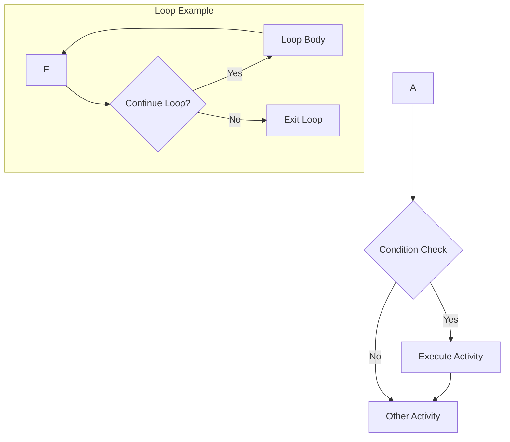
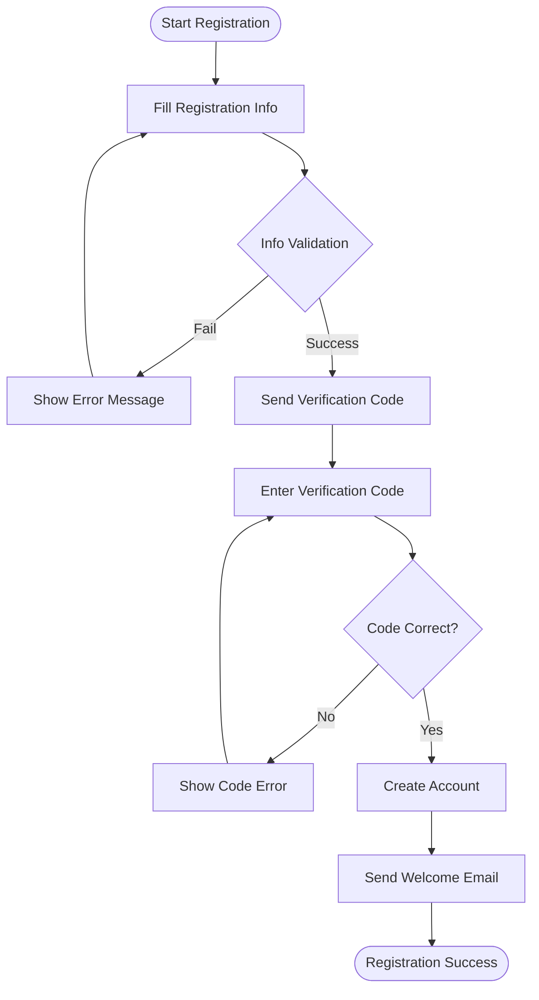
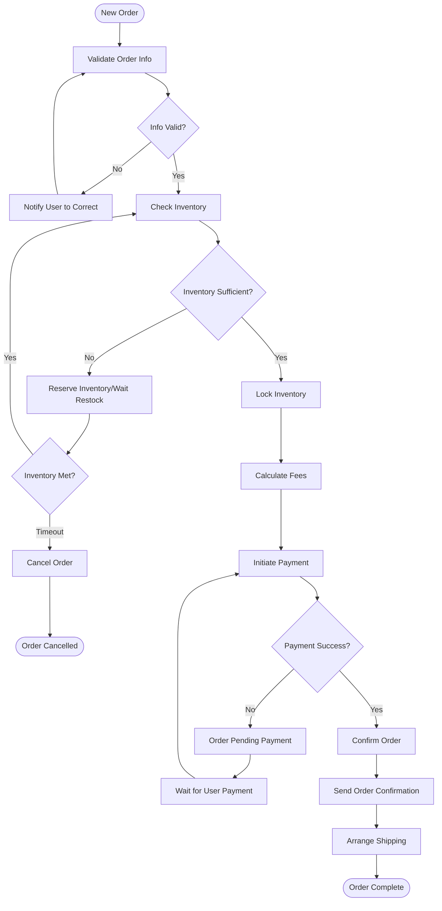
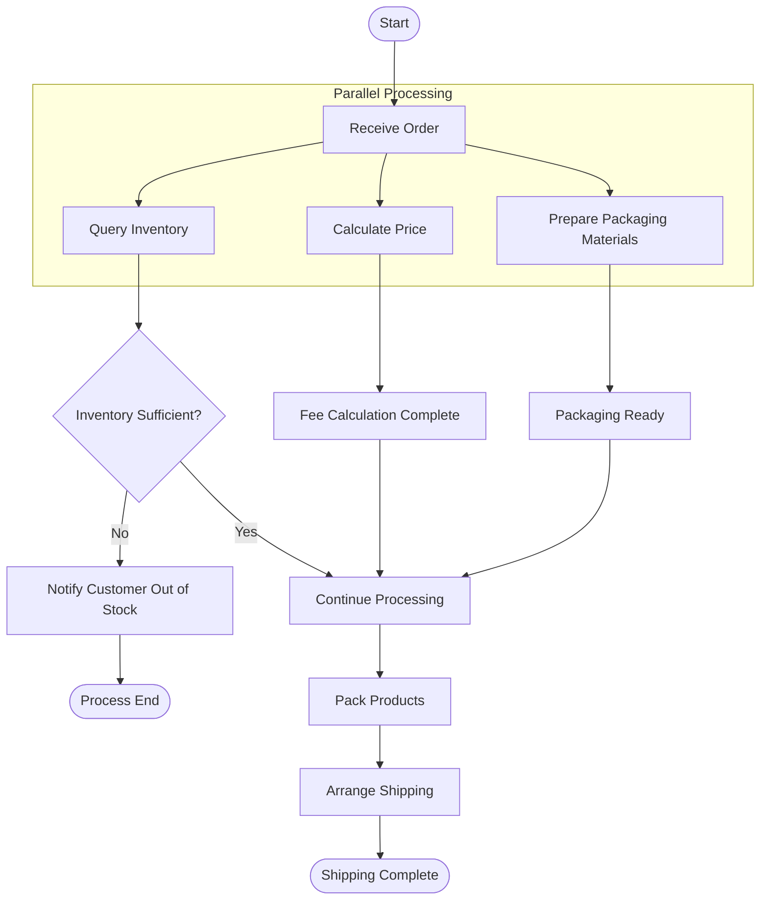
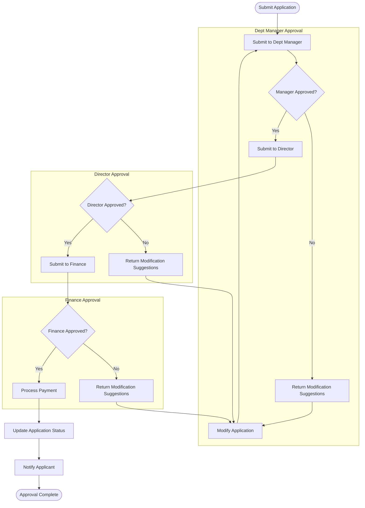
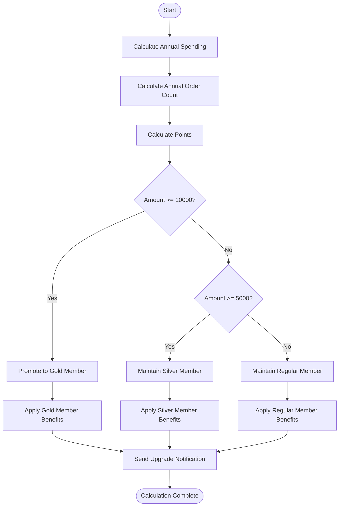
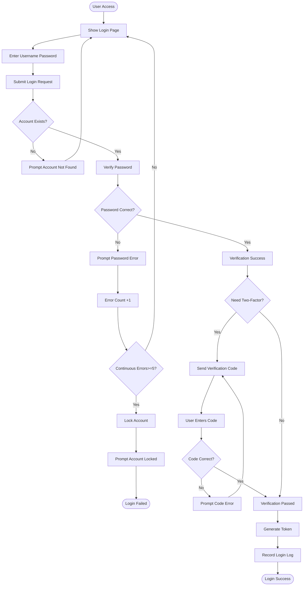

# Activity Diagram Template

## Template Description

Activity Diagram is used to describe business processes, workflows, or algorithm execution steps, supporting parallel activities.

## Basic Syntax

## Node Types

| Syntax | Node Type | Description |
|--------|-----------|-------------|
| `[Text]` | Activity | Rounded rectangle, represents action/operation |
| `{Text}` | Decision | Diamond, represents conditional judgment |
| `([[Text]])` | Start/End | Circle, represents process start or end |
| `((Text))` | Circle | Large dot, represents start (vertical) |
| `([Text])` | Stadium | Rounded rectangle with semicircles on both ends, represents subprocess |

## Branch and Loop

## Template Examples

### 1. User Registration Process

### 2. Order Processing Flow

### 3. Parallel Activity Processing

### 4. Approval Process (With Roles)

### 5. Member Level Calculation

### 6. Login and Permission Verification

## Usage Guide

1. **Clear Start and End**: Each process has exactly one start, multiple ends possible
2. **Activity Naming**: Use verb-object phrases (e.g., "Submit Order", "Validate Info")
3. **Decision Nodes**: Use diamonds, label clear branch conditions
4. **Parallel Processing**: Use `subgraph` to group parallel activities
5. **Swimlane Activity Diagram**: For different roles' activities, use Swimlanes

## Mermaid Activity Diagram Limitations

Mermaid's `graph TD` syntax supports:
- Start/End nodes: `([Text])` or `[[Text]]`
- Activity nodes: `[Text]`
- Decision nodes: `{Text}`
- Subgraph: `subgraph`

Does not support true parallel activity diagrams (Fork/Join), but can represent parallel concepts through visual grouping.