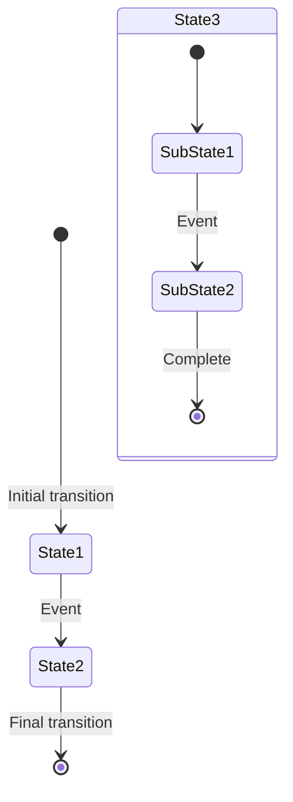
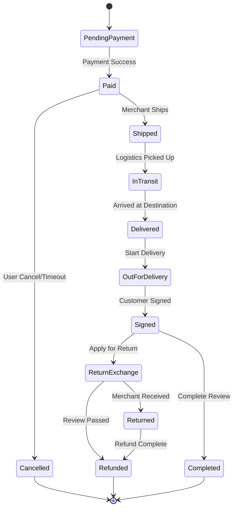
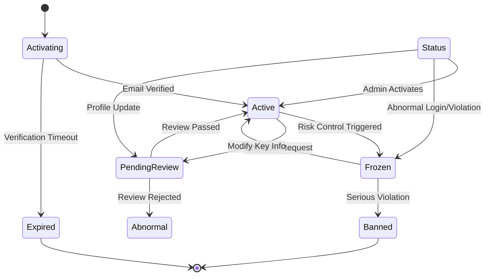
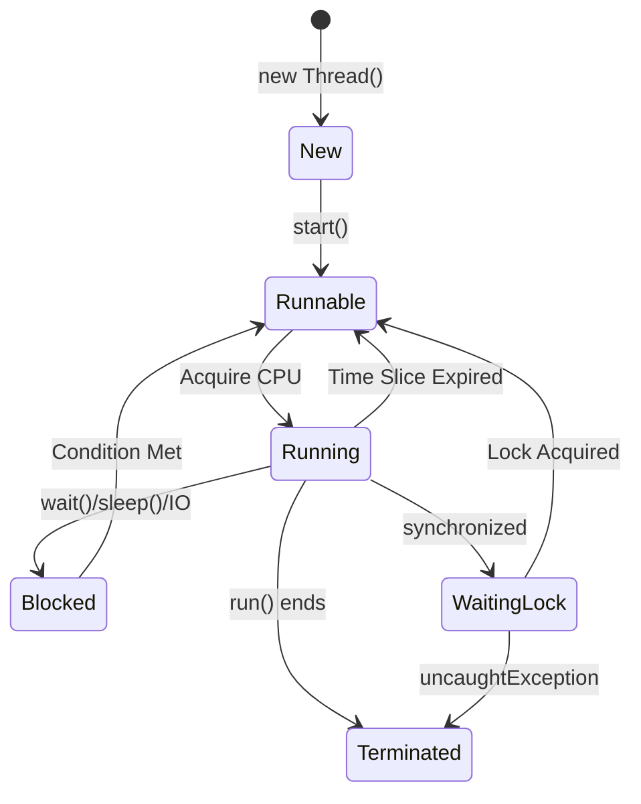
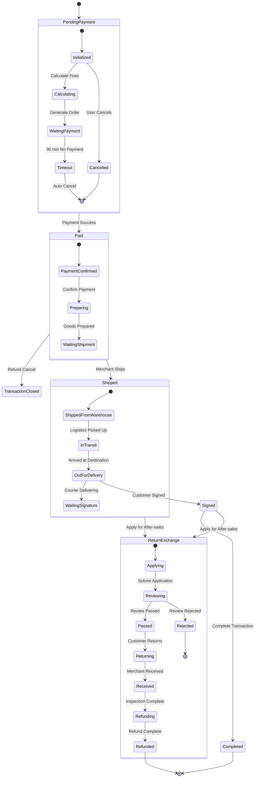
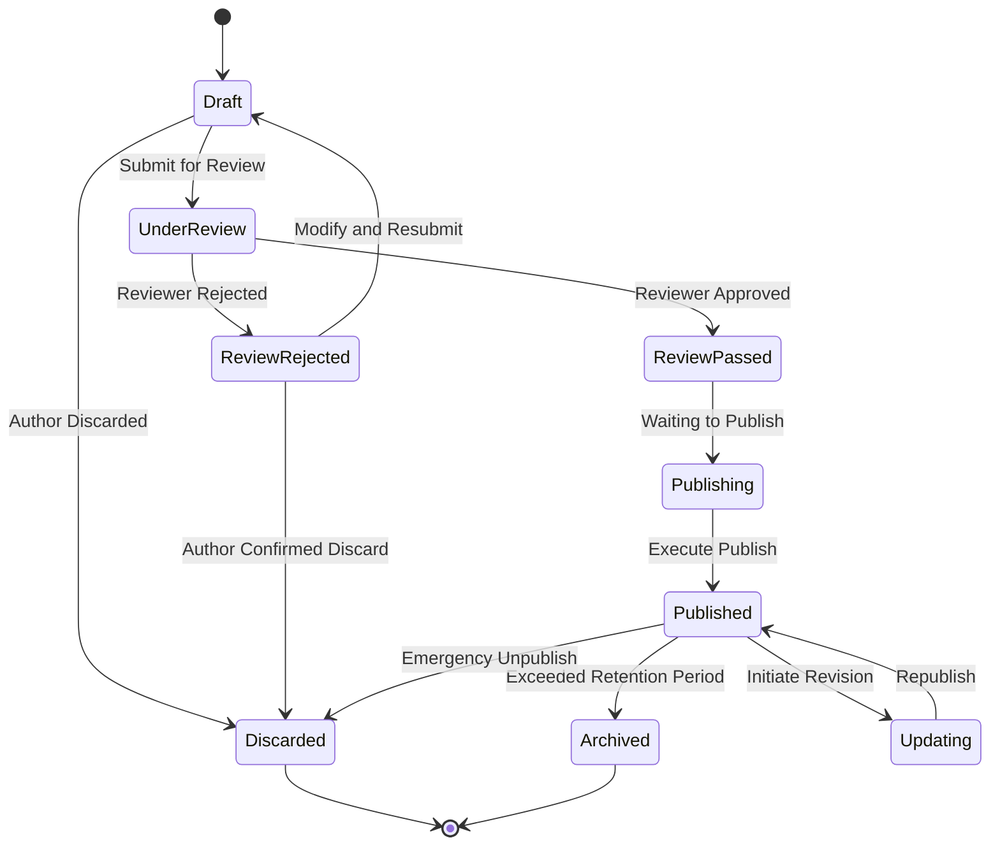
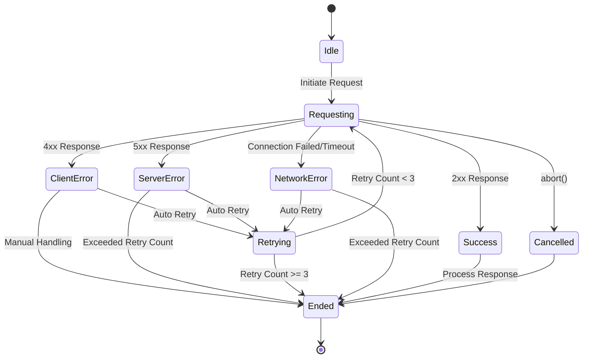

# State Diagram Template

## Template Description

State Diagram is used to describe the state changes of objects or systems, and events that trigger state transitions.

## Basic Syntax

## State Diagram Elements

| Syntax | Element Type | Description |
|--------|--------------|-------------|
| `[*]` | Initial State | Black dot, represents state machine start |
| `[*] --> State` | Transition Arrow | Transition with event |
| `State1 --> State2: Event` | State Transition | Trigger condition and result |
| `state Name { }` | Composite State | State containing substates |

## Template Examples

### 1. Order State Diagram

### 2. User Account State Diagram

### 3. Thread State Diagram

### 4. Composite State Diagram (Order Lifecycle)

### 5. Document State Diagram (Workflow)

### 6. HTTP Request State Diagram

## Usage Guide

1. **Identify States**: Determine all possible states an object may be in
2. **Identify Transitions**: Determine conditions and events between states
3. **Initial and Final States**: Clarify start and end points
4. **Composite States**: For complex objects, use nested substates
5. **Action Labels**: Label actions next to transition arrows (guard conditions)

## Difference Between State Diagram and Activity Diagram

| Feature | State Diagram | Activity Diagram |
|---------|--------------|------------------|
| Focus | Object state changes | Activity execution flow |
| Nodes | States | Activities |
| Transitions | Event-triggered | Sequential execution |
| Parallel | Generally not supported | Supports parallel activities |
| Applicable Scenario | State machines, lifecycles | Business processes, workflows |