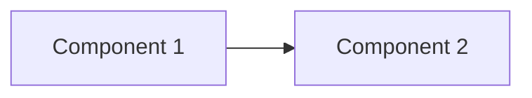
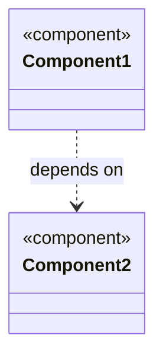
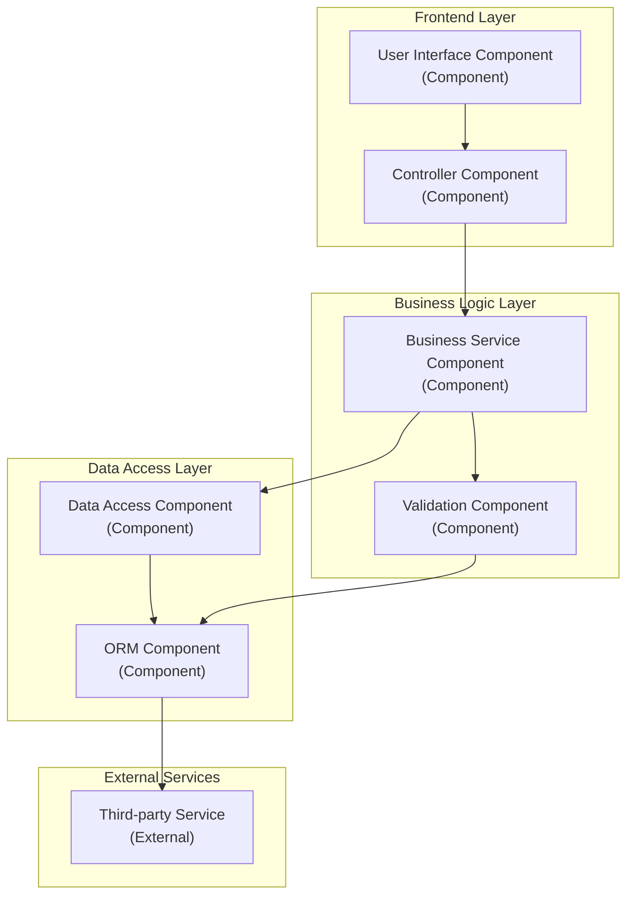
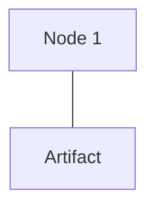
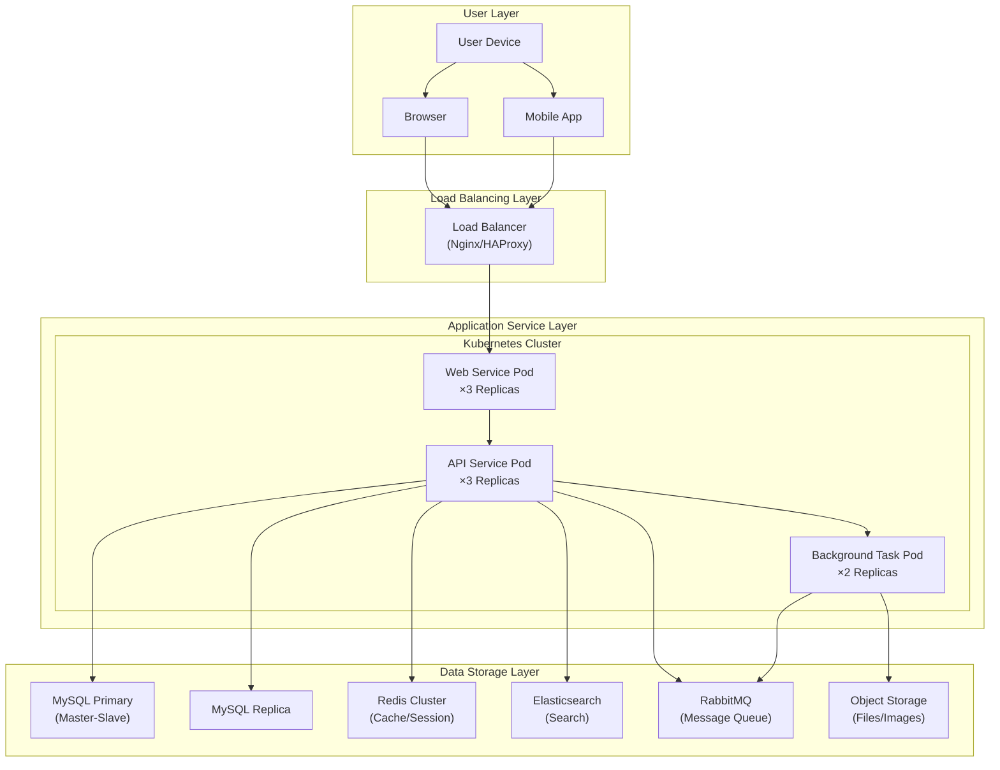
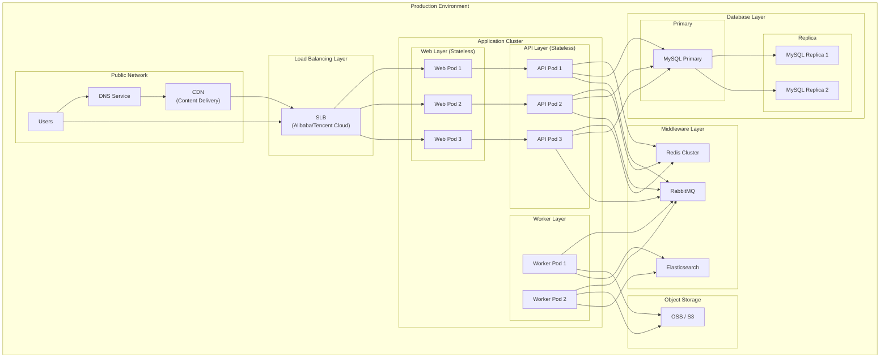

# Component and Deployment Diagram Template

## Component Diagram

### Template Description

Component Diagram is used to show software components and their dependencies in a system.

### Basic Syntax



### Mermaid Component Diagram Syntax



### Component Diagram Example



## Deployment Diagram

### Template Description

Deployment Diagram is used to show the hardware and software deployment structure of a system.

### Basic Syntax



### Mermaid C4 Deployment Diagram Syntax (Alternative)

```mermaid
C4Deployment
    Deployment_Node(loc, alias, "label", "description")
```

### Deployment Diagram Example



## Combined Deployment Diagram



## Complete Microservices Architecture Deployment Diagram

```mermaid
graph TB
    subgraph External["External"]
        Browser["Browser"]
        MobileApp["Mobile App"]
        ThirdParty["Third-party API"]
    end

    subgraph Gateway["API Gateway Layer"]
        Kong["Kong Gateway"]
    end

    subgraph ServiceMesh["Service Mesh Layer"]
        Istio["Istio"]
    end

    subgraph Services["Microservices Layer"]
        subgraph UserService["User Service"]
            U_POD["User Service Pod"]
        end

        subgraph OrderService["Order Service"]
            O_POD["Order Service Pod"]
        end

        subgraph ProductService["Product Service"]
            P_POD["Product Service Pod"]
        end

        subgraph PaymentService["Payment Service"]
            PY_POD["Payment Service Pod"]
        end

        subgraph NotificationService["Notification Service"]
            N_POD["Notification Service Pod"]
        end
    end

    subgraph Backend["Backend Support"]
        Redis["Redis Cluster"]
        MySQL["MySQL Cluster"]
        Kafka["Kafka Cluster"]
        ES["Elasticsearch"]
        S3["Object Storage"]
    end

    Browser --> Kong
    MobileApp --> Kong
    Kong --> Istio

    Istio --> U_POD
    Istio --> O_POD
    Istio --> P_POD
    Istio --> PY_POD
    Istio --> N_POD

    U_POD --> Redis
    U_POD --> MySQL

    O_POD --> Redis
    O_POD --> MySQL
    O_POD --> Kafka

    P_POD --> Redis
    P_POD --> MySQL
    P_POD --> ES

    PY_POD --> MySQL
    PY_POD --> ThirdParty

    N_POD --> Kafka
    N_POD --> S3

    O_POD ..> P_POD : Service Call
    O_POD ..> PY_POD : Service Call
    O_POD ..> N_POD : Async Message
```

## Containerized Deployment Architecture

```mermaid
graph TB
    subgraph DevelopmentEnvironment["Development Environment"]
        DEV_PC["Developer PC"]
        REGISTRY_DEV["Private Image Registry\n(Development)"]
    end

    subgraph CI_CD["CI/CD Pipeline"]
        GitRunner["GitLab Runner"]
        Harbor["Harbor Image Registry"]
    end

    subgraph K8S_Prod["Kubernetes Production Cluster"]
        subgraph Ingress["Ingress"]
            Nginx_Ing["Nginx Ingress"]
        end

        subgraph Monitor["Monitoring Components"]
            Prometheus["Prometheus"]
            Grafana["Grafana"]
        end

        subgraph ApplicationLayer["Application Load"]
            APP_PODS["Business Pod Group"]
        end

        subgraph DataLayer["Storage Layer"]
            PVC["Persistent Volume"]
        end
    end

    DEV_PC --> GitRunner : push code
    GitRunner --> Harbor : push image
    Harbor --> K8S_Prod : pull image

    Nginx_Ing --> APP_PODS
    Prometheus --> APP_PODS
    APP_PODS --> PVC
```

## Component Diagram vs Deployment Diagram Comparison

| Feature | Component Diagram | Deployment Diagram |
|---------|------------------|-------------------|
| Focus | Software components and dependencies | Hardware and software deployment |
| Main Elements | Components, interfaces, dependencies | Nodes, devices, artifacts |
| Purpose | Code organization structure | Physical deployment structure |
| Perspective | Developer perspective | Operations perspective |
| Abstraction Level | Logical level | Physical level |

## Usage Guide

1. **Component Diagram**: Show system's modular structure, reflecting code organization
2. **Deployment Diagram**: Show system's physical architecture, reflecting hardware resources
3. **Combined Use**: Component diagram for design phase, deployment diagram for implementation phase
4. **Hierarchical Structure**: Use `subgraph` to represent system's logical layering
5. **Redundancy Design**: Production environment usually shows multi-replica and high-availability architecture