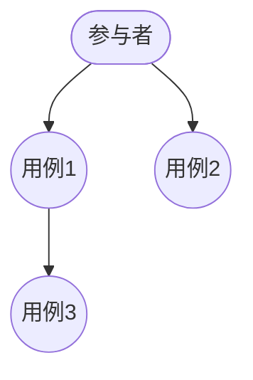
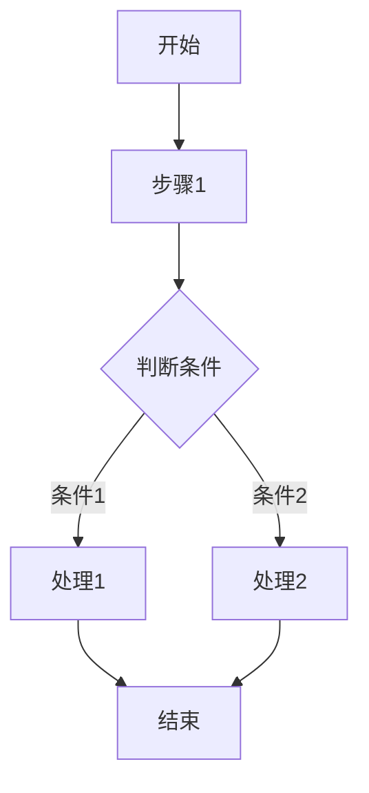

# 需求规格说明书 (SRS)

## 文档信息

| 项目 | 内容 |
|------|------|
| 文档名称 | 需求规格说明书 |
| 文档编号 | SRS-{{projectCode}}-V1.0 |
| 版本 | V1.0 |
| 日期 | {{createdDate}} |
| 作者 | {{author}} |

---

## 版本历史

| 版本 | 日期 | 作者 | 描述 |
|------|------|------|------|
| V1.0 | {{createdDate}} | {{author}} | 初始版本 |

---

## 审查记录

| 日期 | 审查人 | 结论 | 签名 |
|------|--------|------|------|
| {{createdDate}} | {{author}} | [通过/未通过] | [签名] |

---

## 1. 引言

### 1.1 目的

本文档旨在全面描述 **{{projectName}}** 的功能需求和非功能需求，作为软件开发、测试和验收的依据。

### 1.2 范围

本文档适用于：
- 开发团队：理解系统应实现的功能
- 测试团队：编制测试计划和控制测试案例
- 客户/用户：确认系统是否满足其需求
- 项目管理者：作为项目规划和进度控制的基础

### 1.3 定义、缩略语

| 术语 | 定义 |
|------|------|
| [术语1] | [定义] |
| [术语2] | [定义] |

### 1.4 参考资料

| 文档 | 说明 |
|------|------|
| [文档1] | [说明] |
| [文档2] | [说明] |

---

## 2. 总体描述

### 2.1 产品背景

[描述产品的背景、起源、驱动因素]

### 2.2 产品定位

[描述产品在市场或组织中的位置]

### 2.3 用户特征

| 用户类型 | 描述 | 技能水平 | 使用频率 |
|----------|------|----------|----------|
| [类型1] | [描述] | [初级/中级/高级] | [偶尔/经常/频繁] |
| [类型2] | [描述] | [初级/中级/高级] | [偶尔/经常/频繁] |

### 2.4 约束条件

#### 2.4.1 硬件约束
- 服务器配置要求
- 客户端最低配置
- 网络要求

#### 2.4.2 软件约束
- 操作系统要求
- 浏览器要求（Web应用）
- 依赖软件

#### 2.4.3 法规约束
- [相关法律法规]

#### 2.4.4 预算与时间约束
- 项目预算：[X]万元
- 项目周期：[X]个月

### 2.5 假设与依赖关系

| 假设/依赖 | 描述 | 影响 |
|-----------|------|------|
| [假设1] | [描述] | [影响说明] |
| [依赖1] | [描述] | [影响说明] |

---

## 3. 功能需求

### 3.1 功能需求概述

[系统功能总体描述]

### 3.2 用例图

### 3.3 功能需求详述

#### 3.3.1 [功能模块1]

**功能描述**：
[详细描述该功能]

**业务规则**：
| 规则编号 | 规则内容 |
|----------|----------|
| BR-001 | [规则内容] |
| BR-002 | [规则内容] |

**输入项**：
| 字段名 | 类型 | 必填 | 说明 |
|--------|------|------|------|
| [字段1] | [类型] | [是/否] | [说明] |

**输出项**：
[描述系统输出]

**处理流程**：

**异常处理**：
| 异常情况 | 处理方式 |
|----------|----------|
| [异常1] | [处理方式] |

**优先级**： [高/中/低]

#### 3.3.2 [功能模块2]

[同上结构]

### 3.4 数据需求

#### 3.4.1 数据项清单

| 数据项名称 | 数据类型 | 长度 | 说明 |
|------------|----------|------|------|
| [名称1] | [类型] | [长度] | [说明] |
| [名称2] | [类型] | [长度] | [说明] |

#### 3.4.2 数据量估算

| 数据类型 | 初始量 | 年增长量 | 保留期限 |
|----------|--------|----------|----------|
| [类型1] | [X]万条 | [Y]% | [Z]年 |

---

## 4. 非功能需求

### 4.1 性能需求

| 指标 | 要求 | 测试标准 |
|------|------|----------|
| 响应时间 | 操作完成时间 ≤ [X]秒 | [标准] |
| 并发用户数 | 支持 [X]个并发用户 | [标准] |
|吞吐量 | [X] TPS | [标准] |
| 资源占用 | CPU ≤ [X]%, 内存 ≤ [X]MB | [标准] |

### 4.2 可靠性需求

| 指标 | 要求 |
|------|------|
| 系统可用性 | ≥ [X]% |
| MTBF (平均无故障时间) | ≥ [X] 小时 |
| MTTR (平均恢复时间) | ≤ [X] 分钟 |
| 数据准确性 | 误差率 ≤ [X]% |

### 4.3 安全性需求

| 安全要求 | 说明 |
|----------|------|
| 身份认证 | 支持用户名/密码认证，可集成第三方认证 |
| 权限控制 | 基于角色的访问控制 (RBAC) |
| 数据加密 | 敏感数据加密存储和传输 |
| 安全审计 | 记录关键操作日志 |
| 防护措施 | 防止SQL注入、XSS、CSRF等攻击 |

### 4.4 兼容性需求

| 类型 | 要求 |
|------|------|
| 浏览器兼容 | Chrome ≥ 90, Firefox ≥ 88, Safari ≥ 14, Edge ≥ 90 |
| 操作系统兼容 | Windows 10/11, macOS 11+, Linux (Ubuntu 20.04+) |
| 移动端兼容 | iOS 14+, Android 11+ |
| 向后兼容 | [说明] |

### 4.5 易用性需求

| 指标 | 要求 |
|------|------|
| 学习时间 | 普通用户 ≤ [X]小时 |
| 操作效率 | 熟练用户完成任务时间 ≤ [基准时间] |
| 错误率 | 操作错误率 ≤ [X]% |
| 用户满意度 | 满意度评分 ≥ [X]分 |

### 4.6 可维护性需求

| 指标 | 要求 |
|------|------|
| 代码可读性 | 符合代码规范，注释覆盖率 ≥ [X]% |
| 模块化程度 | 模块耦合度 ≤ [X] |
| 文档完备性 | 文档覆盖所有模块 |

### 4.7 可扩展性需求

| 指标 | 要求 |
|------|------|
| 水平扩展 | 支持增加节点扩展系统容量 |
| 垂直扩展 | 支持增加硬件资源提升性能 |
| 功能扩展 | 预留扩展接口，支持功能模块热插拔 |

---

## 5. 接口需求

### 5.1 用户接口

#### 5.1.1 界面风格
- 风格：[现代/传统/简约等]
- 主题：[浅色/深色/跟随系统]
- 语言：[中文/英文/多语言]

#### 5.1.2 界面布局
[描述主要界面布局结构]

#### 5.1.3 交互方式
- 鼠标操作
- 键盘快捷键
- 触摸屏操作（移动端）

### 5.2 硬件接口

| 设备 | 接口类型 | 说明 |
|------|----------|------|
| [设备1] | [类型] | [说明] |

### 5.3 软件接口

#### 5.3.1 外部系统接口

| 系统 | 接口方式 | 数据格式 | 频率 |
|------|----------|----------|------|
| [系统1] | [REST API/消息队列等] | [JSON/XML等] | [实时/定时] |

#### 5.3.2 中间件接口

| 中间件 | 版本 | 用途 |
|--------|------|------|
| [中间件1] | [版本] | [用途] |

### 5.4 通信接口

| 类型 | 协议 | 说明 |
|------|------|------|
| HTTP/HTTPS | TLS 1.2+ | Web通信 |
| WebSocket | - | 实时通信 |
| [其他] | - | - |

---

## 6. 数据字典

### 6.1 主要数据实体

#### [实体名称]

| 字段名 | 中文名 | 数据类型 | 长度 | 主键 | 非空 | 说明 |
|--------|--------|----------|------|------|------|------|
| [字段1] | [名称] | [类型] | [长度] | [是/否] | [是/否] | [说明] |

---

## 7. 验收标准

### 7.1 功能验收标准

| 功能 | 验收条件 | 验证方法 |
|------|----------|----------|
| [功能1] | [条件] | [方法] |

### 7.2 性能验收标准

| 指标 | 达标值 | 验证方法 |
|------|--------|----------|
| [指标1] | [值] | [方法] |

### 7.3 安全验收标准

| 项目 | 验收条件 |
|------|----------|
| [项目1] | [条件] |

---

## 8. 附录

### 8.1 术语表

| 术语 | 英文 | 定义 |
|------|------|------|
| [术语] | [英文] | [定义] |

### 8.2 变更记录

| 变更日期 | 变更内容 | 变更人 | 批准人 |
|----------|----------|--------|--------|
| {{createdDate}} | [内容] | {{author}} | {{author}} |

---

**文档批准**：

| 角色 | 姓名 | 日期 | 签名 |
|------|------|------|------|
| 项目经理 | | | |
| 技术负责人 | | | |
| 质量负责人 | | | |
| 客户代表 | | | |