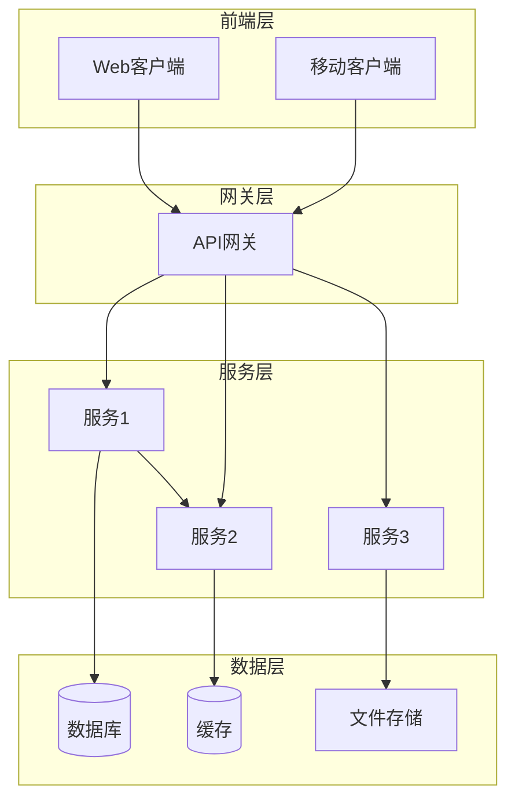
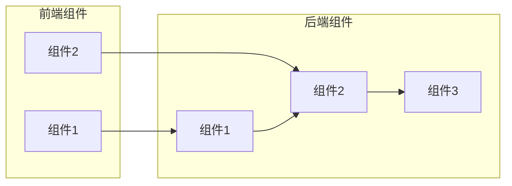
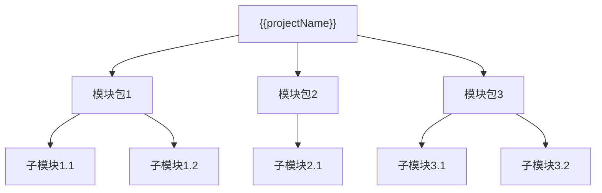
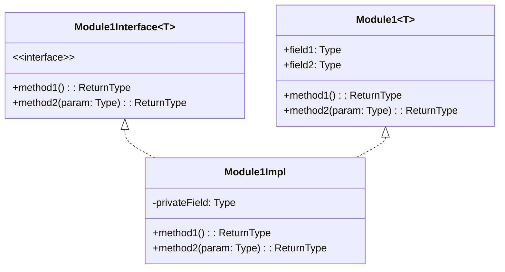
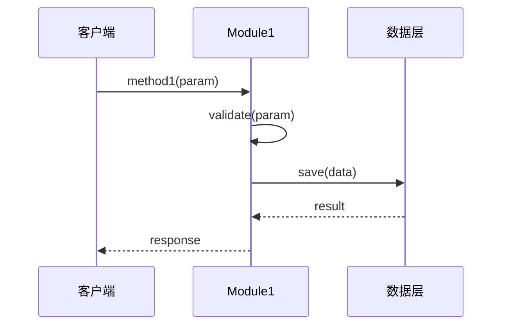
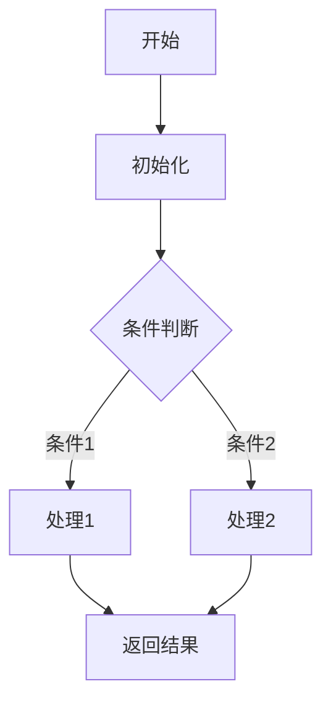
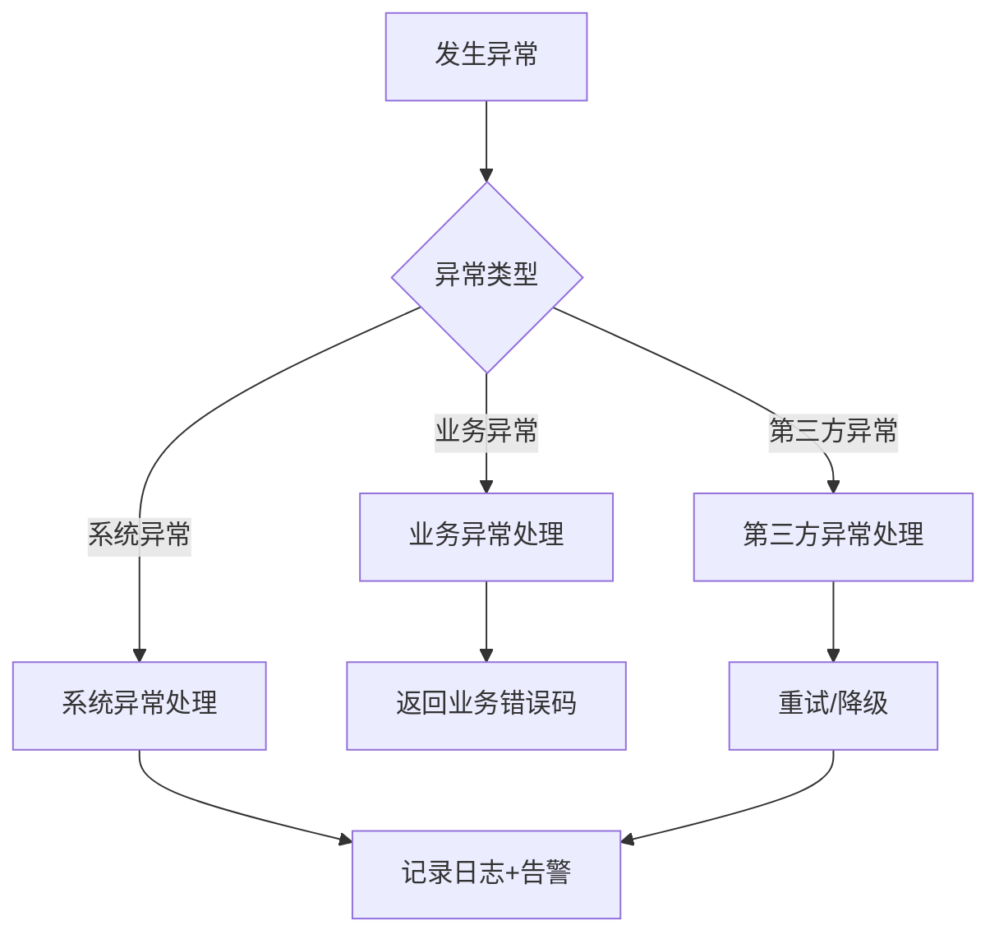
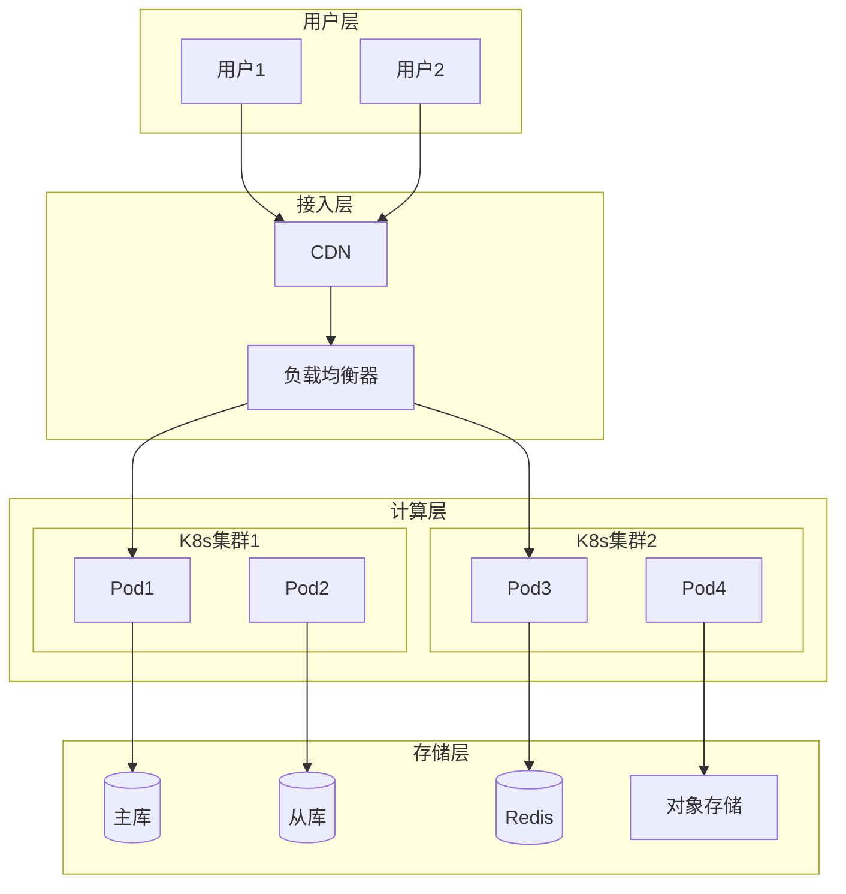

# 软件设计说明书 (SDS)

## 文档信息

| 项目 | 内容 |
|------|------|
| 文档名称 | 软件设计说明书 |
| 文档编号 | SDS-{{projectCode}}-V1.0 |
| 版本 | V1.0 |
| 日期 | {{createdDate}} |
| 作者 | {{author}} |

---

## 版本历史

| 版本 | 日期 | 作者 | 描述 |
|------|------|------|------|
| V1.0 | {{createdDate}} | {{author}} | 初始版本 |

---

## 审查记录

| 日期 | 审查人 | 结论 | 签名 |
|------|--------|------|------|
| {{createdDate}} | {{author}} | [通过/未通过] | [签名] |

---

## 1. 引言

### 1.1 目的

本文档旨在描述 **{{projectName}}** 的软件架构设计和详细设计，为开发人员提供明确的实现指导。

### 1.2 范围

适用于：
- 开发团队：理解系统架构和模块设计
- 测试团队：理解系统行为以编制测试用例
- 维护人员：理解系统以便进行维护和扩展

### 1.3 定义与缩略语

| 术语 | 定义 |
|------|------|
| [术语1] | [定义] |

---

## 2. 系统架构设计

### 2.1 架构概述

[系统整体架构描述]

### 2.2 架构风格

```
□ 分层架构 (Layered Architecture)
□ MVC架构
□ 微服务架构 (Microservices)
□ 事件驱动架构 (Event-Driven)
□ 插件架构 (Plugin Architecture)
□ 其他：[说明]
```

### 2.3 系统架构图



### 2.4 技术栈

| 层次 | 技术选型 | 版本 | 说明 |
|------|----------|------|------|
| 前端框架 | [React/Vue/Angular] | [版本] | [说明] |
| 后端框架 | [Spring Boot/Django/Gin] | [版本] | [说明] |
| 数据库 | [MySQL/PostgreSQL/MongoDB] | [版本] | [说明] |
| 缓存 | [Redis/Memcached] | [版本] | [说明] |
| 消息队列 | [RabbitMQ/Kafka] | [版本] | [说明] |
| 搜索引擎 | [Elasticsearch] | [版本] | [说明] |
| 容器化 | [Docker/Kubernetes] | [版本] | [说明] |

### 2.5 系统组件图



---

## 3. 模块设计

### 3.1 模块划分



### 3.2 模块职责

| 模块名称 | 英文名 | 职责 | 公开接口 |
|----------|--------|------|----------|
| [模块1] | [Name] | [职责描述] | [接口列表] |
| [模块2] | [Name] | [职责描述] | [接口列表] |

### 3.3 模块详细设计

#### 3.3.1 [模块1]

**类图**：


**类的职责**：
[描述该类的职责]

**属性说明**：
| 属性名 | 类型 | 说明 |
|--------|------|------|
| [属性1] | [类型] | [说明] |

**方法说明**：
| 方法名 | 参数 | 返回值 | 说明 |
|--------|------|--------|------|
| [方法1] | [参数] | [类型] | [说明] |

**序列图**：


---

## 4. 数据库设计

（详细内容见《数据库设计说明书》）

---

## 5. 接口设计

### 5.1 接口概述

本系统提供以下类型的接口：
- **内部接口**：模块间调用
- **外部接口**：与其他系统交互
- **用户接口**：前端与后端交互

### 5.2 API接口设计

#### 5.2.1 REST API

**基础URL**：`/api/v1`

| 接口路径 | 方法 | 说明 |
|----------|------|------|
| /users | GET | 获取用户列表 |
| /users/{id} | GET | 获取用户详情 |
| /users | POST | 创建用户 |
| /users/{id} | PUT | 更新用户 |
| /users/{id} | DELETE | 删除用户 |

#### 5.2.2 接口详细定义

**请求格式**：
```json
{
    "field1": "value1",
    "field2": "value2"
}
```

**响应格式**：
```json
{
    "code": 200,
    "message": "success",
    "data": {}
}
```

---

## 6. 设计模式应用

### 6.1 使用的设计模式

| 模式类型 | 模式名称 | 应用场景 | 类/模块 |
|----------|----------|----------|---------|
| 创建型 | [模式名] | [场景] | [类名] |
| 结构型 | [模式名] | [场景] | [类名] |
| 行为型 | [模式名] | [场景] | [类名] |

### 6.2 模式应用说明

#### [模式名称]

**意图**：[描述模式意图]

**结构**：
[类图或结构说明]

**应用**：
[具体应用说明]

---

## 7. 核心算法设计

### 7.1 [算法名称]

**算法描述**：
[描述算法]

**输入**：
[描述输入]

**输出**：
[描述输出]

**流程**：


**复杂度分析**：
- 时间复杂度：O(?)
- 空间复杂度：O(?)

---

## 8. 错误处理策略

### 8.1 错误分类

| 错误类型 | 代码范围 | 处理策略 |
|----------|----------|----------|
| 客户端错误 | 4xx | 返回错误信息，指导用户修正 |
| 服务端错误 | 5xx | 记录日志，返回友好错误信息 |

### 8.2 异常处理机制



---

## 9. 安全设计

### 9.1 认证授权

| 机制 | 说明 |
|------|------|
| 认证方式 | JWT Token / Session |
| 授权方式 | RBAC |
| 密码加密 | BCrypt / Argon2 |

### 9.2 数据安全

| 安全措施 | 说明 |
|----------|------|
| 敏感数据加密 | [算法] |
| 通信加密 | TLS 1.2+ |
| 数据脱敏 | [规则] |

---

## 10. 部署架构



---

**文档批准**：

| 角色 | 姓名 | 日期 | 签名 |
|------|------|------|------|
| 架构师 | | | |
| 技术负责人 | | | |
| 项目经理 | | | |