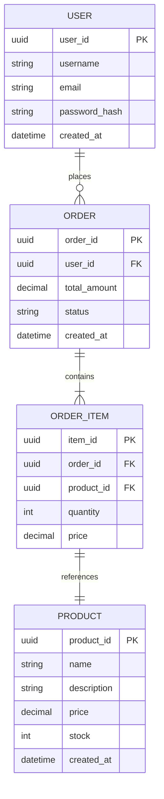
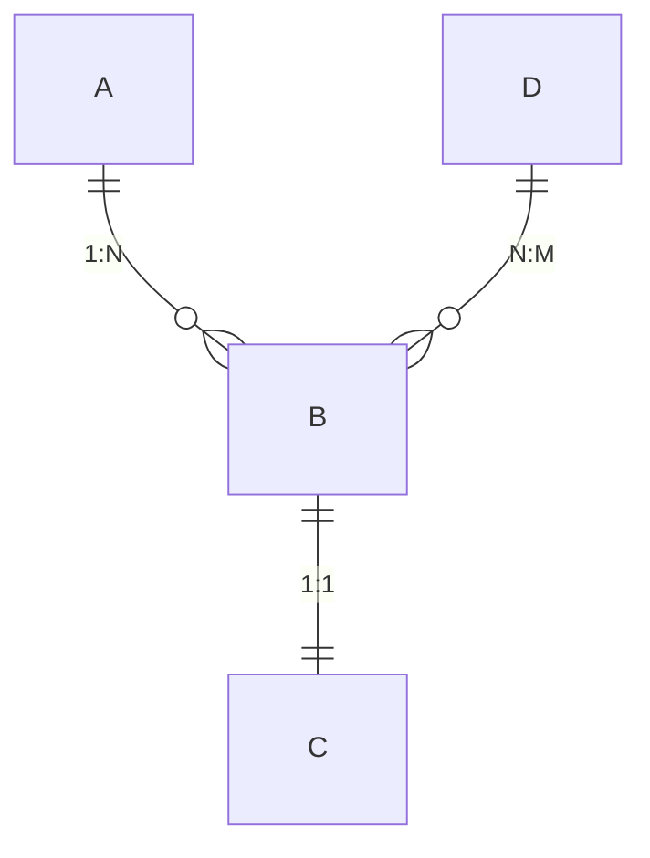

# 数据库设计说明书 (DD)

## 文档信息

| 项目 | 内容 |
|------|------|
| 文档名称 | 数据库设计说明书 |
| 文档编号 | DD-{{projectCode}}-V1.0 |
| 版本 | V1.0 |
| 日期 | {{createdDate}} |
| 作者 | {{author}} |

---

## 1. 引言

### 1.1 目的

本文档定义 **{{projectName}}** 的数据库设计方案，包括概念结构、逻辑结构、物理结构设计。

### 1.2 范围

适用于数据库开发、测试和维护。

---

## 2. 概念结构设计

### 2.1 ER图



### 2.2 实体说明

#### 2.2.1 [实体1]

**描述**：[描述]

**属性**：
| 属性名 | 类型 | 说明 |
|--------|------|------|
| [属性1] | [类型] | [说明] |

---

## 3. 逻辑结构设计

### 3.1 表结构设计

#### 3.1.1 [表名] (table_name)

**表说明**：[描述]

| 序号 | 字段名 | 中文名 | 数据类型 | 长度 | 主键 | 非空 | 默认值 | 说明 |
|------|--------|--------|----------|------|------|------|--------|------|
| 1 | [字段1] | [名称] | [类型] | [长度] | PK | NOT NULL | [值] | [说明] |
| 2 | [字段2] | [名称] | [类型] | [长度] | | NOT NULL | [值] | [说明] |
| 3 | [字段3] | [名称] | [类型] | [长度] | | | [值] | [说明] |
| 4 | [字段4] | [名称] | [类型] | [长度] | | | [值] | [说明] |
| 5 | [字段5] | [名称] | [类型] | [长度] | | | [值] | [说明] |
| 6 | gmt_create | 创建时间 | datetime | | | NOT NULL | CURRENT_TIMESTAMP | |
| 7 | gmt_modified | 修改时间 | datetime | | | NOT NULL | CURRENT_TIMESTAMP ON UPDATE | |

**索引**：
| 索引名 | 索引类型 | 字段 | 说明 |
|--------|----------|------|------|
| idx_[字段] | [BTREE/HASH] | [字段名] | [说明] |
| uk_[字段] | UNIQUE | [字段名] | [说明] |

**约束**：
| 约束名 | 类型 | 字段 | 条件 |
|--------|------|------|------|
| [约束名] | [CHECK/UNIQUE] | [字段] | [条件] |

#### 3.1.2 [表名2]

[同上结构]

### 3.2 表关系汇总



| 关系 | 主表 | 从表 | 关系类型 |
|------|------|------|----------|
| A-B | A | B | 1:N |
| B-C | B | C | 1:1 |
| D-B | D | B | N:M |

---

## 4. 物理结构设计

### 4.1 表空间设计

| 表空间名 | 用途 | 大小 | 扩展策略 |
|----------|------|------|----------|
| [表空间1] | [用途] | [初始大小] | [自动扩展] |

### 4.2 存储参数

| 参数 | 值 | 说明 |
|------|-----|------|
| CHARSET | UTF8MB4 | 字符集 |
| COLLATE | utf8mb4_unicode_ci | 排序规则 |
| ENGINE | InnoDB | 存储引擎 |

### 4.3 分区策略

| 表名 | 分区类型 | 分区键 | 分区数 |
|------|----------|--------|--------|
| [表名] | [RANGE/LIST/HASH] | [字段] | [数量] |

---

## 5. 索引设计

### 5.1 索引汇总

| 表名 | 索引名 | 类型 | 字段 | 唯一 | 说明 |
|------|--------|------|------|------|------|
| [表1] | idx_字段1 | BTREE | 字段1,字段2 | 否 | [说明] |
| [表1] | uk_字段2 | BTREE | 字段2 | 是 | [说明] |

### 5.2 索引设计原则

- 选择性高的字段优先建立索引
- 避免在频繁更新的字段上建立索引
- 联合索引遵循最左前缀原则
- 定期分析索引使用情况，删除无效索引

---

## 6. 视图设计

### 6.1 视图列表

| 视图名 | 说明 | 基础表 |
|--------|------|--------|
| [视图1] | [说明] | [表1, 表2] |

### 6.2 视图定义

#### 6.2.1 [视图名]

```sql
CREATE VIEW view_name AS
SELECT
    t1.field1,
    t2.field2
FROM table1 t1
LEFT JOIN table2 t2 ON t1.id = t2.t1_id
WHERE t1.status = 'ACTIVE';
```

---

## 7. 触发器设计

### 7.1 触发器列表

| 触发器名 | 触发事件 | 触发时机 | 作用表 | 说明 |
|----------|----------|----------|--------|------|
| [触发器1] | [INSERT/UPDATE/DELETE] | [BEFORE/AFTER] | [表名] | [说明] |

### 7.2 触发器定义

```sql
DELIMITER //

CREATE TRIGGER trigger_name
[BEFORE/AFTER] [INSERT/UPDATE/DELETE] ON table_name
FOR EACH ROW
BEGIN
    -- 触发器逻辑
END//

DELIMITER ;
```

---

## 8. 存储过程与函数

### 8.1 存储过程

| 过程名 | 参数 | 说明 |
|--------|------|------|
| [过程1] | [IN/OUT] param type | [说明] |

### 8.2 存储函数

| 函数名 | 参数 | 返回类型 | 说明 |
|--------|------|----------|------|
| [函数1] | param type | type | [说明] |

---

## 9. 数据初始化

### 9.1 初始数据

| 表名 | 用途 | 数据量 |
|------|------|--------|
| [表1] | [基础数据/测试数据] | [数量] |

### 9.2 数据字典

[详细的数据字典定义]

---

## 10. 数据库安全设计

### 10.1 用户权限

| 用户 | 主机 | 权限 | 授权范围 |
|------|------|------|----------|
| [用户1] | localhost | SELECT, INSERT, UPDATE, DELETE | [库名].[表名] |
| [用户2] | % | SELECT | [库名].* |

### 10.2 安全策略

- 密码强度要求：长度≥8，包含大小写字母、数字和特殊字符
- 定期更换密码：90天
- IP访问控制：限制访问IP范围
- 审计日志：记录所有DDL操作

---

**文档批准**：

| 角色 | 姓名 | 日期 | 签名 |
|------|------|------|------|
| DBA | | | |
| 技术负责人 | | | |