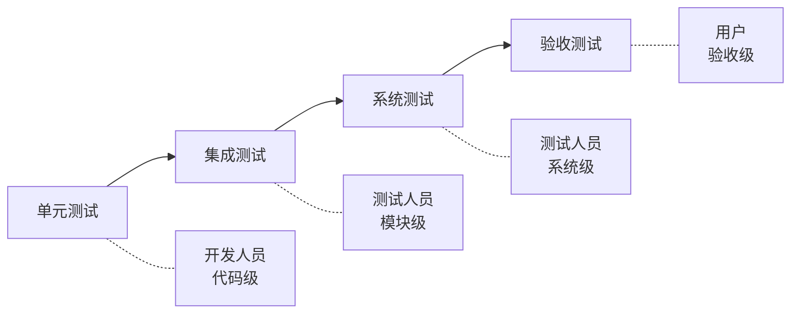
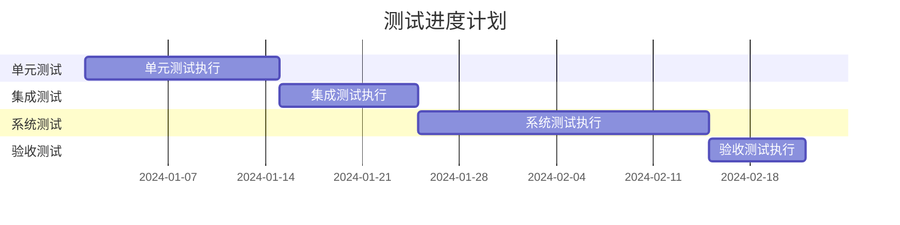

# 测试计划说明书 (TP)

## 文档信息

| 项目 | 内容 |
|------|------|
| 文档名称 | 测试计划说明书 |
| 文档编号 | TP-{{projectCode}}-V1.0 |
| 版本 | V1.0 |
| 日期 | {{createdDate}} |
| 作者 | {{author}} |

---

## 版本历史

| 版本 | 日期 | 作者 | 描述 |
|------|------|------|------|
| V1.0 | {{createdDate}} | {{author}} | 初始版本 |

---

## 1. 引言

### 1.1 目的

本文档定义 **{{projectName}}** 的测试策略、测试方法、测试资源安排和进度计划。

### 1.2 测试范围

| 测试类型 | 覆盖范围 |
|----------|----------|
| 单元测试 | 核心业务逻辑代码 |
| 集成测试 | 模块间接口调用 |
| 系统测试 | 完整系统功能 |
| 验收测试 | 用户需求满足度 |

---

## 2. 测试策略

### 2.1 测试级别

### 2.2 测试方法

| 测试类型 | 方法 | 说明 |
|----------|------|------|
| 黑盒测试 | 功能验证 | 基于需求规格验证功能 |
| 白盒测试 | 结构覆盖 | 基于代码结构设计测试用例 |
| 灰盒测试 | 接口验证 | 结合黑白盒验证接口 |
| 自动化测试 | 脚本执行 | 重复性测试自动化 |
| 性能测试 | 负载模拟 | 验证性能指标 |

### 2.3 测试准入准出标准

#### 2.3.1 准入标准

| 测试阶段 | 准入条件 |
|----------|----------|
| 单元测试 | 代码编写完成，覆盖率≥80% |
| 集成测试 | 单元测试通过，模块完成集成 |
| 系统测试 | 集成测试通过，系统部署完成 |
| 验收测试 | 系统测试通过，稳定版本发布 |

#### 2.3.2 准出标准

| 测试阶段 | 准出条件 |
|----------|----------|
| 单元测试 | 分支覆盖率≥80%，无高危缺陷 |
| 集成测试 | 接口测试通过率100%，无阻塞缺陷 |
| 系统测试 | 功能测试通过率≥95%，无严重缺陷 |
| 验收测试 | 用户确认需求全部满足 |

---

## 3. 测试资源

### 3.1 人力资源

| 测试人员 | 角色 | 职责 | 投入时间 |
|----------|------|------|----------|
| [姓名1] | 测试经理 | 测试计划制定、进度把控 | X人月 |
| [姓名2] | 测试工程师 | 功能测试执行 | X人月 |
| [姓名3] | 自动化测试工程师 | 自动化测试开发 | X人月 |
| [姓名4] | 性能测试工程师 | 性能测试执行 | X人月 |

### 3.2 测试环境

| 环境 | 用途 | 配置 | 软件 |
|------|------|------|------|
| 开发环境 | 日常测试 | [配置] | [软件列表] |
| 测试环境 | 功能测试 | [配置] | [软件列表] |
| 预发布环境 | 验收测试 | [配置] | [软件列表] |
| 生产环境 | 最终验证 | [配置] | [软件列表] |

### 3.3 测试工具

| 工具类型 | 工具名称 | 版本 | 用途 |
|----------|----------|------|------|
| 缺陷管理 | [Jira/Mantis] | [版本] | 缺陷跟踪 |
| 测试管理 | [TestRail/Zephyr] | [版本] | 测试用例管理 |
| 自动化框架 | [Selenium/JUnit/TestNG] | [版本] | 自动化测试 |
| 性能测试 | [JMeter/LoadRunner] | [版本] | 性能测试 |
| 接口测试 | [Postman/SoapUI] | [版本] | 接口测试 |

---

## 4. 测试进度计划

### 4.1 测试里程碑

### 4.2 详细进度计划

| 阶段 | 任务 | 负责人 | 开始日期 | 结束日期 | 工作日 |
|------|------|--------|----------|----------|--------|
| 单元测试 | 测试用例编写 | {{author}} | {{createdDate}} | {{createdDate}} | X天 |
| 单元测试 | 测试执行 | {{author}} | {{createdDate}} | {{createdDate}} | X天 |
| 单元测试 | 缺陷跟踪 | {{author}} | {{createdDate}} | {{createdDate}} | X天 |
| 集成测试 | 接口测试 | {{author}} | {{createdDate}} | {{createdDate}} | X天 |
| ... | ... | ... | ... | ... | ... |

---

## 5. 测试用例设计

### 5.1 用例设计方法

| 方法 | 适用场景 | 说明 |
|------|----------|------|
| 等价类划分 | 输入项多 | 分有效/无效等价类 |
| 边界值分析 | 数值范围 | 测试边界值 |
| 判定表法 | 多条件组合 | 条件组合测试 |
| 场景法 | 业务流程 | 基本/备选/异常场景 |
| 正交试验法 | 多因素组合 | 因素水平组合 |

### 5.2 用例示例

#### 5.2.1 [功能模块] - [测试点]

| 用例编号 | TC-[模块]-001 |
|----------|---------------|
| 用例名称 | [名称] |
| 优先级 | [P0/P1/P2/P3] |
| 预置条件 | [条件] |
| 测试步骤 | 1. [步骤1] 2. [步骤2] 3. [步骤3] |
| 测试数据 | [数据] |
| 预期结果 | [结果] |

---

## 6. 风险评估

### 6.1 测试风险识别

| 风险ID | 风险描述 | 概率 | 影响 | 应对策略 |
|--------|----------|------|------|----------|
| R-001 | [风险1] | [高/中/低] | [高/中/低] | [策略] |
| R-002 | [风险2] | [高/中/低] | [高/中/低] | [策略] |

### 6.2 风险应对计划

- **规避**：采取预防措施消除风险
- **转移**：购买保险或外包
- **减轻**：采取措施降低概率或影响
- **接受**：接受残余风险

---

## 7. 质量度量指标

### 7.1 测试覆盖率

| 指标 | 目标值 |
|------|--------|
| 代码覆盖率 | ≥ 80% |
| 分支覆盖率 | ≥ 80% |
| 需求覆盖率 | 100% |
| 用例执行率 | 100% |

### 7.2 缺陷相关指标

| 指标 | 目标值 |
|------|--------|
| 缺陷密度 | ≤ [X]个/KLOC |
| 缺陷修复率 | ≥ 95% |
| 漏测率 | ≤ [X]% |
| 缺陷等级分布 | 严重:高, 一般:中, 轻微:低 |

---

## 8. 附录

### 8.1 测试术语表

| 术语 | 定义 |
|------|------|
| [术语] | [定义] |

### 8.2 参考文档

| 文档名称 | 文档编号 | 说明 |
|----------|----------|------|
| [文档1] | [编号] | [说明] |

---

**文档批准**：

| 角色 | 姓名 | 日期 | 签名 |
|------|------|------|------|
| 测试经理 | | | |
| 项目经理 | | | |
| 质量负责人 | | | |