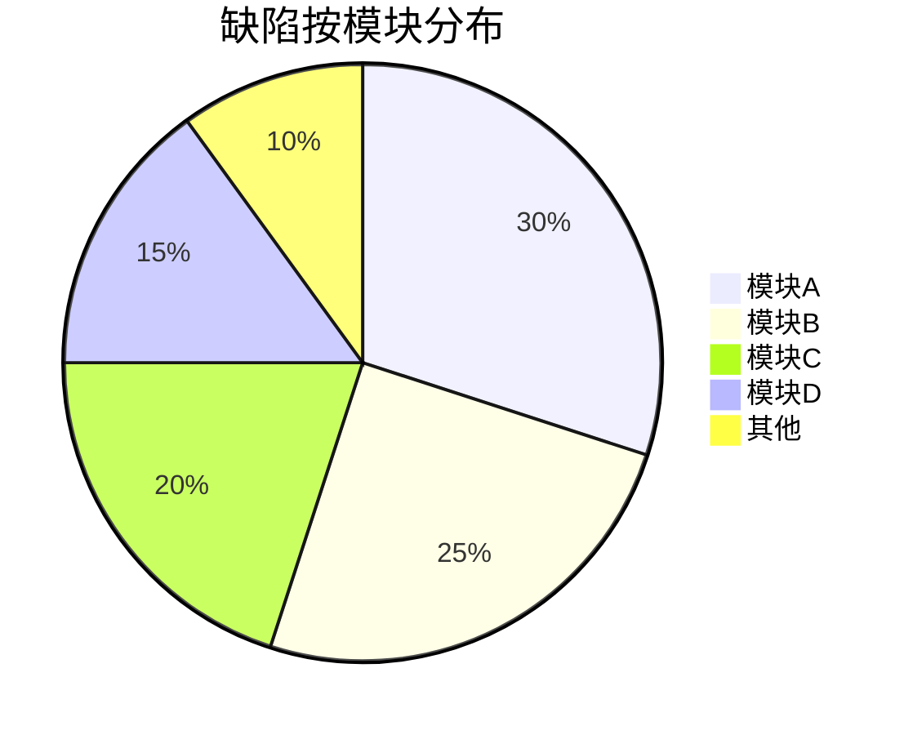
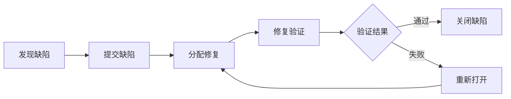

# 测试报告 (TR)

## 文档信息

| 项目 | 内容 |
|------|------|
| 文档名称 | 测试报告 |
| 文档编号 | TR-{{projectCode}}-V1.0 |
| 版本 | V1.0 |
| 日期 | {{createdDate}} |
| 作者 | {{author}} |

---

## 版本历史

| 版本 | 日期 | 作者 | 描述 |
|------|------|------|------|
| V1.0 | {{createdDate}} | {{author}} | 初始版本 |

---

## 1. 测试概述

### 1.1 测试背景

[描述本次测试的背景和目的]

### 1.2 测试范围

| 测试类型 | 测试范围 |
|----------|----------|
| 单元测试 | [模块列表] |
| 集成测试 | [模块列表] |
| 系统测试 | [功能列表] |
| 性能测试 | [场景列表] |

### 1.3 测试环境

| 环境 | 配置 | 软件版本 |
|------|------|----------|
| [环境名称] | [CPU/内存/硬盘] | [软件版本列表] |

---

## 2. 测试执行情况

### 2.1 测试进度

```mermaid
gantt
    title 测试执行进度
    dateFormat YYYY-MM-DD
    section 执行统计
    计划用例数       :2024-01-01, 0d
    已执行用例数     :0d, 7d
    通过用例数       :0d, 7d
    失败用例数       :0d, 7d
    阻塞用例数       :0d, 7d
```

### 2.2 执行统计

| 指标 | 计划 | 实际 | 完成率 |
|------|------|------|--------|
| 测试用例总数 | X | X | X% |
| 已执行用例数 | X | X | X% |
| 通过用例数 | - | X | X% |
| 失败用例数 | - | X | X% |
| 阻塞用例数 | - | X | X% |

### 2.3 用例执行明细

| 模块 | 用例总数 | 通过 | 失败 | 阻塞 | 通过率 |
|------|----------|------|------|------|--------|
| [模块1] | X | X | X | X | X% |
| [模块2] | X | X | X | X | X% |
| 合计 | X | X | X | X | X% |

---

## 3. 缺陷分析

### 3.1 缺陷汇总

| 缺陷等级 | 新增数量 | 已修复 | 未修复 | 修复率 |
|----------|----------|--------|--------|--------|
| 严重(S1) | X | X | X | X% |
| 高(S2) | X | X | X | X% |
| 中(S3) | X | X | X | X% |
| 低(S4) | X | X | X | X% |
| 合计 | X | X | X | X% |

### 3.2 缺陷分布



### 3.3 缺陷趋势



### 3.4 未解决缺陷列表

| 缺陷ID | 缺陷标题 | 严重等级 | 模块 | 状态 | 备注 |
|--------|----------|----------|------|------|------|
| [ID-001] | [标题] | S2 | [模块] | [打开/延期] | [备注] |

---

## 4. 测试结果分析

### 4.1 功能测试结果

| 功能点 | 测试结果 | 说明 |
|--------|----------|------|
| [功能1] | [通过/失败] | [说明] |
| [功能2] | [通过/失败] | [说明] |

### 4.2 性能测试结果

| 指标 | 目标值 | 实际值 | 结果 |
|------|--------|--------|------|
| 响应时间 | ≤ 2s | Xs | [达标/未达标] |
| 并发用户数 | ≥ 100 | X | [达标/未达标] |
| TPS | ≥ 50 | X | [达标/未达标] |
| CPU使用率 | ≤ 80% | X% | [达标/未达标] |

### 4.3 安全测试结果

| 测试项 | 结果 | 说明 |
|--------|------|------|
| [测试项1] | [通过/失败] | [说明] |

---

## 5. 测试质量评估

### 5.1 测试覆盖率

| 覆盖类型 | 覆盖率 | 目标 | 结果 |
|----------|--------|------|------|
| 需求覆盖率 | X% | 100% | [达标/未达标] |
| 代码覆盖率 | X% | ≥80% | [达标/未达标] |
| 分支覆盖率 | X% | ≥80% | [达标/未达标] |

### 5.2 质量评估

| 质量维度 | 评估结果 |
|----------|----------|
| 功能完整性 | [优秀/良好/一般/差] |
| 缺陷修复质量 | [优秀/良好/一般/差] |
| 性能达标情况 | [优秀/良好/一般/差] |
| 整体质量等级 | [优秀/良好/一般/差] |

---

## 6. 风险与遗留问题

### 6.1 遗留风险

| 风险ID | 风险描述 | 影响 | 建议措施 |
|--------|----------|------|----------|
| [ID-001] | [描述] | [影响说明] | [措施] |

### 6.2 遗留问题

| 问题ID | 问题描述 | 严重等级 | 原因 | 处理建议 |
|--------|----------|----------|------|----------|
| [ID-001] | [描述] | [等级] | [原因] | [建议] |

---

## 7. 测试结论与建议

### 7.1 测试结论

**[系统名称]** 本次测试[通过/不通过]验收测试。

- 功能测试：[X]个功能点，[X]个通过，[X]个未通过
- 性能测试：[X]项指标达标，[X]项未达标
- 缺陷修复率：[X]%
- 结论：[综合评估]

### 7.2 改进建议

1. [建议1]
2. [建议2]
3. [建议3]

---

## 8. 附录

### 8.1 测试用例执行明细

[详细的测试用例执行结果列表]

### 8.2 缺陷清单

[完整的缺陷列表]

---

**文档批准**：

| 角色 | 姓名 | 日期 | 签名 |
|------|------|------|------|
| 测试负责人 | | | |
| 技术负责人 | | | |
| 项目经理 | | | |
| 客户代表 | | | |