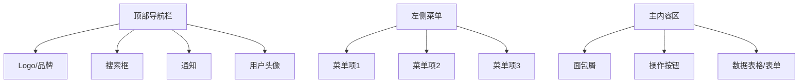

# 用户手册 (UM)

## 文档信息

| 项目 | 内容 |
|------|------|
| 文档名称 | 用户手册 |
| 文档编号 | UM-{{projectCode}}-V1.0 |
| 版本 | V1.0 |
| 日期 | {{createdDate}} |

---

## 目录

1. 产品简介
2. 系统要求
3. 安装部署
4. 快速入门
5. 功能说明
6. 常见问题
7. 附录

---

## 1. 产品简介

### 1.1 产品概述

**{{projectName}}** 是一款[产品定位描述]...

### 1.2 主要功能

| 功能模块 | 功能描述 |
|----------|----------|
| [模块1] | [描述] |
| [模块2] | [描述] |
| [模块3] | [描述] |

### 1.3 产品特点

- **特点1**：[描述]
- **特点2**：[描述]
- **特点3**：[描述]

---

## 2. 系统要求

### 2.1 客户端要求

#### 2.1.1 Web浏览器

| 浏览器 | 最低版本 | 推荐版本 |
|--------|----------|----------|
| Chrome | 90+ | 最新版 |
| Firefox | 88+ | 最新版 |
| Safari | 14+ | 最新版 |
| Edge | 90+ | 最新版 |

#### 2.1.2 移动端

| 平台 | 最低版本 | 推荐版本 |
|------|----------|----------|
| iOS | 14+ | 最新版 |
| Android | 11+ | 最新版 |

### 2.2 网络要求

- 推荐网络带宽：≥ 2Mbps
- 支持网络类型：WiFi、4G、5G

---

## 3. 安装部署

### 3.1 Web端访问

**访问地址**：`https://[域名]`

**首次访问步骤**：
1. 打开浏览器，输入访问地址
2. 进入登录页面
3. 输入账号密码（联系管理员获取初始账号）
4. 首次登录后请修改密码

### 3.2 移动端安装

#### iOS
1. 打开 App Store
2. 搜索 "[应用名称]"
3. 点击安装
4. 安装完成后打开应用

#### Android
1. 打开应用商店
2. 搜索 "[应用名称]"
3. 点击安装
4. 安装完成后打开应用

---

## 4. 快速入门

### 4.1 登录系统

```
步骤1：打开登录页面
步骤2：输入用户名和密码
步骤3：点击"登录"按钮
步骤4：首次登录需绑定手机号/邮箱
步骤5：登录成功，进入首页
```

### 4.2 界面介绍



| 区域 | 说明 |
|------|------|
| 顶部导航栏 | Logo、搜索、通知、用户信息 |
| 左侧菜单 | 功能模块导航 |
| 主内容区 | 业务数据显示和操作区域 |

### 4.3 基础操作

#### 如何搜索
1. 在搜索框输入关键词
2. 按回车或点击搜索图标
3. 查看搜索结果

#### 如何新建
1. 点击"新建"或"添加"按钮
2. 填写表单信息
3. 点击"保存"按钮
4. 提示"保存成功"

#### 如何编辑
1. 在列表找到要编辑的记录
2. 点击"编辑"按钮
3. 修改表单信息
4. 点击"保存"按钮

#### 如何删除
1. 在列表找到要删除的记录
2. 点击"删除"按钮
3. 确认删除提示
4. 提示"删除成功"

---

## 5. 功能说明

### 5.1 [功能模块1]

#### 5.1.1 功能入口

路径：[菜单路径]

#### 5.1.2 功能描述

[详细的功能描述]

#### 5.1.3 操作指南

**步骤1**：[操作说明]
**步骤2**：[操作说明]
**步骤3**：[操作说明]

#### 5.1.4 界面截图

[界面截图位置]

### 5.2 [功能模块2]

[同上结构]

---

## 6. 常见问题

### 6.1 登录相关

| 问题 | 解决方案 |
|------|----------|
| 忘记密码怎么办？ | 点击登录页"忘记密码"，通过绑定的手机号/邮箱重置 |
| 账号被锁定怎么办？ | 联系系统管理员解锁 |
| 登录提示"验证码错误" | 刷新页面重新获取验证码 |

### 6.2 操作相关

| 问题 | 解决方案 |
|------|----------|
| 保存失败怎么办？ | 检查必填项是否填写完整，或联系管理员 |
| 数据导出失败怎么办？ | 检查网络连接，或尝试分批导出 |
| 页面加载缓慢 | 清除浏览器缓存，或切换到推荐浏览器 |

### 6.3 其他问题

| 问题 | 解决方案 |
|------|----------|
| 如何修改个人信息？ | 点击右上角头像，选择"个人设置" |
| 如何修改密码？ | 点击右上角头像，选择"修改密码" |
| 如何联系技术支持？ | 发送邮件至 [支持邮箱] 或拨打 [支持电话] |

---

## 7. 附录

### 7.1 快捷键说明

| 快捷键 | 功能 |
|--------|------|
| Ctrl + S | 保存 |
| Ctrl + Z | 撤销 |
| Ctrl + F | 搜索 |
| Esc | 取消/关闭 |

### 7.2 术语解释

| 术语 | 解释 |
|------|------|
| [术语1] | [解释] |

### 7.3 联系方式

| 类型 | 信息 |
|------|------|
| 技术支持邮箱 | [邮箱] |
| 技术支持电话 | [电话] |
| 官方网站 | [网址] |

---

## 版本更新记录

| 版本 | 日期 | 更新内容 |
|------|------|----------|
| V1.0 | {{createdDate}} | 初始版本发布 |

---

**文档编写完成**