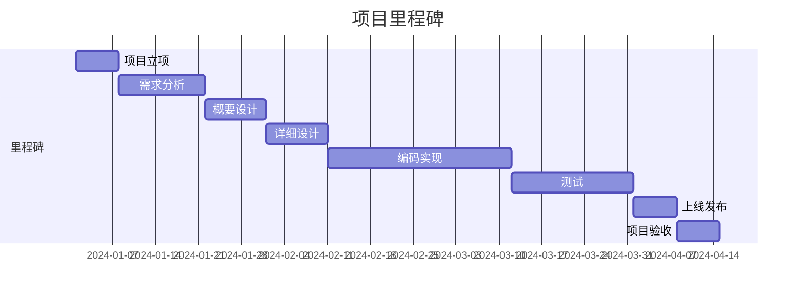
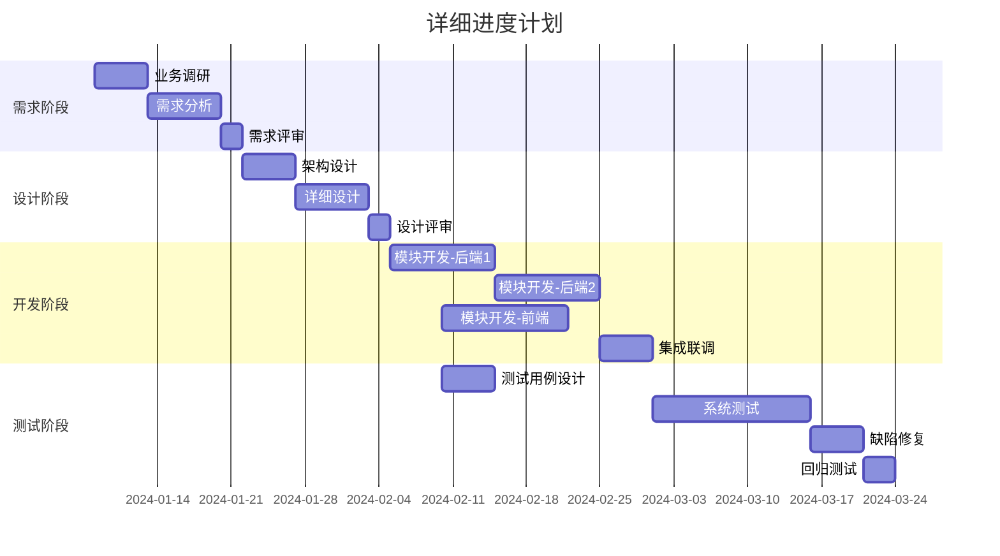

# 项目计划 (PP)

## 文档信息

| 项目 | 内容 |
|------|------|
| 文档名称 | 项目计划 |
| 文档编号 | PP-{{projectCode}}-V1.0 |
| 版本 | V1.0 |
| 日期 | {{createdDate}} |
| 项目经理 | [项目经理姓名] |

---

## 版本历史

| 版本 | 日期 | 作者 | 描述 |
|------|------|------|------|
| V1.0 | {{createdDate}} | {{author}} | 初始版本 |

---

## 1. 项目概述

### 1.1 项目背景

[描述项目的发起原因、业务背景]

### 1.2 项目目标

| 目标编号 | 目标描述 | 衡量标准 |
|----------|----------|----------|
| OBJ-001 | [目标1] | [标准] |
| OBJ-002 | [目标2] | [标准] |

### 1.3 项目范围

**包含范围**：
- [范围1]
- [范围2]

**不包含范围**：
- [排除项1]
- [排除项2]

### 1.4 假设与约束

| 类型 | 内容 | 影响 |
|------|------|------|
| 假设 | [假设条件] | [影响说明] |
| 进度约束 | [时间要求] | [影响说明] |
| 资源约束 | [资源限制] | [影响说明] |

---

## 2. 项目组织

### 2.1 组织结构

```mermaid
graph TB
    PM[项目经理\n[姓名]] --> TL1[技术负责人\n[姓名]]
    PM --> TL2[测试负责人\n[姓名]]

    TL1 --> DEV1[开发工程师1\n[姓名]]
    TL1 --> DEV2[开发工程师2\n[姓名]]

    TL2 --> QA1[测试工程师1\n[姓名]]
    TL2 --> QA2[测试工程师2\n[姓名]]

    PM --> UI[UI设计师\n[姓名]]
```

### 2.2 角色与职责

| 角色 | 姓名 | 主要职责 |
|------|------|----------|
| 项目经理 | [姓名] | 项目整体管理、进度控制、干系人沟通 |
| 技术负责人 | [姓名] | 技术架构、技术决策、代码评审 |
| 开发工程师 | [姓名] | 功能开发、单元测试 |
| 测试负责人 | [姓名] | 测试计划、用例设计、缺陷管理 |
| 测试工程师 | [姓名] | 测试执行、测试报告 |
| UI设计师 | [姓名] | 界面设计、交互设计 |

---

## 3. 里程碑计划

### 3.1 项目里程碑

| 里程碑ID | 里程碑名称 | 计划完成日期 | 实际完成日期 | 状态 |
|----------|------------|--------------|--------------|------|
| M1 | 项目立项 | {{createdDate}} | {{createdDate}} | [完成/进行中/待开始] |
| M2 | 需求分析完成 | {{createdDate}} | {{createdDate}} | [完成/进行中/待开始] |
| M3 | 概要设计完成 | {{createdDate}} | {{createdDate}} | [完成/进行中/待开始] |
| M4 | 详细设计完成 | {{createdDate}} | {{createdDate}} | [完成/进行中/待开始] |
| M5 | 开发完成 | {{createdDate}} | {{createdDate}} | [完成/进行中/待开始] |
| M6 | 测试完成 | {{createdDate}} | {{createdDate}} | [完成/进行中/待开始] |
| M7 | 上线发布 | {{createdDate}} | {{createdDate}} | [完成/进行中/待开始] |
| M8 | 项目验收 | {{createdDate}} | {{createdDate}} | [完成/进行中/待开始] |

### 3.2 里程碑图示



---

## 4. 详细进度计划

### 4.1 WBS工作分解结构

```
{{projectName}}
├── 1. 项目管理
│   ├── 1.1 项目启动
│   ├── 1.2 项目规划
│   ├── 1.3 项目监控
│   └── 1.4 项目收尾
├── 2. 需求工程
│   ├── 2.1 业务调研
│   ├── 2.2 需求分析
│   ├── 2.3 需求评审
│   └── 2.4 需求确认
├── 3. 软件设计
│   ├── 3.1 架构设计
│   ├── 3.2 详细设计
│   └── 3.3 设计评审
├── 4. 编码实现
│   ├── 4.1 编码规范制定
│   ├── 4.2 模块开发
│   ├── 4.3 代码评审
│   └── 4.4 单元测试
├── 5. 测试
│   ├── 5.1 测试计划
│   ├── 5.2 测试用例设计
│   ├── 5.3 测试执行
│   └── 5.4 测试报告
└── 6. 部署运维
    ├── 6.1 环境部署
    ├── 6.2 数据迁移
    ├── 6.3 系统上线
    └── 6.4 运维支持
```

### 4.2 任务分解表

| 阶段 | 任务 | 负责人 | 开始日期 | 结束日期 | 工作量(人天) | 依赖关系 |
|------|------|--------|----------|----------|--------------|----------|
| 项目管理 | 项目启动 | {{author}} | {{createdDate}} | {{createdDate}} | X | - |
| 项目管理 | 项目规划 | {{author}} | {{createdDate}} | {{createdDate}} | X | 项目启动 |
| 需求工程 | 业务调研 | {{author}} | {{createdDate}} | {{createdDate}} | X | 项目规划 |
| 需求工程 | 需求分析 | {{author}} | {{createdDate}} | {{createdDate}} | X | 业务调研 |
| ... | ... | ... | ... | ... | ... | ... |

### 4.3 进度计划图



---

## 5. 资源计划

### 5.1 人力资源

| 角色 | 姓名 | 投入比例 | 投入时间段 |
|------|------|----------|------------|
| 项目经理 | {{author}} | 100% | [起始]-[结束] |
| 技术负责人 | {{author}} | 100% | [起始]-[结束] |
| 开发工程师 | {{author}} | 100% | [起始]-[结束] |
| 测试工程师 | {{author}} | 80% | [起始]-[结束] |
| UI设计师 | {{author}} | 30% | [起始]-[结束] |

### 5.2 硬件资源

| 资源类型 | 规格 | 数量 | 用途 |
|----------|------|------|------|
| 开发服务器 | [规格] | X台 | 开发测试 |
| 测试服务器 | [规格] | X台 | 功能测试 |
| 生产服务器 | [规格] | X台 | 正式部署 |

### 5.3 软件资源

| 软件名称 | 版本 | 数量 | 用途 |
|----------|------|------|------|
| [软件1] | [版本] | X | [用途] |
| [软件2] | [版本] | X | [用途] |

### 5.4 预算估算

| 成本类型 | 预算(万元) | 说明 |
|----------|------------|------|
| 人力成本 | X | 人员费用 |
| 硬件成本 | X | 服务器等 |
| 软件成本 | X | 许可证等 |
| 其他成本 | X | 培训、出差等 |
| **总计** | **X** | |

---

## 6. 风险管理

### 6.1 风险识别

| 风险ID | 风险描述 | 类别 | 概率 | 影响 | 优先级 |
|--------|----------|------|------|------|--------|
| R-001 | [风险1] | [技术/人员/进度] | [高/中/低] | [高/中/低] | [P0-P3] |
| R-002 | [风险2] | [技术/人员/进度] | [高/中/低] | [高/中/低] | [P0-P3] |

### 6.2 风险应对计划

| 风险ID | 应对策略 | 具体措施 | 责任人 | 触发条件 |
|--------|----------|----------|--------|----------|
| R-001 | [规避/转移/减轻/接受] | [措施] | {{author}} | [条件] |
| R-002 | [规避/转移/减轻/接受] | [措施] | {{author}} | [条件] |

---

## 7. 沟通管理

### 7.1 沟通计划

| 沟通类型 | 频率 | 参与者 | 内容 | 输出 |
|----------|------|--------|------|------|
| 周例会 | 每周 | 项目团队 | 进度同步、问题跟踪 | 周报 |
| 里程碑评审 | 里程碑 | 全体干系人 | 阶段评审 | 评审报告 |
| 日常沟通 | 每日 | 团队成员 | 任务协调 | - |

### 7.2 报告机制

| 报告类型 | 频率 | 接收人 | 编制人 |
|----------|------|--------|--------|
| 周进度报告 | 每周 | 项目发起人 | 项目经理 |
| 月度报告 | 每月 | 管理层 | 项目经理 |
| 里程碑报告 | 里程碑 | 全体干系人 | 项目经理 |

---

## 8. 质量保证

### 8.1 质量目标

| 质量指标 | 目标值 | 测量方法 |
|----------|--------|----------|
| 需求文档完整性 | 100% | 评审通过率 |
| 代码评审覆盖率 | ≥ 80% | 评审代码量/总代码量 |
| 测试用例执行率 | 100% | 已执行用例/总用例 |
| 缺陷修复率 | ≥ 95% | 已修复/总缺陷 |
| 客户满意度 | ≥ 90分 | 满意度调查 |

### 8.2 评审计划

| 评审点 | 评审内容 | 评审人 | 时间 |
|--------|----------|--------|------|
| 需求评审 | SRS文档 | 技术/业务 | {{createdDate}} |
| 设计评审 | SDS文档 | 技术团队 | {{createdDate}} |
| 代码评审 | 核心代码 | 技术负责人 | {{createdDate}} |
| 测试评审 | 测试计划 | 测试/技术 | {{createdDate}} |

---

**文档批准**：

| 角色 | 姓名 | 日期 | 签名 |
|------|------|------|------|
| 项目经理 | | | |
| 技术负责人 | | | |
| 质量负责人 | | | |
| 项目发起人 | | | |