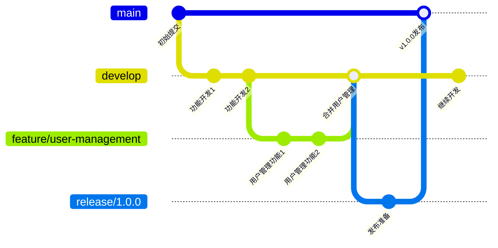
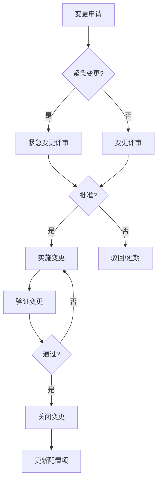

# 配置管理计划 (CMP)

## 文档信息

| 项目 | 内容 |
|------|------|
| 文档名称 | 配置管理计划 |
| 文档编号 | CMP-{{projectCode}}-V1.0 |
| 版本 | V1.0 |
| 日期 | {{createdDate}} |
| 配置管理员 | [配置管理员姓名] |

---

## 版本历史

| 版本 | 日期 | 作者 | 描述 |
|------|------|------|------|
| V1.0 | {{createdDate}} | {{author}} | 初始版本 |

---

## 1. 引言

### 1.1 目的

本文档定义 **{{projectName}}** 的配置管理策略、流程和活动，确保项目资产的完整性、可追溯性和版本控制。

### 1.2 范围

适用于：
- 源代码管理
- 文档版本管理
- 缺陷跟踪
- 变更控制

### 1.3 定义与缩略语

| 术语 | 定义 |
|------|------|
| SCM | Software Configuration Management，软件配置管理 |
| 基线 | Baseline，经过正式评审批准的配置项集合 |
| 配置项 | Configuration Item，纳入配置管理的实体 |
| 变更控制 | Change Control，对配置项变更的评审和批准流程 |

---

## 2. 配置管理策略

### 2.1 配置管理工具

| 工具类型 | 工具名称 | 版本 | 用途 |
|----------|----------|------|------|
| 版本控制 | Git | 2.x+ | 源代码管理 |
| 代码仓库 | GitHub/GitLab/Gitee | - | 远程仓库 |
| 文档管理 | [Confluence/其他] | - | 文档存储 |
| 缺陷管理 | [Jira/Mantis] | - | 缺陷跟踪 |
| 包管理 | [Nexus/Artifactory] | - | 制品库 |

### 2.2 分支策略



#### 2.2.1 分支类型说明

| 分支类型 | 命名规范 | 生命周期 | 说明 |
|----------|----------|----------|------|
| main/master | main | 永久 | 正式发布版本 |
| develop | develop | 永久 | 开发主分支 |
| feature/* | feature/功能名 | 临时 | 功能分支 |
| release/* | release/版本号 | 临时 | 发布分支 |
| hotfix/* | hotfix/问题描述 | 临时 | 紧急修复分支 |

#### 2.2.2 分支合并规则

- feature → develop：Pull Request + 代码审查
- release → main：Pull Request + 测试通过 + 发布审批
- hotfix → main + develop：Pull Request + 紧急审批

### 2.3 版本命名规范

**格式**：`主版本.次版本.修订版本`

| 标识 | 含义 | 变更规则 |
|------|------|----------|
| 主版本 | 重大架构变更 | 不兼容的API变更 |
| 次版本 | 功能新增 | 向下兼容的功能新增 |
| 修订版本 | 问题修复 | 向下兼容的bug修复 |

**示例**：`v1.2.3`
- 1：主版本号
- 2：次版本号
- 3：修订版本号

---

## 3. 配置项标识

### 3.1 配置项分类

| 配置项类型 | 标识格式 | 存储位置 |
|------------|----------|----------|
| 源代码 | src/* | Git仓库 |
| 配置文件 | config/* | Git仓库 |
| 文档 | docs/* | Git仓库/Confluence |
| 数据库脚本 | sql/* | Git仓库 |
| 依赖库 | lib/* | 制品库 |
| 发布的制品 | *-release/* | 制品库 |
| 测试用例 | test/* | Git仓库 |

### 3.2 配置项清单

| 配置项ID | 配置项名称 | 类型 | 存储位置 | 责任人 |
|----------|------------|------|----------|--------|
| CI-001 | 源代码 | source | Git | 开发负责人 |
| CI-002 | 需求文档 | document | Confluence | 产品经理 |
| CI-003 | 设计文档 | document | Confluence | 技术负责人 |
| CI-004 | 测试用例 | test | Git | 测试负责人 |
| CI-005 | 部署脚本 | script | Git | 运维负责人 |
| CI-006 | 发布制品 | release | 制品库 | 运维负责人 |

---

## 4. 变更控制流程

### 4.1 变更流程



### 4.2 变更类型与审批权限

| 变更类型 | 影响范围 | 审批人 | 响应时间 |
|----------|----------|--------|----------|
| 紧急变更 | 业务中断/严重缺陷 | 项目经理+技术负责人 | 4小时 |
| 重大变更 | 架构调整/核心功能 | 项目经理+技术负责人+客户 | 3天 |
| 一般变更 | 功能调整/非核心 | 技术负责人 | 1天 |
| 轻微变更 | 代码优化/文档修正 | 开发负责人 | 立即 |

### 4.3 变更申请表格

| 字段 | 内容 |
|------|------|
| 变更编号 | [自动生成] |
| 变更标题 | [标题] |
| 变更类型 | [紧急/重大/一般/轻微] |
| 变更描述 | [详细描述] |
| 变更原因 | [原因] |
| 变更影响 | [影响分析] |
| 实施计划 | [计划] |
| 回滚方案 | [方案] |
| 申请人 | {{author}} |
| 申请日期 | {{createdDate}} |
| 审批人 | {{author}} |
| 审批意见 | [意见] |
| 审批日期 | {{createdDate}} |

---

## 5. 基线管理

### 5.1 基线定义

| 基线名称 | 基线内容 | 评审时间 | 批准人 |
|----------|----------|----------|--------|
| 功能基线 | 需求规格说明书SRS | 需求评审通过后 | 产品经理 |
| 设计基线 | 软件设计说明书SDS | 设计评审通过后 | 技术负责人 |
| 产品基线 | 可发布版本vX.X.X | 发布前评审 | 项目经理 |

### 5.2 基线发布流程

1. 触发条件：满足基线发布标准
2. 评审确认：配置审计 + 变更确认
3. 基线创建：打标签 + 存档
4. 通知相关人：发布基线通知

---

## 6. 配置审计

### 6.1 审计类型

| 审计类型 | 频率 | 执行人 | 内容 |
|----------|------|--------|------|
| 功能配置审计 | 每月 | 配置管理员 | 配置项完整性检查 |
| 物理配置审计 | 每季度 | QA | 配置存储介质检查 |
| 发布审计 | 每次发布 | 配置管理员 | 发布一致性检查 |

### 6.2 审计检查清单

| 检查项 | 检查内容 | 结果 |
|--------|----------|------|
| 标识完整性 | 配置项是否都有唯一标识 | [通过/未通过] |
| 存储完整性 | 所有配置项是否都在受控存储 | [通过/未通过] |
| 变更记录 | 变更是否有完整记录 | [通过/未通过] |
| 版本一致性 | 相关配置项版本是否一致 | [通过/未通过] |

---

## 7. 备份与恢复

### 7.1 备份策略

| 数据类型 | 备份频率 | 保留期限 | 存储位置 |
|----------|----------|----------|----------|
| 源代码仓库 | 实时同步 | 永久 | 主仓库 + 镜像 |
| 配置库 | 每日增量 | 90天 | 本地 + 云端 |
| 制品库 | 每周全量 | 1年 | 本地 + 云端 |
| 文档库 | 每日增量 | 90天 | 本地 + 云端 |

### 7.2 恢复测试

| 测试类型 | 频率 | 负责人 | 记录 |
|----------|------|--------|------|
| 数据恢复测试 | 每季度 | 配置管理员 | [记录位置] |
| 演练 | 每半年 | 运维负责人 | [记录位置] |

---

## 8. 角色与职责

| 角色 | 职责 | 人员 |
|------|------|------|
| 配置管理员 | 日常配置管理、备份、审计 | {{author}} |
| 开发负责人 | 代码分支管理、合并审批 | {{author}} |
| 发布管理员 | 制品发布、版本管理 | {{author}} |
| 项目经理 | 变更审批、基线发布 | {{author}} |

---

## 9. 附录

### 9.1 Git命令参考

```bash
# 创建功能分支
git checkout develop
git pull origin develop
git checkout -b feature/功能名

# 合并到develop
git checkout develop
git pull origin develop
git merge feature/功能名
git push origin develop

# 创建发布分支
git checkout develop
git pull origin develop
git checkout -b release/v1.0.0
# 发布后合并到main和develop
```

### 9.2 配置管理检查表

- [ ] 配置管理工具已安装配置
- [ ] 分支策略已制定并沟通
- [ ] 访问权限已设置
- [ ] 备份策略已配置
- [ ] 变更流程已培训

---

**文档批准**：

| 角色 | 姓名 | 日期 | 签名 |
|------|------|------|------|
| 配置管理员 | | | |
| 技术负责人 | | | |
| 项目经理 | | | |