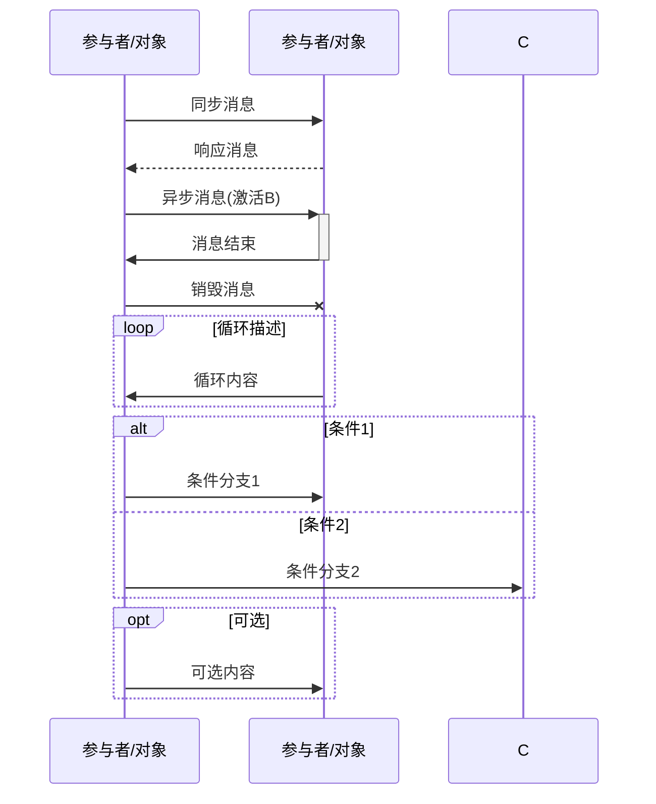
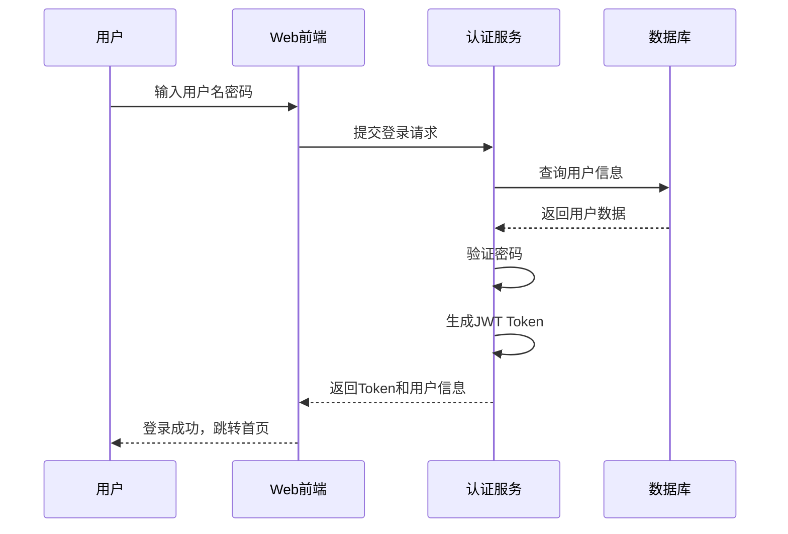
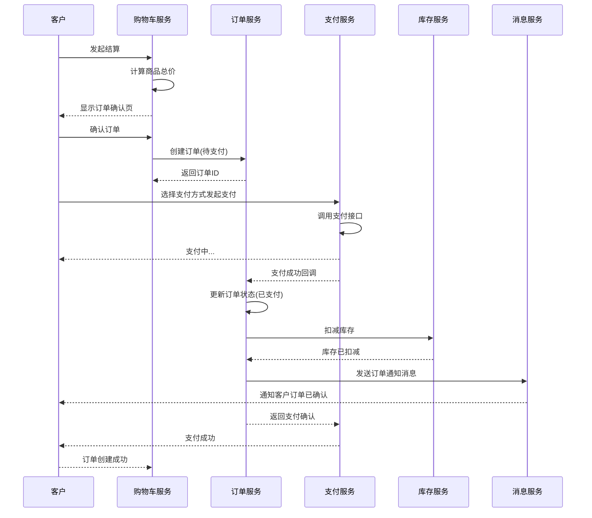
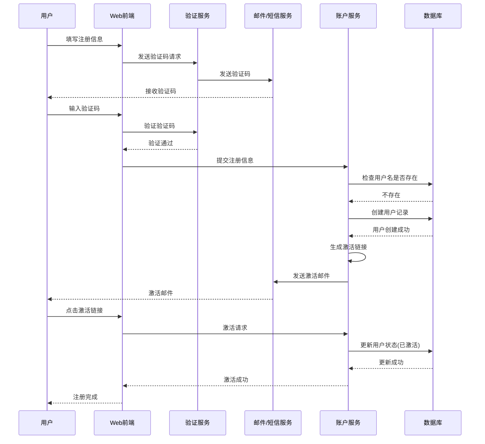
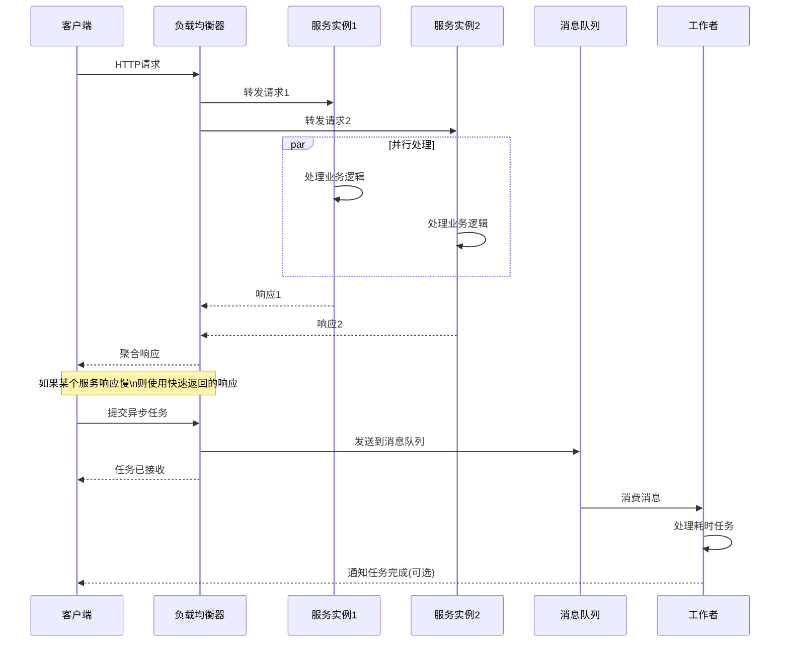
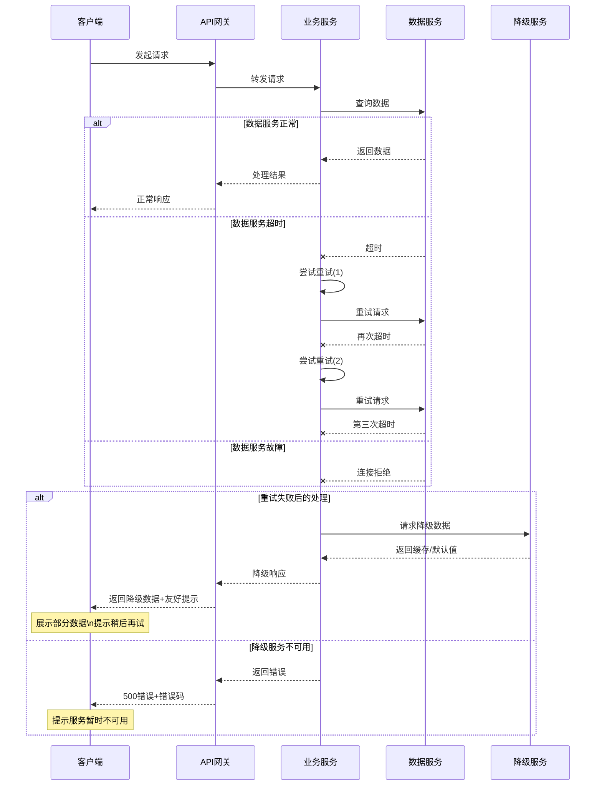
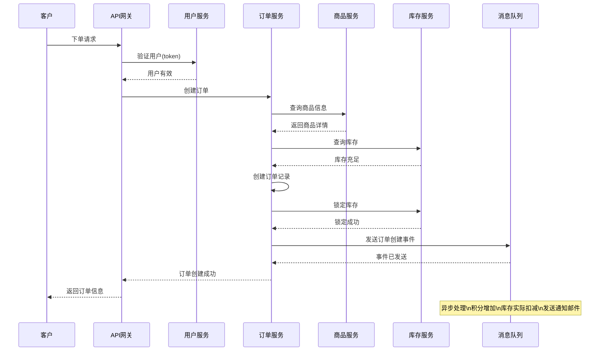

# 序列图模板 (Sequence Diagram)

## 模板说明

序列图（Sequence Diagram）用于描述对象之间按时间顺序交互的消息序列。

## 基本语法

## 消息类型说明

| 语法 | 消息类型 | 说明 |
|------|----------|------|
| `->>` | 同步消息 | 发送者等待响应 |
| `-->>` | 响应消息 | 返回值 |
| `->>+` | 激活+同步 | 激活目标对象 |
| `-->>-` | 结束激活 | 销毁对象 |
| `-x` | 异步消息 | 发送者不等待 |
| `loop` | 循环片段 | 循环执行 |
| `alt/else` | 选择片段 | 条件分支 |
| `opt` | 可选片段 | 可选执行 |

## 模板示例

### 1. 用户登录序列图

### 2. 订单创建序列图

### 3. 用户注册序列图

### 4. 并发处理序列图

### 5. 错误处理序列图

### 6. 微服务调用序列图

## 使用指南

1. **确定参与者**：识别交互过程中的主要对象/服务
2. **确定消息**：识别参与者之间传递的信息
3. **确定顺序**：按时间顺序排列消息
4. **标注激活**：需要标识对象生命周期的开始和结束
5. **处理分支**：使用 `alt/else` 表示条件分支
6. **处理循环**：使用 `loop` 表示重复操作

## 最佳实践

- 消息流从上到下表示时间推进
- 使用清晰的参与者命名
- 关键消息添加说明注释
- 复杂流程拆分为多个序列图
- 使用 `Note` 标记重要说明