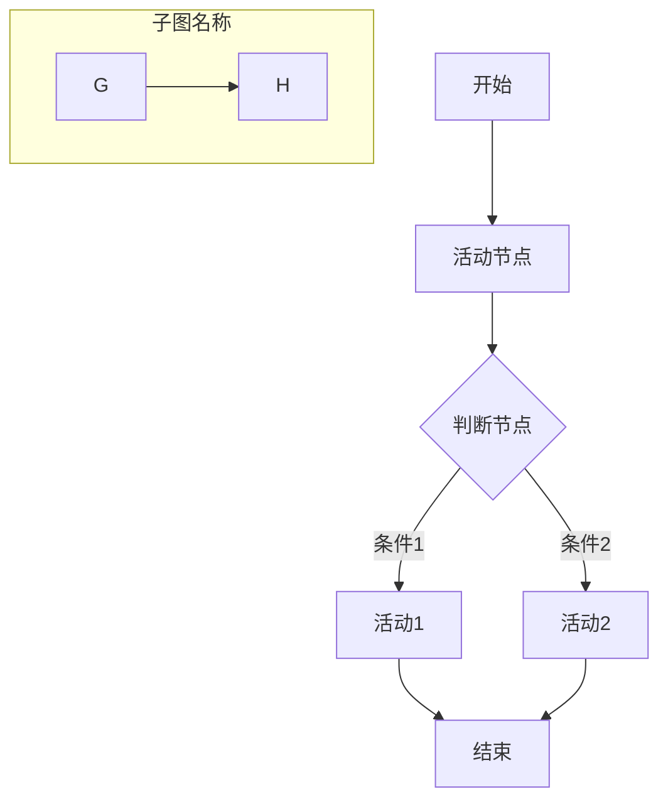
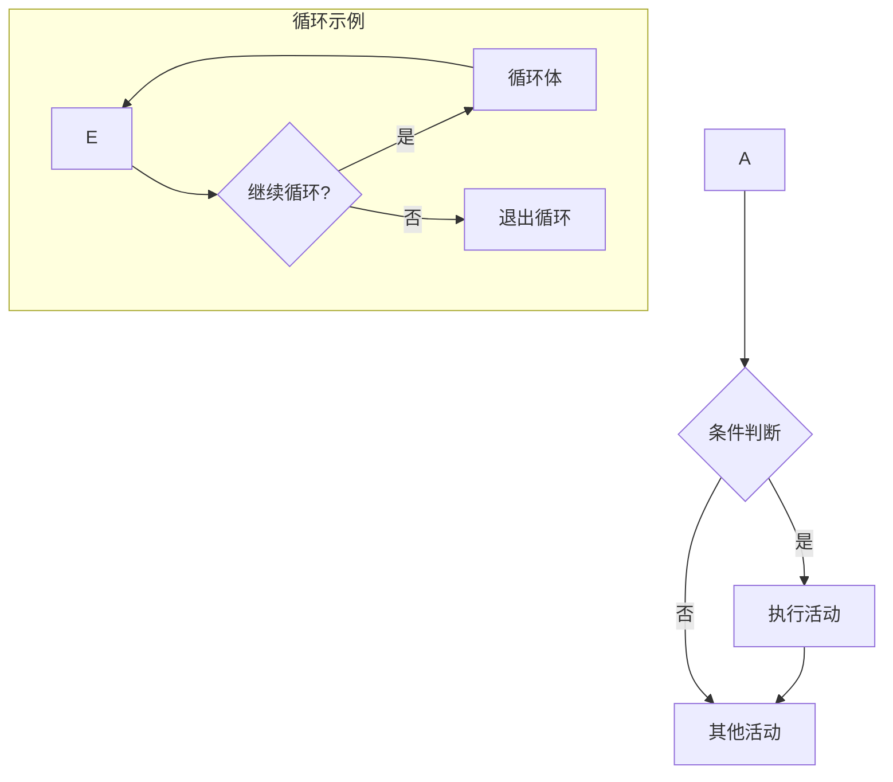
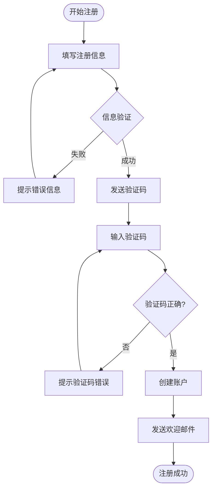
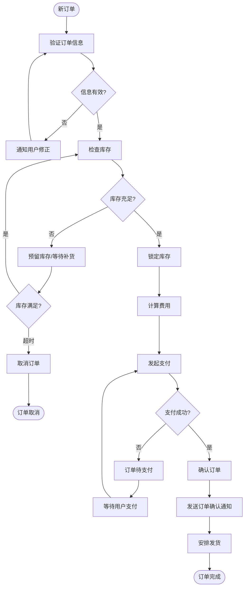
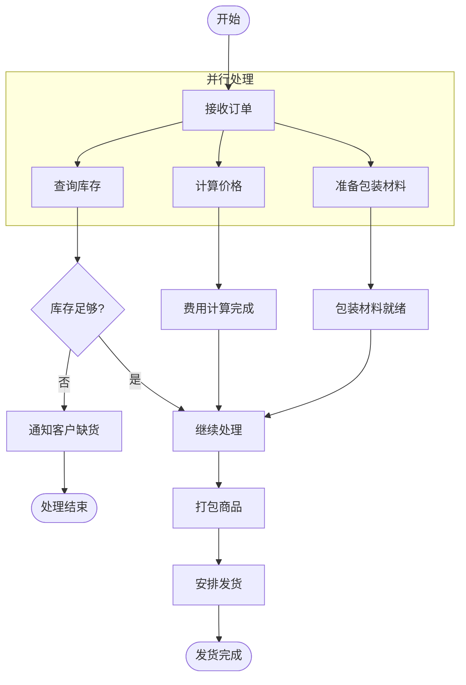
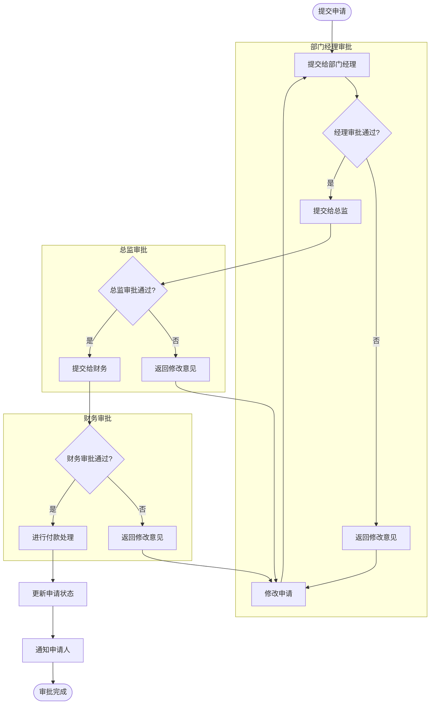
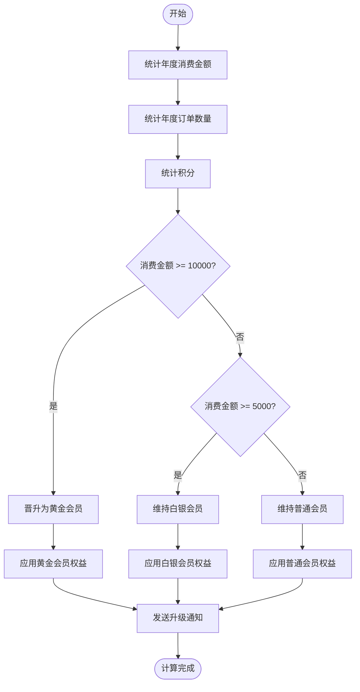
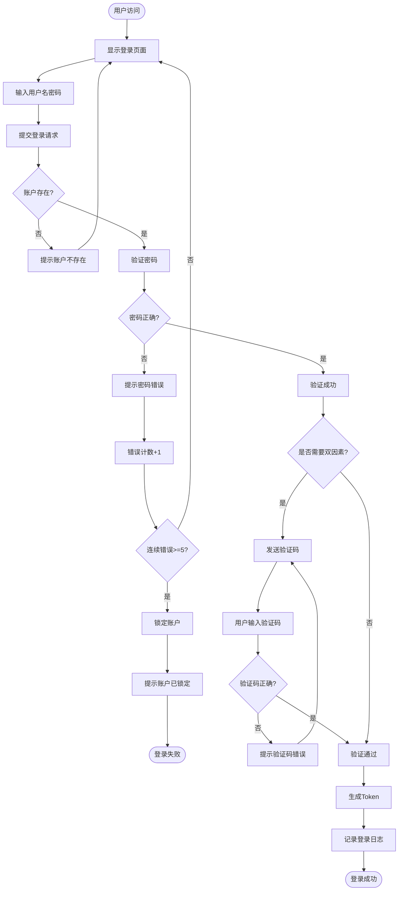

# 活动图模板 (Activity Diagram)

## 模板说明

活动图（Activity Diagram）用于描述业务流程、工作流或算法的执行步骤，支持并行活动。

## 基本语法

## 节点类型

| 语法 | 节点类型 | 说明 |
|------|----------|------|
| `[文本]` | 活动 | 圆角矩形，表示动作/操作 |
| `{文本}` | 判断 | 菱形，表示条件判断 |
| `([[文本]])` | 开始/结束 | 圆圈，表示流程开始或结束 |
| `((文本))` | 圆形 | 大圆点，表示流程开始(竖向) |
| `([文本])` | 跑道形 | 圆角矩形两端半圆，表示子流程 |

## 分支与循环

## 模板示例

### 1. 用户注册流程

### 2. 订单处理流程

### 3. 并行活动处理

### 4. 审批流程（带角色）

### 5. 会员等级计算

### 6. 登录与权限验证

## 使用指南

1. **明确开始和结束**：每个流程有且只有一个开始，可有多个结束
2. **活动命名**：使用动宾短语（如"提交订单"、"验证信息"）
3. **判断节点**：用菱形表示，标注清晰的分支条件
4. **并行处理**：使用 `subgraph` 分组并行活动
5. **泳道活动图**：如需表示不同角色的活动，可用泳道（Swimlanes）

## Mermaid活动图限制

Mermaid 的 `graph TD` 语法支持：
- 开始/结束节点：`([文本])` 或 `[[文本]]`
- 活动节点：`[文本]`
- 判断节点：`{文本}`
- 子图：`subgraph`

不支持真正的并行活动图（Fork/Join），但可通过视觉分组表示并行概念。