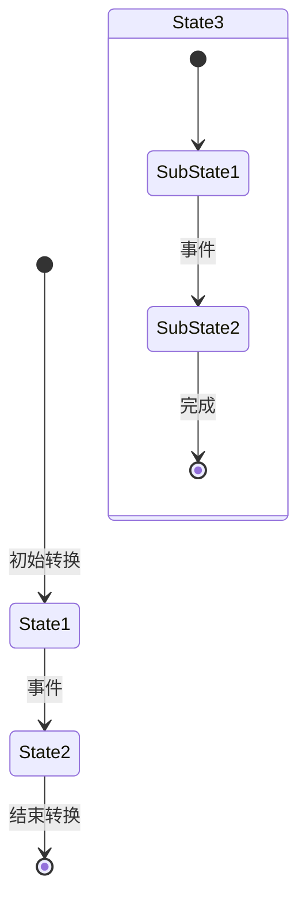
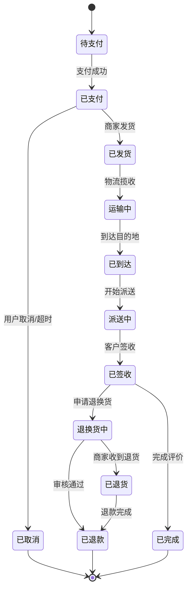
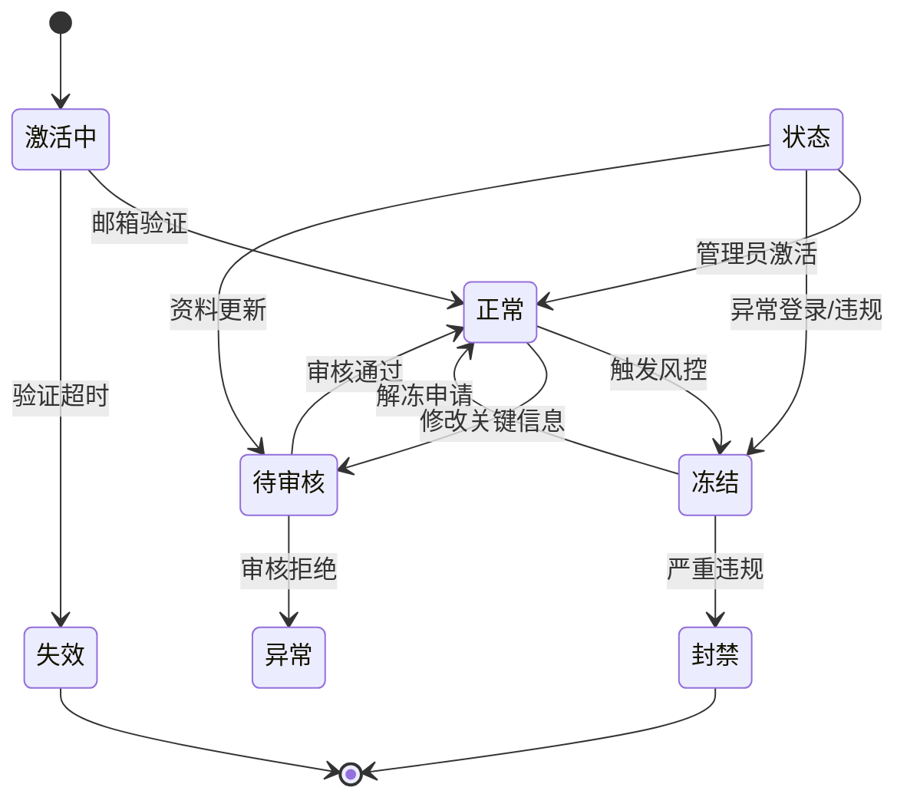
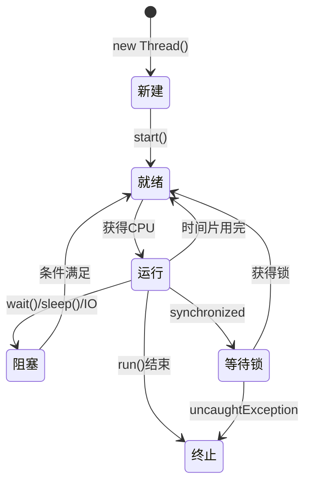
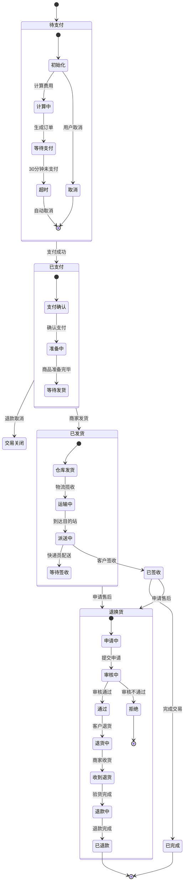
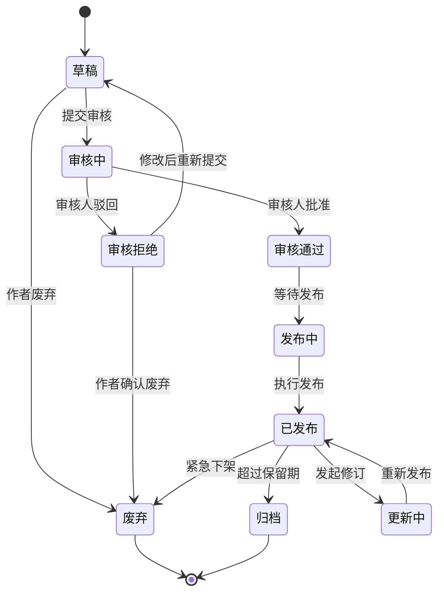
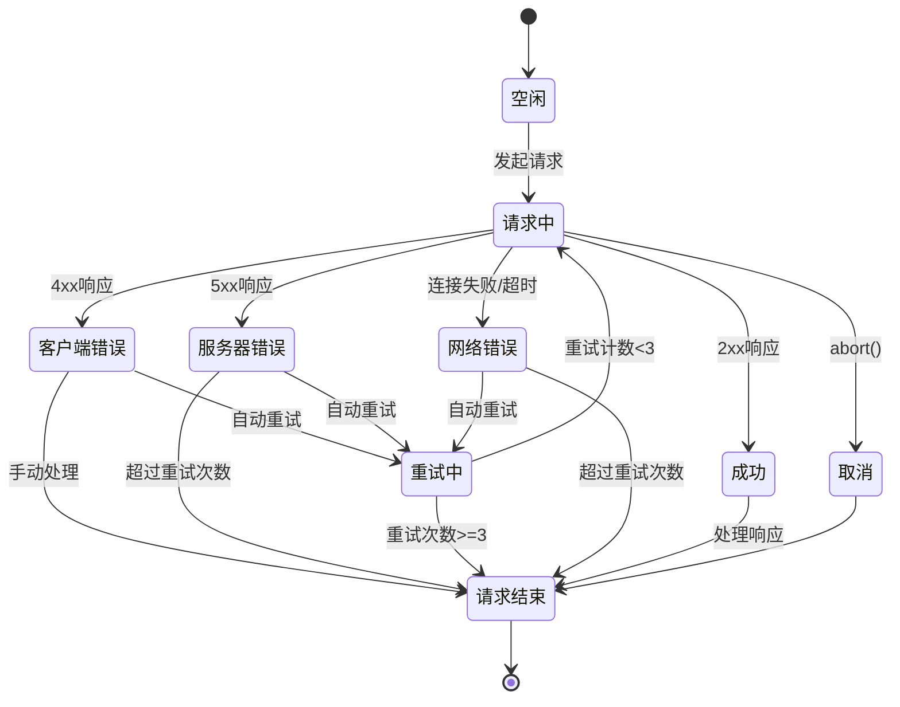

# 状态图模板 (State Diagram)

## 模板说明

状态图（State Diagram）用于描述对象或系统的状态变化，以及触发状态转换的事件。

## 基本语法

## 状态图元素

| 语法 | 元素类型 | 说明 |
|------|----------|------|
| `[*]` | 初始状态 | 黑点，表示状态机开始 |
| `[*] --> State` | 转换箭头 | 带事件的转换 |
| `State1 --> State2: 事件` | 状态转换 | 触发条件和结果 |
| `state Name { }` | 复合状态 | 包含子状态的状态 |

## 模板示例

### 1. 订单状态图

### 2. 用户账户状态图

### 3. 线程状态图

### 4. 复合状态图（订单生命周期）

### 5. 文档状态图（工作流）

### 6. HTTP请求状态图

## 使用指南

1. **识别状态**：确定对象可能处于的所有状态
2. **识别转换**：确定状态之间的转换条件和事件
3. **初始和最终状态**：明确状态的起点和终点
4. **复合状态**：对于复杂对象，使用嵌套的子状态
5. **动作标注**：可在转换箭头旁标注动作（guard conditions）

## 状态图与活动图的区别

| 特征 | 状态图 | 活动图 |
|------|--------|--------|
| 关注点 | 对象的状态变化 | 活动的执行流程 |
| 节点 | 状态 | 活动 |
| 转换 | 事件触发 | 按顺序执行 |
| 并行 | 一般不支持 | 支持并行活动 |
| 适用场景 | 状态机、生命周期 | 业务流程、工作流 |