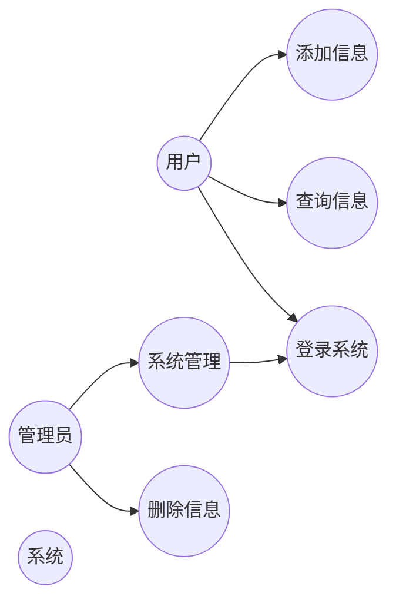

# 用例图模板 (Use Case Diagram)

## 模板说明

用例图（Use Case Diagram）用于描述系统功能与外部参与者之间的交互关系。

## 基本语法

```mermaid
graph LR
    %% 参与者定义
    A([参与者]) or A[参与者] or ((参与者))

    %% 用例定义
    U((用例))

    %% 关系定义
    A --> U  %% 关联关系
    A -- "关系描述" --> U  %% 带标签关联
    U1 --o|包含| U2  %% 包含关系
    U1 --|>扩展| U2  %% 扩展关系
    A --|> --> U  %% 泛化关系
```

## 符号说明

| 符号 | 含义 | 说明 |
|------|------|------|
| `(--)` | 参与者/系统边界 | 圆角矩形或人形图标 |
| `((())` | 用例 | 椭圆 |
| `-->` | 关联关系 | 实线箭头 |
| `--o` | 包含关系 | 虚线箭头，标注"include" |
| `--|>` | 扩展关系 | 虚线箭头，标注"extend" |
| `--\|>` | 泛化关系 | 实线空心箭头 |

## 模板示例

### 1. 简单用户管理系统用例图



### 2. 完整电商系统用例图

```mermaid
graph TB
    subgraph "用户角色"
        Customer((客户))
        Merchant((商家))
        Admin((管理员))
    end

    subgraph "客户功能"
        UC1((浏览商品))
        UC2((搜索商品))
        UC3((加入购物车))
        UC4((下单购买))
        UC5((支付订单))
        UC6((查看订单))
        UC7((评价商品))
        UC8((退换货))
    end

    subgraph "商家功能"
        UC9((商品管理))
        UC10((订单管理))
        UC11((销售统计))
    end

    subgraph "管理员功能"
        UC12((用户管理))
        UC13((商品审核))
        UC14((数据统计))
    end

    subgraph "系统功能"
        UC15((用户注册))
        UC16((用户登录))
        UC17((消息通知))
    end

    %% 客户与系统关系
    Customer --> UC1
    Customer --> UC2
    Customer --> UC3
    Customer --> UC4
    Customer --> UC5
    Customer --> UC6
    Customer --> UC7
    Customer --> UC8

    %% 商家与系统关系
    Merchant --> UC9
    Merchant --> UC10
    Merchant --> UC11

    %% 管理员与系统关系
    Admin --> UC12
    Admin --> UC13
    Admin --> UC14

    %% 包含和扩展关系
    UC4 ..> UC5 : include
    UC8 ..> UC5 : extend
    UC2 ..> UC1 : extend
```

### 3. 银行转账系统用例图

```mermaid
graph TB
    Actor((客户))
    Bank((银行系统))
    Auth((认证系统))

    %% 用例
    Login((登录))
    CheckBalance((查询余额))
    Transfer((转账))
    ViewHistory((查看交易历史))
    ManageAccount((账户管理))

    %% 外部系统用例
    Notify((短信通知))

    %% 关系
    Actor --> Login
    Actor --> CheckBalance
    Actor --> Transfer
    Actor --> ViewHistory
    Actor --> ManageAccount

    Login --> Auth : include
    Transfer ..> Notify : extend

    Bank --- Auth
    Bank --- Notify
```

## 使用指南

1. **识别参与者**：找出所有与系统交互的外部实体
2. **识别用例**：从参与者角度描述系统功能
3. **建立关系**：
   - 使用 `include` 表示必须包含的公共行为
   - 使用 `extend` 表示可选的扩展行为
4. **组织结构**：使用 `subgraph` 对用例进行分组

## 最佳实践

- 用例名称使用动宾短语（如"登录系统"）
- 参与者名称使用角色名词（如"客户"、"管理员"）
- 避免用例之间直接连接，用例通过参与者关联
- 包含关系：子用例是父用例的必要组成部分
- 扩展关系：子用例是父用例的可选扩展