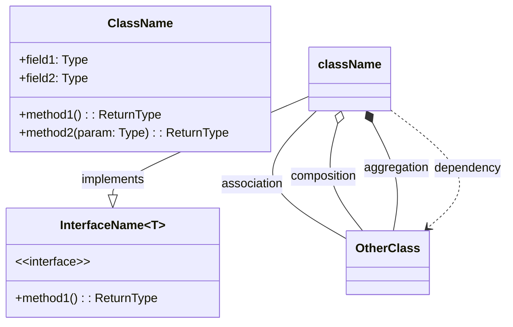
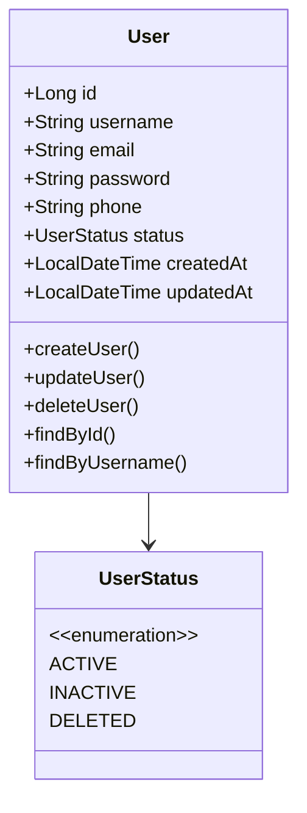
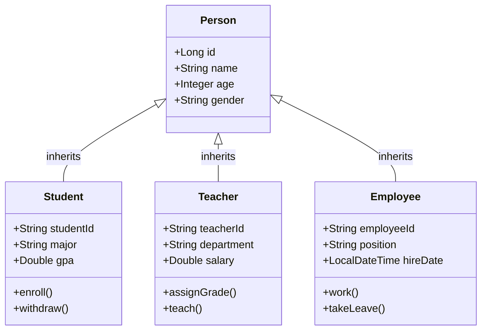
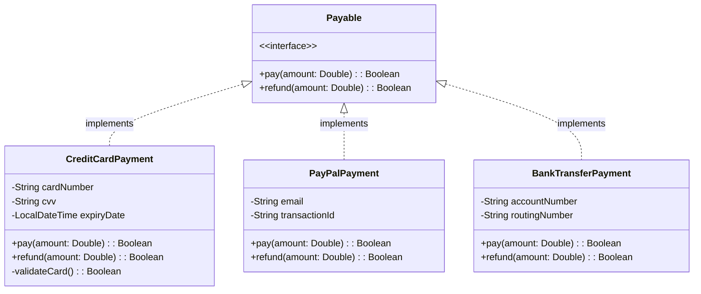
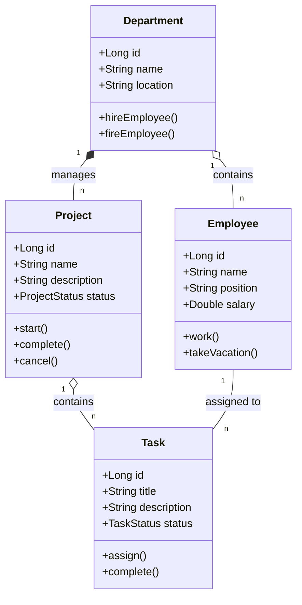
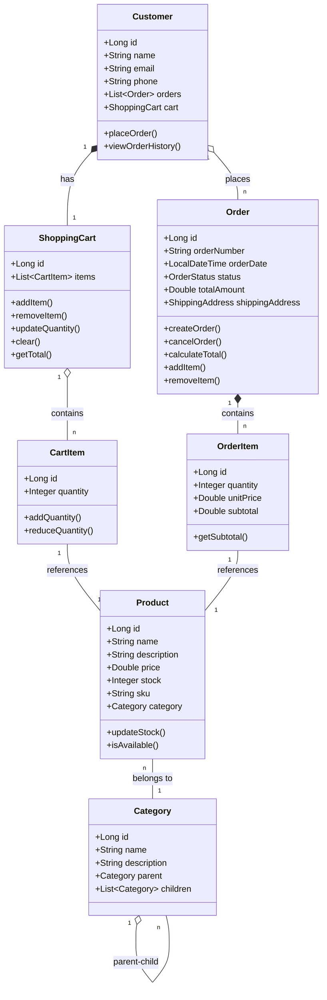
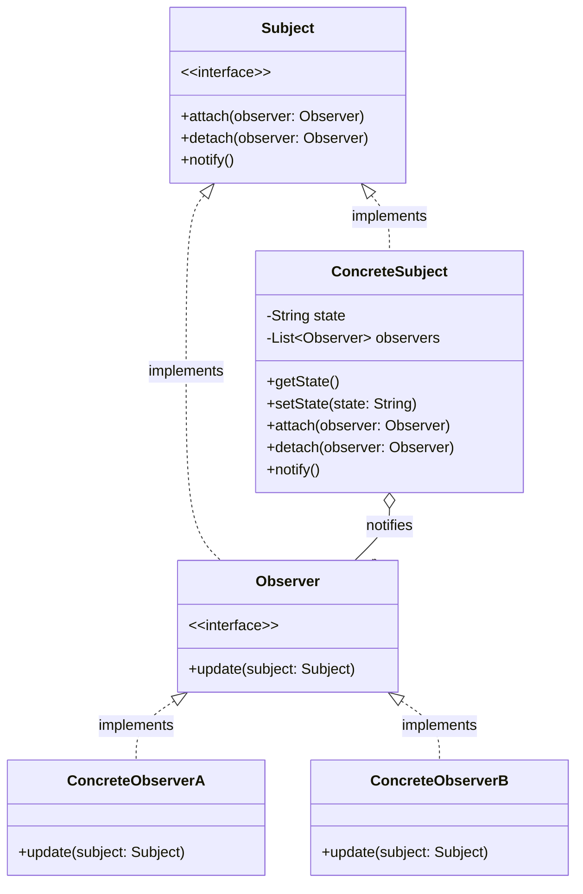

# 类图模板 (Class Diagram)

## 模板说明

类图（Class Diagram）用于展示系统中的类、接口及其之间的关系。

## 基本语法

## 符号说明

| 符号 | 关系类型 | 说明 |
|------|----------|------|
| `-->` | 关联关系 | 类之间的连接 |
| `*--` | 组合关系 | 强"拥有"关系，部分不能独立于整体 |
| `o--` | 聚合关系 | 弱"拥有"关系，部分可以独立 |
| `--|>` | 泛化关系 | 继承 |
| `..|>` | 实现关系 | 接口实现 |
| `..>` | 依赖关系 | 一个类使用另一个类 |
| `--` | 直接关联 | 双向关联 |

## 模板示例

### 1. 基础实体类

### 2. 继承关系

### 3. 接口与实现

### 4. 组合/聚合关系

### 5. 完整业务类图

### 6. 设计模式示例

## 使用指南

1. **类名**：首字母大写，使用名词
2. **属性**：可见性 + 名称 + 类型
   - `+` public
   - `-` private
   - `#` protected
   - `~` package
3. **方法**：可见性 + 名称 + 参数 + 返回类型
4. **关系线**：在连接线两端标注 multiplicity（多重度）

## 多重度说明

| 表示 | 含义 |
|------|------|
| 1 | 有且只有一个 |
| 0..1 | 零个或一个 |
| n | 正好n个 |
| 0..* 或 * | 零个或多个 |
| 1..* | 一个或多个 |
| m..n | 最少m个，最多n个 |