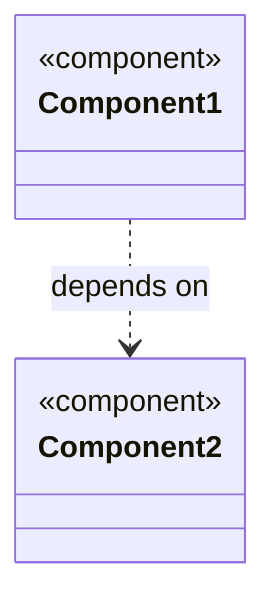
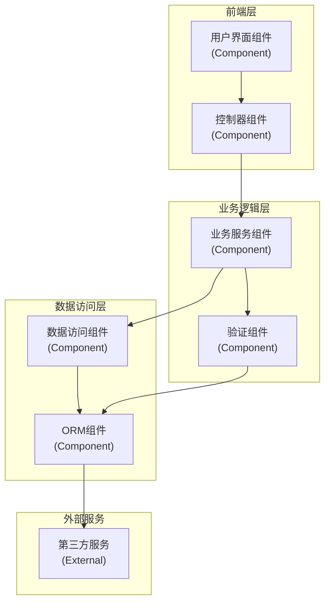
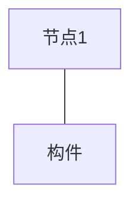
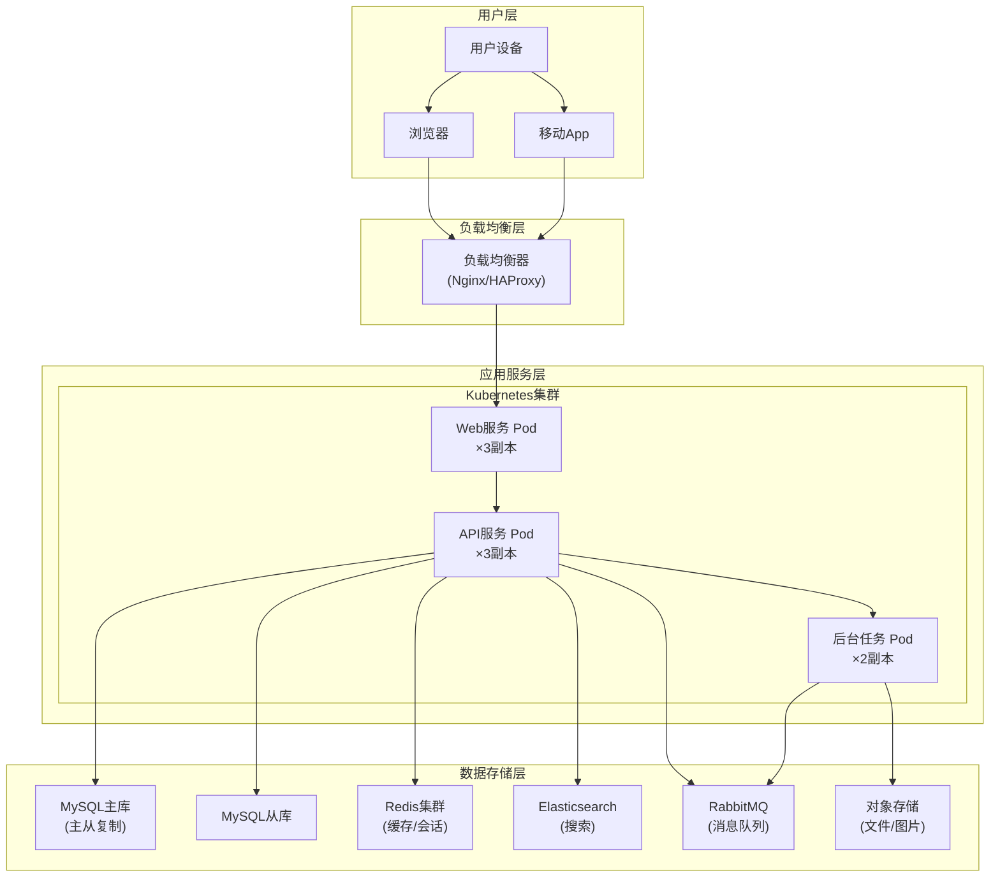
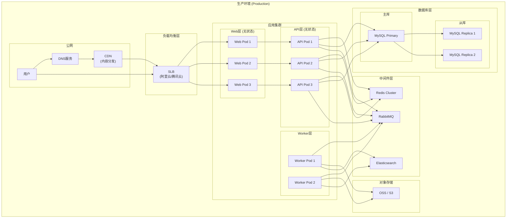

# 组件图与部署图模板

## 组件图 (Component Diagram)

### 模板说明

组件图用于展示系统中软件组件及其依赖关系。

### 基本语法


### Mermaid组件图语法



### 组件图示例



## 部署图 (Deployment Diagram)

### 模板说明

部署图用于展示系统的硬件和软件部署结构。

### 基本语法



### Mermaid C4部署图语法（替代方案）

```mermaid
C4Deployment
    Deployment_Node(loc, alias, "标签", "描述")
```

### 部署图示例



## 组合部署图



## 完整微服务架构部署图

```mermaid
graph TB
    subgraph External["外部"]
        Browser["浏览器"]
        MobileApp["移动App"]
        ThirdParty["第三方API"]
    end

    subgraph Gateway["API网关层"]
        Kong["Kong网关"]
    end

    subgraph ServiceMesh["服务网格层"]
        Istio["Istio"]
    end

    subgraph Services["微服务层"]
        subgraph 用户服务["用户服务"]
            U_POD["User Service Pod"]
        end

        subgraph 订单服务["订单服务"]
            O_POD["Order Service Pod"]
        end

        subgraph 商品服务["商品服务"]
            P_POD["Product Service Pod"]
        end

        subgraph 支付服务["支付服务"]
            PY_POD["Payment Service Pod"]
        end

        subgraph 通知服务["通知服务"]
            N_POD["Notification Service Pod"]
        end
    end

    subgraph Backend["后端支撑"]
        Redis["Redis Cluster"]
        MySQL["MySQL Cluster"]
        Kafka["Kafka Cluster"]
        ES["Elasticsearch"]
        S3["对象存储"]
    end

    Browser --> Kong
    MobileApp --> Kong
    Kong --> Istio

    Istio --> U_POD
    Istio --> O_POD
    Istio --> P_POD
    Istio --> PY_POD
    Istio --> N_POD

    U_POD --> Redis
    U_POD --> MySQL

    O_POD --> Redis
    O_POD --> MySQL
    O_POD --> Kafka

    P_POD --> Redis
    P_POD --> MySQL
    P_POD --> ES

    PY_POD --> MySQL
    PY_POD --> ThirdParty

    N_POD --> Kafka
    N_POD --> S3

    O_POD ..> P_POD : 服务调用
    O_POD ..> PY_POD : 服务调用
    O_POD ..> N_POD : 异步消息
```

## 容器化部署架构

```mermaid
graph TB
    subgraph 开发环境["开发环境"]
        DEV_PC["开发者PC"]
        REGISTRY_DEV["私有镜像库\n(开发)"]
    end

    subgraph CI_CD["CI/CD流水线"]
        GitRunner["GitLab Runner"]
        Harbor["Harbor镜像仓库"]
    end

    subgraph K8S_Prod["Kubernetes生产集群"]
        subgraph Ingress["Ingress"]
            Nginx_Ing["Nginx Ingress"]
        end

        subgraph Monitor["监控组件"]
            Prometheus["Prometheus"]
            Grafana["Grafana"]
        end

        subgraph 应用层["应用负载"]
            APP_PODS["业务Pod组"]
        end

        subgraph 数据层["存储层"]
            PVC["持久卷"]
        end
    end

    DEV_PC --> GitRunner : push code
    GitRunner --> Harbor : push image
    Harbor --> K8S_Prod : pull image

    Nginx_Ing --> APP_PODS
    Prometheus --> APP_PODS
    APP_PODS --> PVC
```

## 组件图与部署图对比

| 特性 | 组件图 | 部署图 |
|------|--------|--------|
| 关注点 | 软件组件和依赖 | 硬件和软件部署 |
| 主要元素 | 组件、接口、依赖 | 节点、设备、构件 |
| 目的 | 代码组织结构 | 物理部署结构 |
| 视角 | 开发人员视角 | 运维人员视角 |
| 抽象层次 | 逻辑层面 | 物理层面 |

## 使用指南

1. **组件图**：展示系统的模块化结构，反映代码组织
2. **部署图**：展示系统的物理架构，反映硬件资源
3. **组合使用**：组件图用于设计阶段，部署图用于实施阶段
4. **层次结构**：使用 `subgraph` 表示系统的逻辑分层
5. **冗余设计**：生产环境通常展示多副本和高可用架构